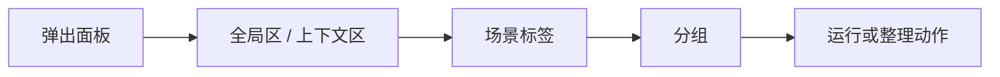

# 动作面板（新面板）

新面板窗口是 Quicker 2.0 的主要动作入口。它按 **场景 → 分组 → 动作** 组织，不再要求把动作固定放在二维动作页里；同一个动作也可以出现在多个场景或其它触发入口中。

适合：弹出一排动作再点选、按当前程序 / 网址切换上下文、在面板里查找并整理常用入口。

## 面板上的设置在哪

新面板的设置分散在标题栏、动作区右上角、侧边栏和系统设置里。下面的布局示意可点击分区，查看该区域是什么、以及从哪里配置。

<ActionPanelLayoutDemo />

先点示意分区，再看右侧说明中的「设置位置」。完整启用、整理与显示步骤见[使用说明](./usage.md)。

## 先分清两件事

在新面板中，**动作本体**和**动作的显示位置**是两回事：

- 「从此场景移除」只移除当前场景中的入口，不会删除动作本体。
- 「删除」会删除动作本体，并在确认后清理动作页、场景和触发规则等引用。

如果只是整理面板，请优先使用移动、分组或「从此场景移除」。

## 本目录

| 页面 | 内容 |
| --- | --- |
| [使用说明](./usage.md) | 启用、结构、查找运行、双击导航、整理分组、显示方式 |
| [本机动作暂存区](./action-drafts.md) | 暂存、用 AI 写、保留到场景、本机边界 |
| [常见问题](./faq.md) | 迁移、批量整理、置顶、查找不到动作等 |

相对 1.x / 面板迁移的增量说明仍保留在 [新面板窗口（2.x 变化）](/v2/what's-new/new-main-win/usage)。

## 相关链接

<RelatedDocs
  items={[
    {
      href: '/v2/features/action-panel/usage',
      label: '使用说明',
      description: '启用、结构、查找与整理',
    },
    {
      href: '/v2/features/action-panel/action-drafts',
      label: '本机动作暂存区',
      description: '试运行、用 AI 写、保留到场景',
    },
    {
      href: '/v2/features/action-panel/faq',
      label: '常见问题',
      description: '迁移、批量移动与排障',
    },
    {
      href: '/v2/features/actions',
      label: '动作与动作面板',
      description: '动作本体、引用与分享',
    },
    {
      href: '/v2/features/scenes',
      label: '场景与分组',
      description: '场景上下文与触发共用',
    },
    {
      href: "/v2/what's-new/new-main-win/usage",
      label: '新面板窗口（2.x 变化）',
      description: '相对 1.x / 迁移相关说明',
    },
  ]}
/>
