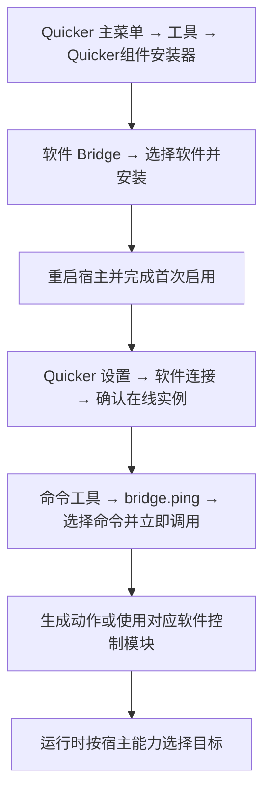

Bridge 是安装在第三方软件中的连接插件。Quicker 通过它读取当前文档、调用软件命令或脚本，并把重复操作做成动作。

它直接调用宿主开放的能力，通常不依赖模拟按键或寻找屏幕按钮；但需要宿主运行并加载插件，不等于无头运行或远程控制接口。能够调用什么、是否需要文档或选择对象，由该软件和当前 Bridge 决定。

## 从安装到动作

1. [安装、更新、修复与卸载](./install-and-manage.md)：安装器管理插件。
2. [连接状态与命令工具](./command-tool.md)：设置页查看连接，工具选择实例并测试命令。
3. 选择下表中的软件指南和模块参考，创建可重复运行的动作。
4. 遇到问题，从[通用排障](./troubleshooting.md)定位失败环节。

WPS 使用官方网页管理，是上述普通安装路径的例外，目前正式分发仍处于预览。

## 支持的软件

下表的验证记录来自已完成的宿主安装与回连验收，不表示所有小版本或全部业务命令均已验证。每篇软件指南列出兼容范围及特有限制；实际可安装版本以安装器为准。

| 软件 | 用途 | 当前可用／验证状态 | 管理方式 | 动作目标方式 | 模块 | 指南 |
| --- | --- | --- | --- | --- | --- | --- |
| 3ds Max | 三维与动画 | 已有安装与连接验证记录 | 统一安装器 | 前台进程精确路由 | [3ds Max控制](/v2/xaction/modules/3dsmaxcontrol) | [查看指南](./software/3ds-max.md) |
| After Effects | 视频与动效 | 已有安装与连接验证记录 | 统一安装器 | 前台类型 + 唯一会话 | [After Effects控制](/v2/xaction/modules/aftereffectscontrol) | [查看指南](./software/after-effects.md) |
| AutoCAD | CAD | 已有安装与连接验证记录 | 统一安装器 | 前台进程精确路由 | [AutoCAD控制](/v2/xaction/modules/autocadcontrol) | [查看指南](./software/autocad.md) |
| Blender | 三维与动画 | 已有安装与连接验证记录 | 统一安装器 | 前台进程精确路由 | [Blender控制](/v2/xaction/modules/blendercontrol) | [查看指南](./software/blender.md) |
| Cinema 4D | 三维与动画 | 已有安装与连接验证记录 | 统一安装器 | 前台进程精确路由 | [Cinema 4D控制](/v2/xaction/modules/cinema4dcontrol) | [查看指南](./software/cinema-4d.md) |
| CorelDRAW | 平面设计 | 已有安装与连接验证记录 | 统一安装器 | 前台进程精确路由 | [CorelDRAW控制](/v2/xaction/modules/coreldrawcontrol) | [查看指南](./software/coreldraw.md) |
| Illustrator | 平面设计 | 已有安装与连接验证记录 | 统一安装器 | 唯一在线会话 | [Illustrator控制](/v2/xaction/modules/illustratorcontrol) | [查看指南](./software/illustrator.md) |
| InDesign | 排版 | 已有安装与连接验证记录 | 统一安装器 | 唯一在线会话 | [InDesign控制](/v2/xaction/modules/indesigncontrol) | [查看指南](./software/indesign.md) |
| Maya | 三维与动画 | 已有安装与连接验证记录 | 统一安装器 | 前台进程精确路由 | [Maya控制](/v2/xaction/modules/mayacontrol) | [查看指南](./software/maya.md) |
| Photoshop | 图像处理 | 已有安装与连接验证记录 | 统一安装器 | 前台类型 + 唯一会话 | [Photoshop控制](/v2/xaction/modules/photoshopcontrol) | [查看指南](./software/photoshop.md) |
| Premiere Pro | 视频与动效 | 已有安装与连接验证记录 | 统一安装器 | 前台类型 + 唯一会话 | [Premiere Pro控制](/v2/xaction/modules/premierecontrol) | [查看指南](./software/premiere-pro.md) |
| Revit | 建筑与 BIM | 已有安装与连接验证记录 | 统一安装器 | 前台进程精确路由 | [Revit控制](/v2/xaction/modules/revitcontrol) | [查看指南](./software/revit.md) |
| Rhino | CAD 与三维 | 已有安装与连接验证记录 | 统一安装器 | 前台进程精确路由 | [Rhino软件控制](/v2/xaction/modules/rhinocontrol) | [查看指南](./software/rhino.md) |
| SketchUp | 建筑与三维 | 已有安装与连接验证记录 | 统一安装器 | 前台进程精确路由 | [SketchUp控制](/v2/xaction/modules/sketchupcontrol) | [查看指南](./software/sketchup.md) |
| SOLIDWORKS | 机械 CAD | 已有安装与连接验证记录 | 统一安装器 | 前台进程精确路由 | [SOLIDWORKS控制](/v2/xaction/modules/solidworkscontrol) | [查看指南](./software/solidworks.md) |
| WPS Office | 办公 | 预览／分发闭环未完成 | 官方管理页（预览） | 前台窗口 + WPS 组件 | [WPS Office控制](/v2/xaction/modules/wpscontrol) | [查看指南](./software/wps-office.md) |

:::caution[WPS 正式分发仍未完成闭环]
WPS 已有 JSA 加载、回连与命令目录验证，但正式管理页的安装、更新、卸载仍待真机闭环。请先阅读 [WPS 预览说明](./software/wps-office.md)，不要把已有页面或安装器入口等同于正式可用。
:::

## 工具选中的实例会保存在动作里吗？

不会。命令工具立即调用显式选择的实例，**生成动作不保存临时 session**。运行时，10 个宿主按前台 PID 与启动时间精确路由；WPS 按 HWND 与组件定位；Photoshop、Premiere Pro、After Effects 先要求前台软件正确，再使用唯一在线会话；Illustrator、InDesign 仅要求唯一在线会话。

精确路由的目标未连接时不会改投其他实例；唯一会话模式遇到多个会话会拒绝执行。完整说明见[动作目标规则](./command-tool.md#动作怎样选择目标)。

## 使用边界

Bridge 只连接本机 Quicker。可用命令受插件、宿主版本、许可证及当前文档状态限制，不能绕过宿主的信任、宏安全或文档编辑规则。

查询可先用 `bridge.ping` 验证连接。保存、删除、导出或任意脚本可能修改文件和模型；请阅读命令说明，并先在副本中验证。成功连接不代表每个业务操作都能撤销。
