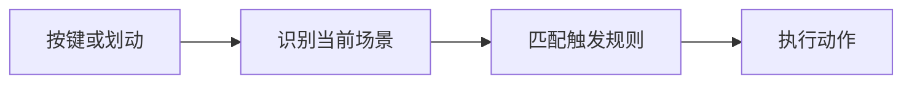

# 快速触发概览

动作是「做什么」，触发是「什么时候、用什么输入把它跑起来」。同一个动作可以挂在面板、快捷键、手势、轮盘等多种入口上；从某个入口移除规则，不会删除动作本身。

规则按**场景**生效：全局、当前程序、网址或子场景。更具体的场景可以覆盖或禁用上级规则。统一编辑入口在 **场景与动作管理**。

## 怎么选

| 习惯 | 更合适的入口 |
| --- | --- |
| 鼠标不离开当前窗口，画一下就执行 | [鼠标手势](./mouse-gestures.md)、[轮盘菜单](/v2/what's-new/others/circle-menu) |
| 键盘不离手 | [动作快捷键](/v2/what's-new/others/action-hotkeys)、[扩展热键](/v2/what's-new/others/powerkeys)、[文本指令](/v2/what's-new/others/text-commands) |
| 划词后立刻处理 | [选中文本工具条](./text-selection-toolbar.md) |
| 弹出一排动作再点 | [动作面板](/v2/getting-started)（默认中键等） |

下面这段演示是鼠标手势的运行时画面：移入可自己画，移出后自动播放几条常见轨迹。

<GestureTriggerDemo />

完整配置步骤见 [鼠标手势](./mouse-gestures.md)。

## 触发方式一览

| 触发方式 | 一句话 | 文档 |
| --- | --- | --- |
| 鼠标手势 | 按住键并移动画出轨迹，匹配后执行动作 | [使用说明](./mouse-gestures.md) |
| 选中文本工具条 | 划词后在指针附近显示候选操作 | [使用说明](./text-selection-toolbar.md) |
| 动作快捷键 | 全局或按场景绑定组合键到动作 | [使用说明](/v2/what's-new/others/action-hotkeys) |
| 扩展热键 | 引导键 + 第二键，适合字母键扩展 | [使用说明](/v2/what's-new/others/powerkeys) |
| 热键联动 | 监听一段或两段快捷键再执行 | [2.x 变化](/v2/what's-new/others/hotkey-watchers) |
| 文本指令 | 输入缩写或正则匹配后执行 | [使用说明](/v2/what's-new/others/text-commands) |
| 按键双击 | 双击某键触发 | [2.x 变化](/v2/what's-new/others/key-double-click)（尚无独立使用说明） |
| 左键辅助 | 按住左键再配合其它键或滚轮 | [2.x 变化](/v2/what's-new/others/left-button-plus)（尚无独立使用说明） |
| 轮盘菜单 | 在指针周围用方向选动作 | [使用说明](/v2/what's-new/others/circle-menu) |
| 高级鼠标触发 | 短按、长按、划动、角落、边界摩擦等 | [2.x 变化](/v2/what's-new/others/advanced-mouse-triggers)（尚无独立使用说明） |
| 动作面板 | 弹出面板再点动作 | [开始使用](/v2/getting-started)、[新面板](/v2/what's-new/new-main-win/usage) |
| 滚轮触发动作 | 在悬浮按钮等位置用滚轮连续调用 | [教程](/v2/xaction/guides/scroll-trigger) |

快捷键、扩展热键、轮盘和文本指令已有相对完整的说明（含配置路径）。**按键双击、左键辅助、高级鼠标触发**目前只有相对 1.x 的变化说明，还没有单独的使用说明；配置仍以软件里 **场景与动作管理** 为准。

## 统一管理与排障

1. 打开新版主窗口工具菜单中的 **场景与动作管理**（或设置里对应入口）。
2. 左侧选场景，右侧按 **键盘触发** / **鼠标触发** 等标签编辑规则。
3. 误触发或场景不对时：看 **最近触发历史**（本次运行约 30 分钟内的记录），并可配合 **当前场景诊断**。
4. 快捷键冲突：用 **设置 → 快捷键查询 → 快捷键占用查询** 定位 Quicker 内已注册的键。

场景继承与禁用语义见 [场景与触发方式（V2 变化）](/v2/what's-new/scenes-and-triggers)。

## 相关链接

<RelatedDocs
  items={[
    {
      href: '/v2/features/triggers/mouse-gestures',
      label: '鼠标手势',
      description: '轨迹、场景绑定与常见协作',
    },
    {
      href: '/v2/features/triggers/text-selection-toolbar',
      label: '选中文本工具条',
      description: '划词后显示候选操作',
    },
    {
      href: "/v2/what's-new/scenes-and-triggers",
      label: '场景与触发方式',
      description: 'V2 统一管理与诊断',
    },
  ]}
/>
