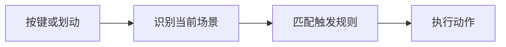

# 快速触发概览

动作是「做什么」，触发是「什么时候、用什么输入把它跑起来」。同一个动作可以挂在面板、快捷键、手势、轮盘等多种入口上；从某个入口移除规则，不会删除动作本身。

规则按**场景**生效：全局、当前程序、网址或子场景。更具体的场景可以覆盖或禁用上级规则。统一编辑入口在 **场景、动作与触发管理**。

```mermaid
flowchart LR
  input[按键或划动] --> scene[识别当前场景]
  scene --> rule[匹配触发规则]
  rule --> action[执行动作]
```

## 怎么选

| 习惯 | 更合适的入口 |
| --- | --- |
| 鼠标不离开当前窗口，画一下就执行 | [鼠标手势](./mouse-gestures.md)、[轮盘菜单](./circle-menu.md) |
| 键盘不离手 | [动作快捷键](./action-hotkeys.md)、[扩展热键](./powerkeys.md)、[文本指令](./text-commands.md) |
| 划词后立刻处理 | [选中文本工具条](./text-selection-toolbar.md) |
| 按住左键再配合其它键 | [左键辅助](./left-button-plus.md) |
| 短按、划动、角落或边界 | [高级鼠标触发](./advanced-mouse-triggers.md) |
| 弹出一排动作再点 | [动作面板](/v2/getting-started)（默认中键等） |

下面这段演示是鼠标手势的运行时画面：移入可自己画，移出后自动播放几条常见轨迹。

<GestureTriggerDemo />

完整配置步骤见 [鼠标手势](./mouse-gestures.md)。

## 触发方式一览

| 触发方式 | 一句话 | 文档 |
| --- | --- | --- |
| 鼠标手势 | 按住键并移动画出轨迹，匹配后执行动作 | [使用说明](./mouse-gestures.md) |
| 选中文本工具条 | 划词后在指针附近显示候选操作 | [使用说明](./text-selection-toolbar.md) |
| 动作快捷键 | 全局或按场景绑定组合键到动作 | [使用说明](./action-hotkeys.md) |
| 扩展热键 | 引导键 + 第二键，适合字母键扩展 | [使用说明](./powerkeys.md) |
| 热键联动 | 监听一段或两段快捷键再执行 | [使用说明](./hotkey-watchers.md) |
| 文本指令 | 输入缩写或正则匹配后执行 | [使用说明](./text-commands.md) |
| 按键双击 | 双击某键触发 | [使用说明](./key-double-click.md) |
| 左键辅助 | 按住左键再配合其它键或滚轮 | [使用说明](./left-button-plus.md) |
| 轮盘菜单 | 在指针周围用方向选动作 | [使用说明](./circle-menu.md) |
| 高级鼠标触发 | 短按、长按、划动、角落、边界摩擦等 | [使用说明](./advanced-mouse-triggers.md) |
| 动作面板 | 弹出面板再点动作 | [开始使用](/v2/getting-started)、[新面板](/v2/features/action-panel/usage) |
| 滚轮触发动作 | 在悬浮按钮等位置用滚轮连续调用 | [教程](/v2/xaction/guides/scroll-trigger) |

上表「使用说明」均指向本目录下的功能页。相对 1.x 的改进清单见各功能页中的「2.x 变化」链接。配置入口以软件里 **场景、动作与触发管理** 为准。 部分规则还可从设置中的「功能快捷键」入口进入，参见各功能页。

<a id="开发版键盘触发黑名单" />
<a id="程序黑名单与全屏禁用" />

## 程序黑名单与全屏禁用

以下功能从 **2.3.2** 起可用。

在设置中搜索「禁用Quicker的应用程序」，配置不希望触发的进程；需要时启用全屏禁用，并设置全屏例外。黑名单页可分别选择将这些限制应用于 **扩展热键、动作快捷键、按键双击、热键联动**。

新增的后三个开关默认关闭，升级不会自动让现有键盘规则失效。只开启需要限制的类型：前台程序命中黑名单，或触发全屏禁用且不在例外中时，该类键盘触发暂停；离开后按当前规则恢复。

动作快捷键暂停时会释放对应的系统快捷键注册，避免继续占用组合键。按键双击和热键联动会取消尚未完成的按键序列；已经触发的动作不会因此中止。未被全局限制时，各功能自身的进程条件与场景规则继续生效。

这些开关不包含暂停、打开设置等 **Quicker 功能快捷键**，也不会统一禁止自动运行或其他触发方式。排查某个动作仍在运行时，先确认它实际使用的触发入口。

旧客户端保存并同步设置可能清除这三个新字段，重新升级后需要重新开启。建议所有维护同一账号设置的设备升级到 2.3.2 后再配置，见[升级与回退](/v2/migration/upgrade-and-rollback#232-键盘黑名单与悬浮分组)。

<a id="开发中单击-ctrl-弹出面板" />

### 单击 Ctrl 弹出面板

以下入口调整从 **2.3.3** 起生效。

控制单击 Ctrl 是否遵循程序黑名单的开关，移到黑名单页并显示为 **单击Ctrl弹出面板**。开启后，在黑名单程序中单击 Ctrl 不再弹出面板；它不会开启“单击 Ctrl 键”这个面板触发方式，触发方式仍需在面板弹出设置中配置。

无论此开关是否开启，已生效的全屏禁用都会阻止单击 Ctrl 弹出面板。**面板全局快捷键不受此项影响**；不要用它判断动作快捷键或其他键盘触发是否已暂停。

## 统一管理与排障

1. 打开标题栏「更多」→「场景、动作与触发」（或设置里对应入口）。
2. 左侧选场景，右侧按 **键盘触发** / **鼠标触发** 等标签编辑规则。
3. 误触发或场景不对时：看 **「更多」→「工具」→「诊断与修复」→「动作运行与触发记录」→「触发记录」**（本次运行约 30 分钟内的记录），并可配合 **当前场景诊断**；2.1.23 起，切换窗口后高级鼠标、手势、轮盘等会更稳定地使用触发当时的程序和场景，历史记录中的规则、场景和操作摘要也更便于归因。
4. 快捷键冲突：2.2.25 起，在 **设置 → 功能快捷键** 页的相关功能中打开 **快捷键占用查询**，也可直接搜索此名称；较早版本的入口在「设置 → 快捷键查询」。

:::note[2.2.26 起的入口名称]
2.2.26 起，管理窗口更名为「场景、动作与触发管理」。设置中的规则管理入口会先打开全局场景；要修改特定程序或网址的规则，进入后再切换场景。此窗口与管理动作本体的「设置 → 动作 → 全部动作」是不同入口，名称变化不改变规则的继承和触发范围。
:::

场景继承与禁用语义见 [场景与触发方式（V2 变化）](/v2/what's-new/scenes-and-triggers)。

<a id="开发版搜索操作类型" />

## 选择操作类型

2.3.1 起，点击操作类型按钮后显示 **多级菜单**，按分类展开后选择目标操作。菜单只提供当前编辑场景可用的操作类型。

:::note[2.3.0 的搜索弹层]
2.3.0 中点击操作类型按钮会打开搜索弹层：可以输入名称或拼音搜索，也可选择分类；用上下方向键选择，`Enter` 确认，`Esc` 取消。候选同样受当前编辑场景限制。2.3.1 起恢复为上面的多级菜单，不再使用该弹层。
:::

2.3.0 起，还可在管理窗口内使用 [AI 助手配置设置和触发规则](/v2/features/ai-and-agent#设置与场景窗口中的-ai-助手)。

## 相关链接

<RelatedDocs
  items={[
    {
      href: '/v2/features/triggers/mouse-gestures',
      label: '鼠标手势',
      description: '轨迹、场景绑定与常见协作',
    },
    {
      href: '/v2/features/triggers/circle-menu',
      label: '轮盘菜单',
      description: '圈层、可视子动作与来源切换',
    },
    {
      href: '/v2/features/triggers/text-selection-toolbar',
      label: '选中文本工具条',
      description: '划词后显示候选操作',
    },
    {
      href: '/v2/features/triggers/action-hotkeys',
      label: '动作快捷键',
      description: '按场景绑定系统组合键',
    },
    {
      href: '/v2/features/triggers/powerkeys',
      label: '扩展热键',
      description: '引导键策略、校准与诊断',
    },
    {
      href: '/v2/features/triggers/hotkey-watchers',
      label: '热键联动',
      description: '单段或两段按键序列',
    },
    {
      href: '/v2/features/triggers/text-commands',
      label: '文本指令',
      description: '缩写或正则匹配后执行',
    },
    {
      href: '/v2/features/triggers/key-double-click',
      label: '按键双击',
      description: '不拦截原键的双击触发',
    },
    {
      href: '/v2/features/triggers/advanced-mouse-triggers',
      label: '高级鼠标触发',
      description: '短按、划动、角落，以及启动轮盘/手势',
    },
    {
      href: '/v2/features/triggers/left-button-plus',
      label: '左键辅助',
      description: '按住左键再配合其它键',
    },
    {
      href: "/v2/what's-new/scenes-and-triggers",
      label: '场景与触发方式',
      description: 'V2 统一管理与诊断',
    },
  ]}
/>
