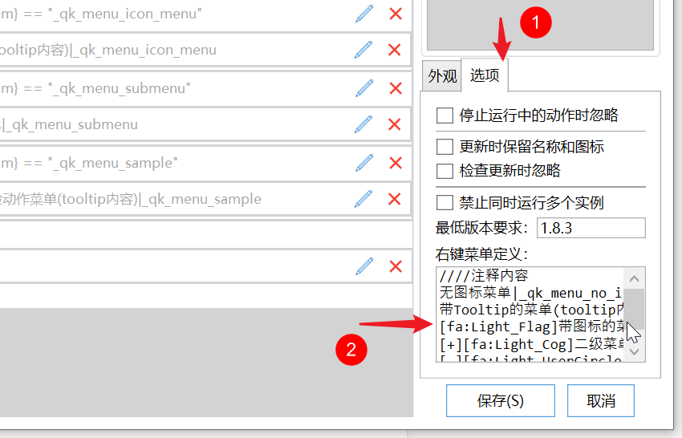
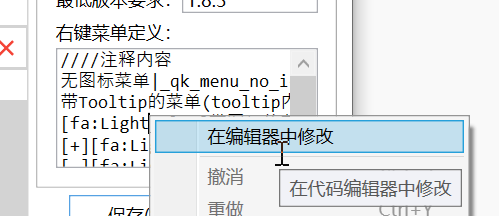
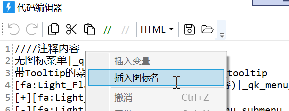

# 为动作设计自定义右键菜单

1.8.3+ 可为动作自定义右键菜单，用来解决两件事：

1. 怎么进配置界面，让使用者改个性化设置。
2. 一个动作有多种模式时，启动时怎么选定。

更早的做法是：在动作自己的窗口里加菜单，或启动时看有没有按 `Ctrl`。自定义右键菜单的原理更直接：

- 点菜单项 = 运行该动作，并传入该项写死的参数。
- 动作里读 `{quicker_in_param}`，按参数走对应分支。

<ContextMenuPreview
  openPath={['动作设置']}
  items={[
    {label: '运行', icon: 'fa:Light_Play:#39b54d'},
    {label: '调试运行', icon: 'fa:Light_Bug:#f5b042'},
    {type: 'separator'},
    {label: '动作设置', icon: 'fa:Light_Cog:#FF0000'},
    {label: '编辑'},
    {label: '分享'},
  ]}
/>

## 定义菜单

菜单文本写在编辑器右侧「选项 / 外观」里。输入框偏小，内容多时在框上右键选「在编辑器中修改」。





### 格式

- 一行一项。
- `////` 开头当注释。
- `----` 是分割线。
- 竖线 `|` 左边是外观，右边是传给动作的参数。

例子：`[fa:Light_Flag]菜单标题(tooltip内容)|_qk_menu_icon_menu`

外观可含图标、标题、Tooltip（后两项可选）：

- `[fa:图标名称]`：默认色（动作菜单默认偏绿，和内置菜单区分）。
- `[fa:图标名:#RRGGBB]`：自定义颜色，给有风险或要强调的项用。
- 图标名可在编辑器右键「插入图标名菜单」里挑。见 [在动作中使用图标](/v2/xaction/concepts/use-icon-in-actions)。



参数尽量用不容易撞车的值。多项时可加同一前缀，动作里按前缀分支。

### 多级菜单

**缩进**（1.36.7+）：空格或 Tab 表示子菜单。同一级对齐，两种空白不要混用。

```text
[fa:Light_Cog:#FF0000]设置
  [fa:Light_Cog:#FF0000]设置项1|参数值1
    [fa:Light_Cog:#FF0000]设置项11|参数值11
  [fa:Light_Cog:#FF0000]设置项2|参数值2
    [fa:Light_Cog:#FF0000]设置项21|参数值21
```

<ContextMenuPreview
  openPath={['设置', '设置项1']}
  items={[
    {label: '编辑', icon: 'fa:Light_Pen', iconColor: '#2b7abf'},
    {label: '调试运行', icon: 'fa:Light_Play:#f75711'},
    {
      label: '设置',
      icon: 'fa:Light_Cog:#FF0000',
      children: [
        {
          label: '设置项1',
          icon: 'fa:Light_Cog:#FF0000',
          children: [{label: '设置项11', icon: 'fa:Light_Cog:#FF0000'}],
        },
        {
          label: '设置项2',
          icon: 'fa:Light_Cog:#FF0000',
          children: [{label: '设置项21', icon: 'fa:Light_Cog:#FF0000'}],
        },
      ],
    },
    {label: '悬浮', icon: 'fa:Light_UfoBeam', iconColor: '#2b7abf', children: [{label: '…'}]},
    {label: '分享', icon: 'fa:Light_ShareAlt', iconColor: '#2b7abf', children: [{label: '…'}]},
  ]}
/>

**符号标记**（1.36.7 之前）：父项前加 `[+]`，子项前加 `[-]`。

```text
////注释内容
无图标菜单|_qk_menu_no_icon
带Tooltip的菜单(tooltip内容)|_qk_menu_tooltip
[fa:Light_Flag]带图标的菜单(tooltip内容)|_qk_menu_icon_menu
[+][fa:Light_Cog]二级菜单(提示内容...)
[-][fa:Light_UserCircle]子菜单|_qk_menu_submenu
[fa:Light_Wrench:#f57e42]危险动作菜单(tooltip内容)|_qk_menu_sample
```

<ShareLinkCard
  code="85e2fa76-4bfb-4e1b-aa78-08d80d33b91a"
  title="右键菜单示例"
/>

### 在动作里判断

用 [如果](/v2/xaction/modules/if) 比较 `{quicker_in_param}` 和菜单参数：

<ModuleParamPreview
  moduleKey="sys:if"
  focusKeys={['condition']}
  values={{condition: '$= {quicker_in_param} == "_qk_menu_no_icon"'}}
/>

命中就走对应步骤。

## 会变的菜单项

菜单文案要随工作模式变时，用 [状态存取](/v2/xaction/modules/statestorage) 改。

## 调试菜单项

**方式 1**：按 **右侧 Shift** 再点菜单项，走调试运行。

**方式 2**：另建一个动作，用 [运行其他动作](/v2/xaction/modules/runaction) 填目标和参数，勾选调试。

<ModuleParamPreview
  moduleKey="sys:runAction"
  values={{debug: 'true', inputParam: '_qk_menu_no_icon'}}
  focusKeys={['actionId', 'inputParam', 'debug']}
/>

连续改的话，编辑器里 **Ctrl + 点击保存** 只存不关窗。

<ShareLinkCard
  code="ea84295f-a89f-4eed-2181-08d87f35f7db"
  title="动作调试器"
/>

## 使用

在动作上右键点对应项即可。右侧 Shift + 点击该项则调试运行。

## 更多示例

来自 @瓜皮之牙：

<ShareLinkCard
  code="862a746e-35d8-4d6f-3efe-08d97ef43193"
  title="菜单定义心得"
/>

<ShareLinkCard
  code="20d89403-3c40-480d-394f-08d98bd92463"
  title="菜单示例"
/>

入门教程：[瓜皮的自定义右键菜单](https://getquicker.net/Guides/Guide?id=9260b229-c617-42f5-378b-08da75b5e519&step=54f7f144-58a1-43c5-a41d-08da7756e1a7)

## 限制与排障

- 参数要足够特殊，避免和正常传入的数据撞车。
- 缩进子菜单不要把空格和 Tab 混在同一份定义里。
- 改了菜单参数却没改动作里的判断，点菜单会落到默认分支。

## 相关链接

<RelatedDocs
  items={[
    {
      href: '/v2/xaction/concepts/quicker_in_param',
      label: '为动作传递参数',
      description: '菜单项就是在传参',
    },
    {
      href: '/v2/xaction/concepts/store-settings',
      label: '在动作中存储用户设置',
      description: '设置菜单 + 状态变量',
    },
    {
      href: '/v2/xaction/modules/statestorage',
      label: '状态存取',
      description: '动态改菜单文案',
    },
    {
      href: '/v2/xaction/modules/form',
      label: '多字段表单',
      description: '设置界面',
    },
    {
      href: '/v2/xaction/modules/clouddata',
      label: '云状态存取',
      description: '把设置存到网上',
    },
    {
      href: '/v2/xaction/concepts/use-icon-in-actions',
      label: '在动作中使用图标',
      description: '菜单图标写法',
    },
  ]}
/>
