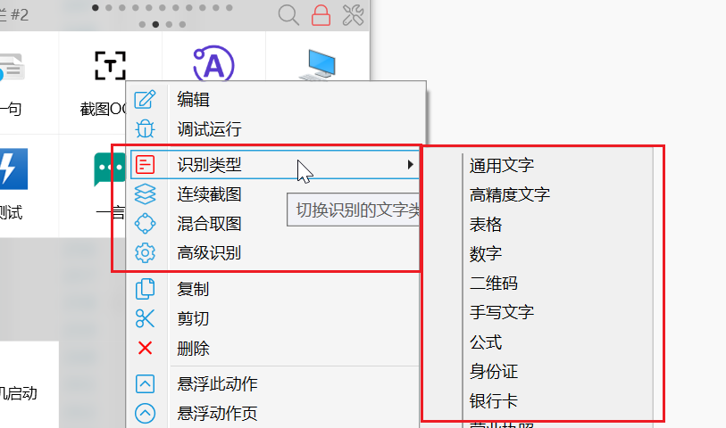
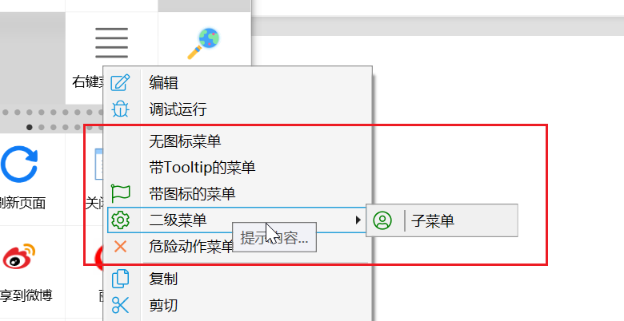
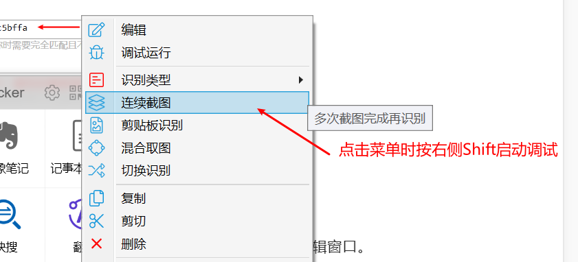
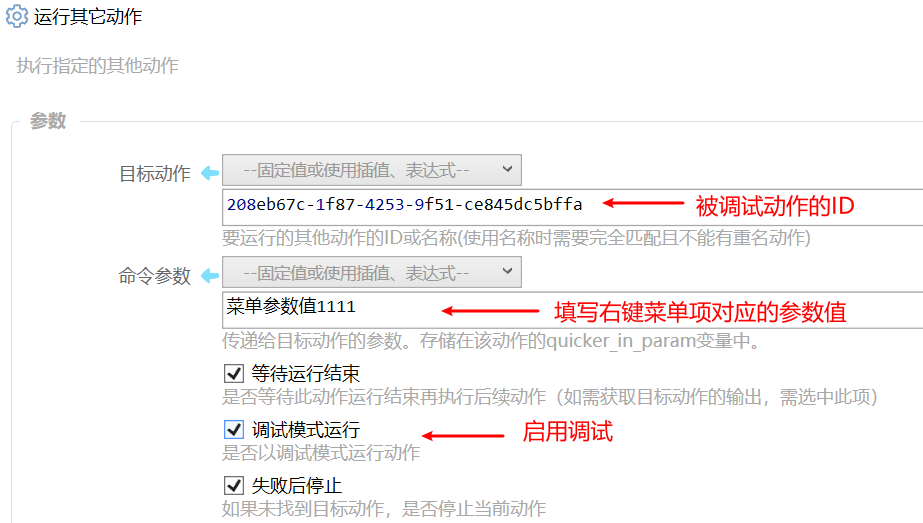

注：Quicker1.8.3以后的版本支持此功能。


## 概述

当动作功能变得更强大之后，通常会面临2个设计问题：

1.  如何进入配置界面，让使用者方便的自定义一些个性化信息？
2.  动作提供多个功能或模式，如何在启动动作时确定运行哪个功能？


在1.8.3版本之前，动作作者大概会使用这些办法：

-   在动作操作界面的菜单中增加功能选项。（如文本窗口的菜单、用户选择的选项或菜单等）
-   在启动时检查键盘状态，根据是否按下了某个控制键（如ctrl），决定进入参数配置功能还是正常运行动作。


在1.8.3版本中，Quicker增加了给动作自定义右键菜单的功能。基本原理是这样：

-   点击菜单时，运行动作并给动作传递某个特定的参数。
-   在动作中判断参数变量quicker\_in\_param的值，根据对应的菜单项执行某个操作。




## 定义菜单

菜单数据在动作编辑窗口的“选项”区域。


输入框比较小，如果需要输入较多内容，可以在输入框上右键，选择“在编辑器中修改”。


### 格式说明

1.  每行定义一个菜单项；
2.  4个斜线开始的内容（////），作为注释忽略；
3.  使用4个半角短横线（----）添加分割线；
4.  每个菜单项的内容分为2个主要部分，中间使用竖线“|”分隔。

1.  前半部分定义菜单的外观；
2.  后半部分定义要给动作传递的参数；
3.  例子：\[fa:Light\_Flag\]菜单标题(tooltip内容)**|**\_qk\_menu\_icon\_menu

5.  外观部分可以包含图标、标题和鼠标悬浮在菜单上时显示的Tooltip信息。其中图标信息和tooltip信息是可选的。

1.  图标信息：**\[fa:*****图标名称*****\]** 图标将以默认颜色显示（为和quicker内置右键菜单区别，动作图标默认使用绿色显示）。
2.  如果需要对某些具有一定风险或需要突出显示的图标指定自定义颜色，也可以使用 **\[fa:图标名:#RRGGBB\]** 这样的格式。
3.  图标名称可以在编辑器中右键选择“插入图标名菜单”后选择。 

6.  动作参数尽量使用较为特殊的内容，避免和正常使用动作时传入的参数冲突。如果有多个菜单项，也可以考虑为参数加入相同的前缀，从而方便在动作中根据前缀执行某个分支的步骤。


#### 多级菜单

**缩进方式设置**（自1.36.7版本支持）

使用空格或tab缩进表示子菜单（空格或tab不能混用，同一级别对齐）。

示例：

```text
[fa:Light_Cog:#FF0000]设置
  [fa:Light_Cog:#FF0000]设置项1|参数值1
    [fa:Light_Cog:#FF0000]设置项11|参数值11
  [fa:Light_Cog:#FF0000]设置项2|参数值2
    [fa:Light_Cog:#FF0000]设置项21|参数值21
```

对应的菜单：

<ContextMenuPreview
  openPath={['设置', '设置项1']}
  items={[
    {label: '编辑', icon: 'fa:Light_Pen', iconColor: '#2b7abf'},
    {label: '调试运行', icon: 'fa:Light_Play:#f75711'},
    {
      label: '设置',
      icon: 'fa:Light_Cog:#FF0000',
      children: [
        {
          label: '设置项1',
          icon: 'fa:Light_Cog:#FF0000',
          children: [{label: '设置项11', icon: 'fa:Light_Cog:#FF0000'}],
        },
        {label: '设置项2', icon: 'fa:Light_Cog:#FF0000', children: [{label: '设置项21'}]},
      ],
    },
    {label: '悬浮', icon: 'fa:Light_UfoBeam', iconColor: '#2b7abf', children: [{label: '…'}]},
    {label: '分享', icon: 'fa:Light_ShareAlt', iconColor: '#2b7abf', children: [{label: '…'}]},
  ]}
/>

**符号标记格式**

【1.36.7之前版本】如果需要定义二级菜单：

1.  在父菜单的最前面加入 **\[+\]**
2.  在该父菜单下面的子菜单项的最前面加入 **\[-\]**


例子（网址[https://getquicker.net/sharedaction?code=85e2fa76-4bfb-4e1b-aa78-08d80d33b91a](https://getquicker.net/sharedaction?code=85e2fa76-4bfb-4e1b-aa78-08d80d33b91a)）：

```text
////注释内容
无图标菜单|_qk_menu_no_icon
带Tooltip的菜单(tooltip内容)|_qk_menu_tooltip
[fa:Light_Flag]带图标的菜单(tooltip内容)|_qk_menu_icon_menu
[+][fa:Light_Cog]二级菜单(提示内容...)
[-][fa:Light_UserCircle]子菜单|_qk_menu_submenu
[fa:Light_Wrench:#f57e42]危险动作菜单(tooltip内容)|_qk_menu_sample
```

对应的菜单：




### 在动作中判断菜单

使用“如果”模块，判断动作参数的值是否为某个菜单项的参数值：

<ModuleParamPreview
  moduleKey="sys:if"
  focusKeys={['condition']}
  values={{condition: '$= {quicker_in_param} == "_qk_menu_no_icon"'}}
/>

如果是的话，就执行对应的操作即可。


## 定义变化的右键菜单项

如果有些右键菜单项需要根据动作的工作模式变化，可以通过“[状态存取](/v2/xaction/modules/statestorage)”模块来设置。


## 调试右键菜单项

**方式1**：按右侧Shift键点击菜单项，可以启动调试运行模式。




**方式2**：创建一个新的动作，在动作中使用“运行其他动作”模块，指定要传递的参数内容和是否启动调试模式。




如果需要连续编辑调试，可以在动作编辑窗口中 按Ctrl+点击保存，可以只保存不关闭编辑窗口。

[
](https://getquicker.net/sharedaction?code=ea84295f-a89f-4eed-2181-08d87f35f7db)


## 使用菜单

在动作上右键，选择对应菜单项即可。

按**右侧Shift**的同时点击菜单项，可以使用调试模式运行。


## 相关内容

-   状态存储：在用户计算机保存状态信息

-   [状态存取模块](/v2/xaction/modules/statestorage)
-   将变量设置为作为状态使用：保存变量的值到本地，下次运行时自动加载。

-   [云状态存取](/v2/xaction/modules/clouddata)：将内容保存到网络，在需要的时候读取。
-   [多字段表单](/v2/xaction/modules/form)：通常用于设计动作参数设置界面。


来自网友@瓜皮之牙的右键菜单示例：

[https://getquicker.net/Sharedaction?code=862a746e-35d8-4d6f-3efe-08d97ef43193](https://getquicker.net/Sharedaction?code=862a746e-35d8-4d6f-3efe-08d97ef43193)

[https://getquicker.net/Sharedaction?code=20d89403-3c40-480d-394f-08d98bd92463](https://getquicker.net/Sharedaction?code=20d89403-3c40-480d-394f-08d98bd92463)

瓜皮的自定义右键菜单入门教程（通俗易懂）：[https://getquicker.net/Guides/Guide?id=9260b229-c617-42f5-378b-08da75b5e519&step=54f7f144-58a1-43c5-a41d-08da7756e1a7](https://getquicker.net/Guides/Guide?id=9260b229-c617-42f5-378b-08da75b5e519&step=54f7f144-58a1-43c5-a41d-08da7756e1a7)


## 更新历史

-   1.36.7 支持缩进方式。
-   增加瓜皮分享的入门教程网址和示例动作。
