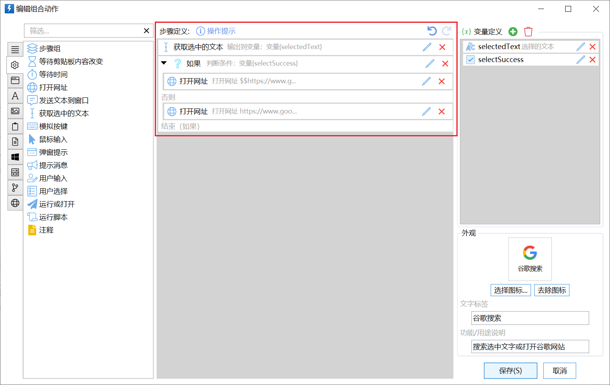
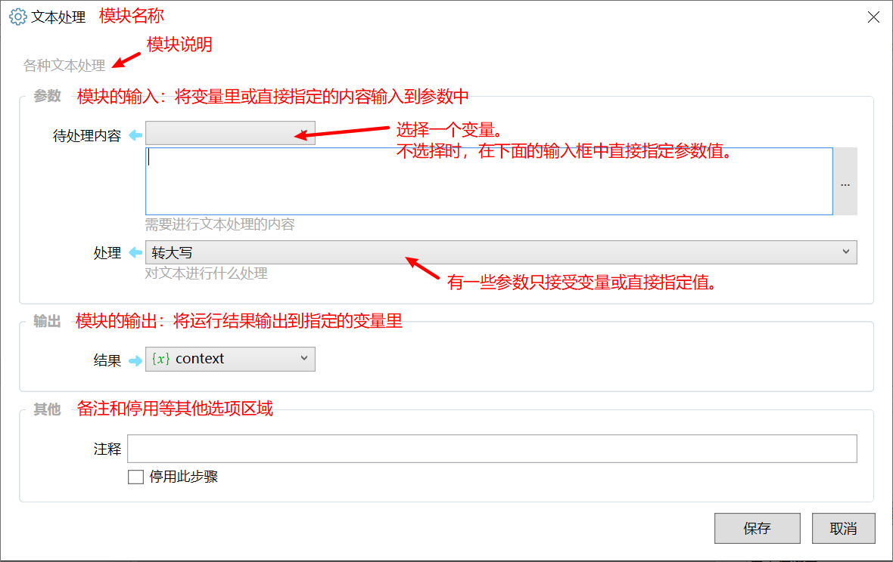
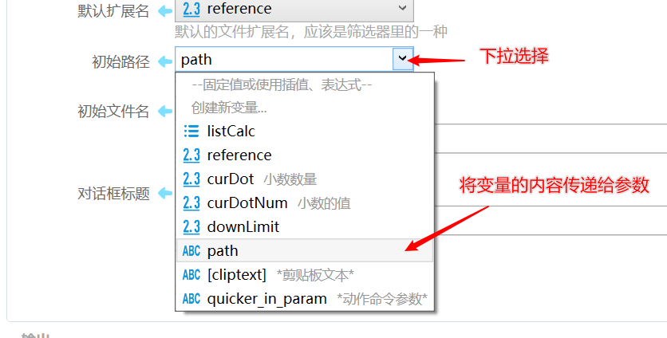
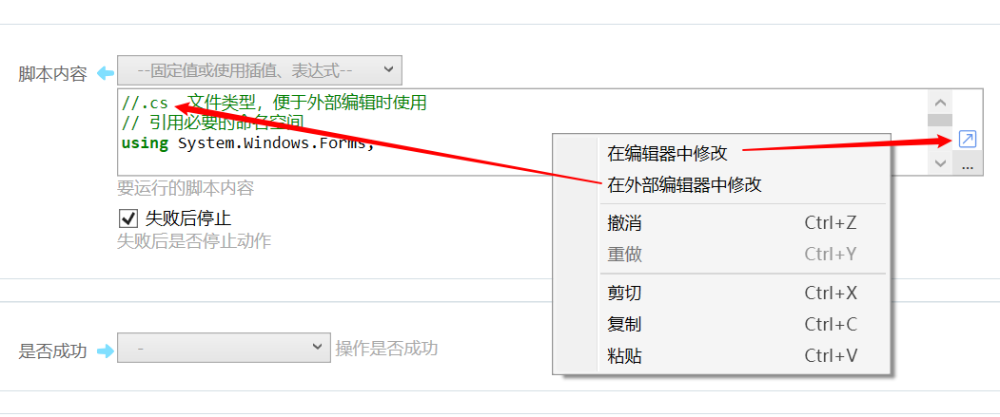
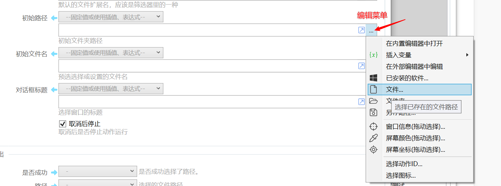
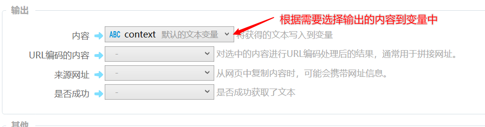
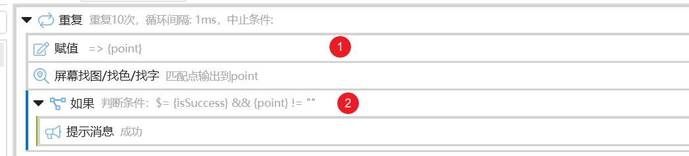

## 使用说明

### 步骤列表

我们通过定义一系列的步骤来实现组合动作的功能。

从左侧的步骤工具箱中拖放需要的模块到步骤列表中的合适位置即可添加新的步骤。

### 模块

模块通常会接收一些输入（从变量中读取或直接指定固定的参数值），进行某种处理后，再把结果输出到变量里。

比如下面的 “文本处理” 模块，将待处理的文本转换为大写后，再输出到context变量中。

#### 输入参数值的指定

可以使用两种方式为输入参数赋值：

**1） 使用变量**

**2）指定固定值，或使用文本插值/表达式。**

在变量下拉框中选择“--固定值或使用插值、表达式--”（旧版为“不使用变量”），这时会在下拉框下面显示一个输入框。可以在这里直接输入以下三种类型的内容：

-   要赋值给参数的内容。
-   使用**$$**开始使用[插值方式拼接文本](/v2/xaction/concepts/interpolation)。
-   使用**$=**开始使用[表达式进行计算](/v2/xaction/concepts/expression)。

参数输入框支持一些辅助输入的功能：

**右键菜单：**

-   在编辑器中修改：弹出代码编辑窗口以输入较多的内容。
-   在外部编辑器中修改：使用第三方编辑器修改参数内容。
    编辑的内容会自动写入一个临时文件，并请用户选择使用什么编辑器打开。在参数内容第一行使用注释+扩展名可以指定生成的临时文件扩展名(从第三个字符判断，如`//.js`、`//.cs`、`##.ps1`等)，方便windows自动选择编辑器、在编辑器中自动启用语法高亮。

**扩展菜单：**

-   在编辑器中修改：同上
-   插入变量：在参数内容中插入变量的名称。
-   用于选取内容的其他工具菜单。

#### 输出内容

一个步骤可能会输出比较多的内容，但不是所有都需要使用。

只要输出需要的内容到合适的变量中即可。

**高级话题**

注意：对于步骤执行失败的情况，后面的输出是否会执行是不确定的，因此可能存在两种情况：

-   输出被执行，变量内容会被修改。
-   输出不被执行，变量内容保持不变。

因此，在有可能执行失败的情况下，如果后续步骤需要根据模块输出到的变量的内容做处理，请在前面使用“赋值”模块预先给变量赋值，并且在判断“是否成功”。

如下图一个循环找图的步骤。在循环开始处，给point变量赋值空字符串，以避免在循环的其它步骤中使用到前一次循环得到的point结果。

