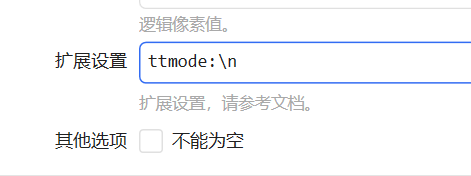
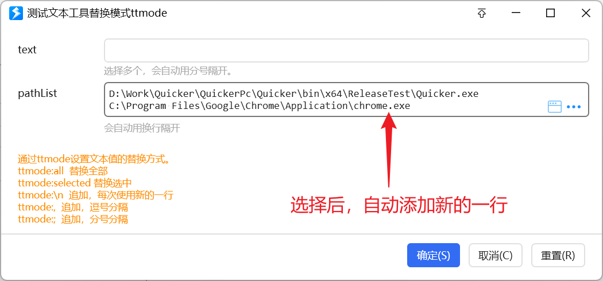

# 为输入框设置自定义的文本选择工具

文本选择工具用来给输入框快速填一段特定内容。鼠标停在文本框上时会出现一排小工具。

<PreviewMarks
  marks={[{key: 'texttools', label: '自定义文本选择工具'}]}>
  <UserInputPreview
    title="填写表单"
    prompt="text"
    value=""
    selectValue={false}
    hint="默认的文本变量"
    showEnterTip={false}
    tools={[
      {
        key: 'fill-direct',
        icon: 'fa:Light_Cog',
        tooltip: '直接填入内容\n没有界面的',
      },
      {
        key: 'select-content',
        icon: 'fa:Light_Pen',
        tooltip: '选择内容\n测试子程序中调用界面',
      },
      {
        key: 'append',
        icon: 'fa:Light_Wifi',
        tooltip: '追加内容\n在当前内容基础上添加一行',
      },
      {
        key: 'aaaa',
        icon: 'fa:Light_Text',
        tooltip: 'AAAA\n为相同子程序传递不同参数',
      },
      {
        key: 'bbbb',
        icon: 'fa:Light_Text:#009900',
        tooltip: 'BBBB\n为相同子程序传递不同参数',
      },
    ]}
    activeTool="fill-direct"
    showToolTooltip
  />
</PreviewMarks>

[多字段表单](/v2/xaction/modules/form) 里某字段用单行/多行文本，或 [用户输入](/v2/xaction/modules/userinput) 时，可以启用文本选择工具。

<ModuleParamPreview
  moduleKey="sys:userInput"
  values={{type: 'text', texttools: 'path'}}
  focusKeys={['type', 'texttools', 'extraSettings']}
/>

1.40.11+ 可通过调用子程序做**自定义**文本选择工具。

## 自定义文本工具

<ShareLinkCard
  code="d08bf039-e016-4482-7fe6-08dbdfe824d8"
  title="示例：自定义文本工具"
/>

<StepProgramView example="d08bf039-e016-4482-7fe6-08dbdfe824d8" />

### 准备子程序

给子程序设好预置变量，用来接输入、吐输出。

<ActionEditorPreview
  caption="自定义文本工具子程序的变量"
  focus="variables"
  data={{steps: []}}
  actionTitle="自定义文本工具"
  actionDescription="子程序输入输出"
  variables={[
    {name: 'text', type: 'Text', usage: ['in'], remark: '文本框当前内容'},
    {name: 'selected', type: 'Text', usage: ['in'], remark: '当前选中内容'},
    {name: 'parent', type: 'Any', remark: '父窗口'},
    {name: 'count', type: 'Number', usage: ['in'], remark: '自定义参数'},
    {name: 'output', type: 'Text', usage: ['out'], remark: '写回输入框'},
  ]}
  selectedVar="output"
/>

**输入**

| 变量 | 类型 | 作用 |
| --- | --- | --- |
| `text` | 文本 | 文本框当前内容。不关心可不定义。 |
| `selected` | 文本 | 当前选中内容。不关心可不定义。 |
| `parent` | 动态对象 | 文本框所在父窗口（WPF `Window`）。不关心可不定义。 |
| 其它自定义参数 | 按需 | 一个子程序处理多种情况时用，如上表 `count`。名字不能和上面预置的撞车。 |

**输出**

- `output`：要写回输入框的内容。默认替换整框。若要追加，在子程序里拼好再返回，或用下面的 `ttmode:`。

子程序按需求把结果写到 `output`。

### 设置

在字段「扩展设置」里加自定义文本选择工具。

<ModuleParamPreview
  moduleKey="sys:userInput"
  values={{
    type: 'text',
    extraSettings: '[fa:Light_Magic]生成示例(按 count 生成)|operation=sp&spname=自定义文本工具&count=3',
  }}
  focusKeys={['extraSettings']}
/>

格式：

- 前缀 `texttool:`。
- 不额外传参：`[图标]第一行提示(其它提示)|子程序名称`。
- 要传自定义参数：`[图标]第一行提示(其它提示)|operation=sp&spname=子程序名称&自定义参数1=值1&自定义参数2=值2`。值里有特殊字符先做 URL 编码。

图标写法见 [在动作中使用图标](/v2/xaction/concepts/use-icon-in-actions)，建议用内置矢量图标。

## 替换模式

选完之后是换掉整框、只换选区，还是追加，用 `ttmode:` 指定（会覆盖工具默认模式）：

| 指令 | 效果 |
| --- | --- |
| `ttmode:all` | 替换全部 |
| `ttmode:selected` | 只替换当前选中 |
| `ttmode:\n` | 追加，换行分隔 |
| `ttmode:,` | 追加，逗号分隔 |
| `ttmode:;` | 追加，分号分隔 |

只支持上面这几种。例如选完窗口后把路径追加到文本框：

## 限制与排障

- 自定义参数名不能叫 `text` / `selected` / `parent` / `output`。
- `ttmode:` 只认表里那几种，写错会落到默认「替换全部」。
- 子程序没把结果写到 `output`，点工具后输入框不会变。

## 相关链接

<RelatedDocs
  items={[
    {
      href: '/v2/xaction/modules/userinput',
      label: '用户输入',
      description: '文本选择工具和扩展设置',
    },
    {
      href: '/v2/xaction/modules/form',
      label: '多字段表单',
      description: '字段上挂自定义工具',
    },
    {
      href: '/v2/xaction/concepts/subprogram',
      label: '子程序',
      description: '工具背后的子程序',
    },
    {
      href: '/v2/xaction/concepts/use-icon-in-actions',
      label: '在动作中使用图标',
      description: '工具图标',
    },
  ]}
/>
