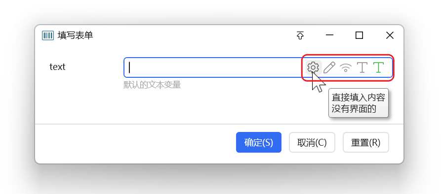
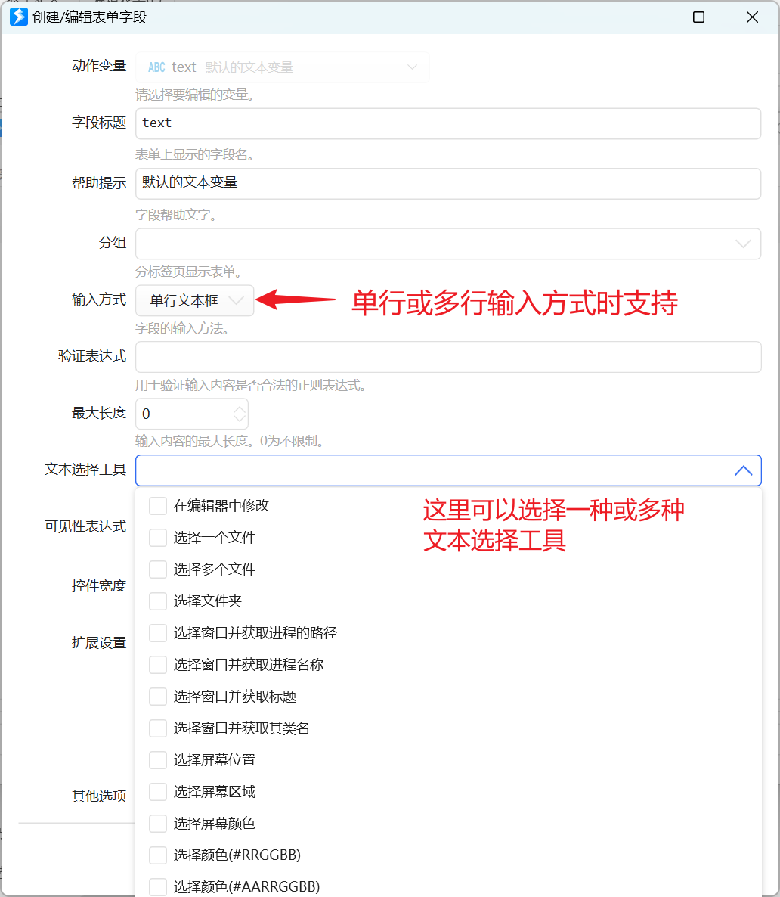
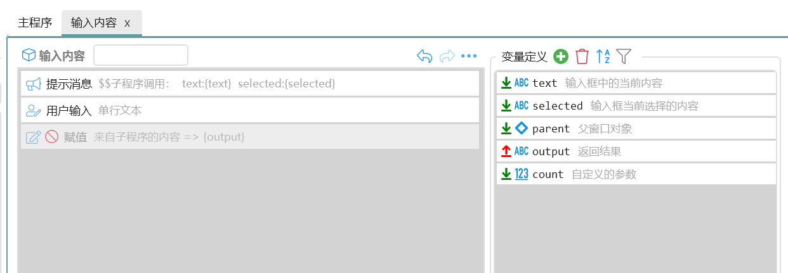
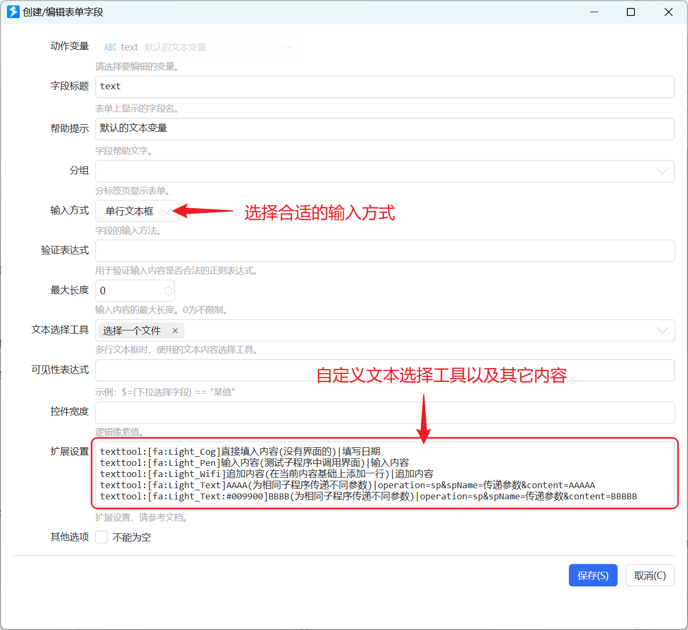

## 什么是文本选择工具

在文本选择工具用于快速为输入框填写特定的内容。

在“[多字段表单](/v2/xaction/modules/form)”对某个变量使用单行/多行文本编辑框输入方式，或 “[用户输入](/v2/xaction/modules/userinput)”模块时，可以选择启用文本选择工具。

在1.40.11版本中，增加了通过调用子程序实现自定义文本选择工具的功能。

## 自定义文本选择工具

示例动作：[示例：自定义文本工具](https://getquicker.net/Sharedaction?code=d08bf039-e016-4482-7fe6-08dbdfe824d8)

### 准备子程序

通过为子程序设定一些预置的变量，来完成参数的输入和输出。

**输入变量**

-   `text` （文本）文本框中当前的内容。如果不关注，可以不定义。
-   `selected` （文本）文本框中当前选择的内容。如果不关注，可以不定义。
-   `parent` （动态对象）文本框所在父窗口对象，为WPF的Window类型。 如果不关注，可以不定义。
-   其它需要为子程序传入数据的自定义参数，如上图中的`count`。自定义参数用于一个子程序处理多种情况时使用。 仅需要时定义。如何为参数传入内容，请参考本文后面部分。参数名不能和上面预定义的相同。

**输出变量**

-   `output` 返回的写入输入框的内容。 默认情况下，这些内容将替换输入框里的所有内容。如需在现有内容中追加，可以在子程序中处理后一起返回，也可以通过自定义替换模式实现追加，请参考本文后面部分。

子程序应该根据实际需求，将要生成的结果输出到`output`变量中。

### 设置自定义文本工具

在表单字段的“扩展设置”参数中添加自定义文本选择工具设置。

格式如下：

-   以`texttool:`作为指令前缀。
-   不需要为子程序传递额外参数时，使用格式 `[图标]第一行提示(其它提示)|子程序名称`。
-   需要为子程序传递额外参数时，使用格式 `[图标]第一行提示(其它提示)|operation=sp&spname=子程序名称&自定义参数1=值1&自定义参数2=值2` ，如果值中有特殊字符，请先URL编码后写入。

图标格式请参考， [在动作中使用图标 - Quicker](/v2/xaction/concepts/use-icon-in-actions)，建议使用内置矢量图标。

## 控制文本选择工具的结果替换模式

使用文本工具选择内容后，是替换输入框里所有内容，还是追加到现有内容上，可以在“扩展设置”中使用`ttmode:指令`的方式指定：

-   `ttmode:all` 替换输入框中所有内容；
-   `ttmode:selected` 替换输入框内当前选中的内容；
-   `ttmode:\n` 追加模式，换行分隔；
-   `ttmode:,` 追加模式，逗号分隔；
-   `ttmode:;` 追加模式，分号分隔。

注意，这里仅支持上述几种模式。这里设定的模式会覆盖文本选择工具的默认模式。

例如：

将会在选择窗口后，将路径追加到文本框中：

