## 概述

*本功能自1.1.0版本开始提供。*

调试运行后可以看到每一步的执行情况（输入参数、输出参数、执行错误信息等），便于定位动作中的问题。

此处为语雀视频卡片，点击链接查看：[调试运行动作.mp4](/v2/xaction/concepts/debug)

## 操作

### 调试运行动作

您可以通过如下方式调试运行一个动作：

-   在动作上点右键，菜单中选择“**调试运行**”。
    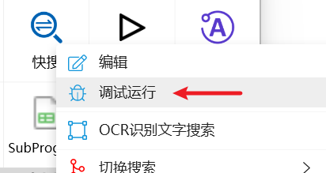
-   也可以在面板窗口或悬浮动作按钮上，按**右侧Shift键+点击动作按钮**以调试方式运行动作。（此方式也可用于调试动作的自定义右键菜单）
-   外部启动方式运行动作，可以可以使用 **quicker:debugaction:动作id/名称/动作库ID** 的命令行格式以调试方式启动动作。
-   做一个新的动作，在里面使用“运行或停止其它动作”模块，指定要运行的动作id或名称，并选中“调试模式运行”选项。可以使用此方式调试右键菜单参数。
    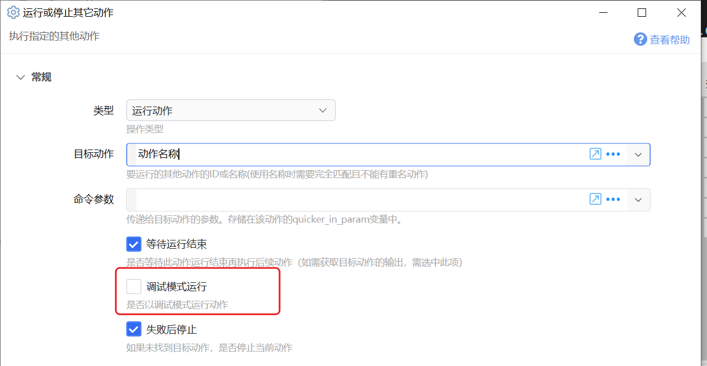

也开启自动调试运行某个动作（v1.38.43+），之后以任何方式触发动作都会以调试模式运行：

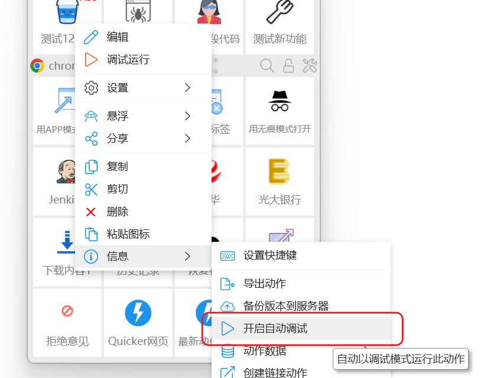

注：同一时间只能对1个动作开启自动调试；再次点击此处菜单可关闭自动调试，重启Quicker后自动调试设置也会失效。

Quicker将会执行动作并收集每个步骤执行过程中的相关信息。

动作执行后，Quicker会将过程信息输出到一个html网页格式的log文件，然后使用默认浏览器打开此网页（建议使用谷歌浏览器，IE会不支持网页里的动态交互）。

### 复制或上传调试文件

### 在编辑器中调试运行动作

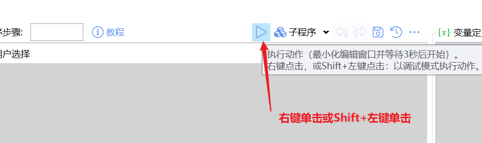

右键点击运行按钮即可调试运行动作。

### 调试部分步骤

如果某一段步骤不太依赖之前的变量值，可以单独调试这些步骤。

选择步骤后，点击鼠标右键打开菜单，然后按住Shift键点击“运行”菜单项。

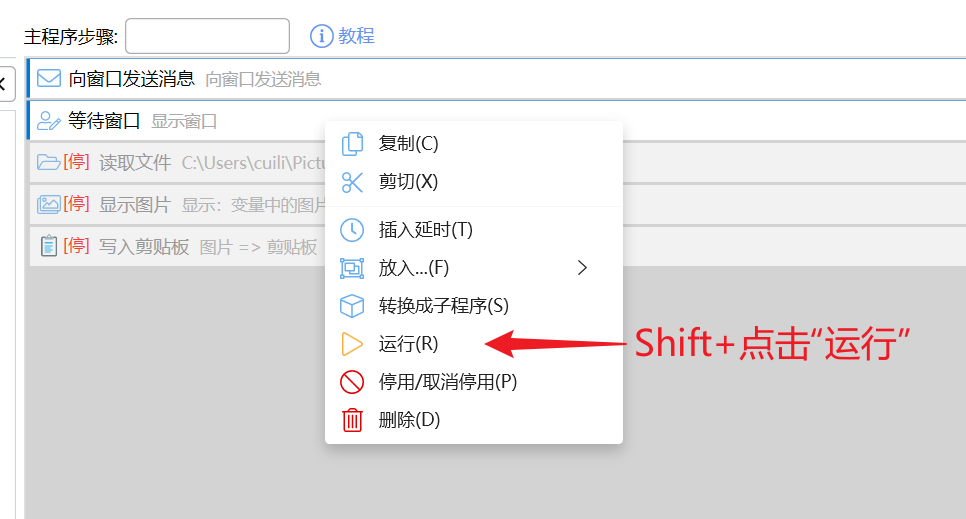

## 查看调试Log文件

通过log文件可以查看步骤的执行流程，以及每个步骤的输入参数和输出值。

文件为一个HTML格式的文本文件，调试完成后会自动使用默认浏览器打开。

### 调试文件的整体结构

调试文件分为文件头黑步骤执行流程列表两部分。

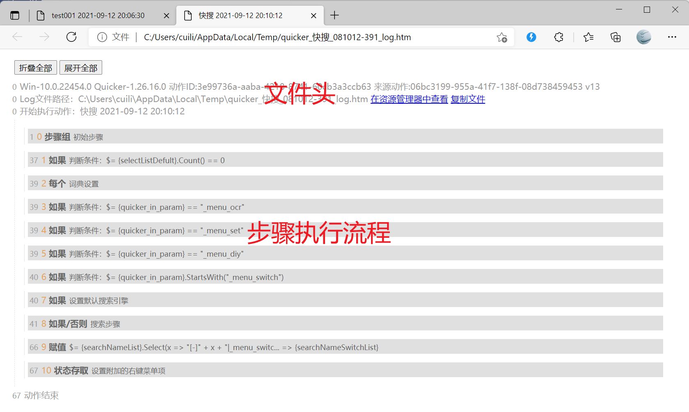

### 文件头

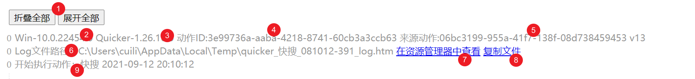

（1）展开或折叠所有的步骤；（2）Windows版本；（3）Quicker版本；（4）动作ID；（5）动作的对应动作库ID；（6）Log文件路径；（7）在资源管理器中定位log文件；（8）复制文件（然后可以在QQ对话窗口中等位置粘贴）

### 步骤信息

分为两个部分，步骤头和步骤详细信息。

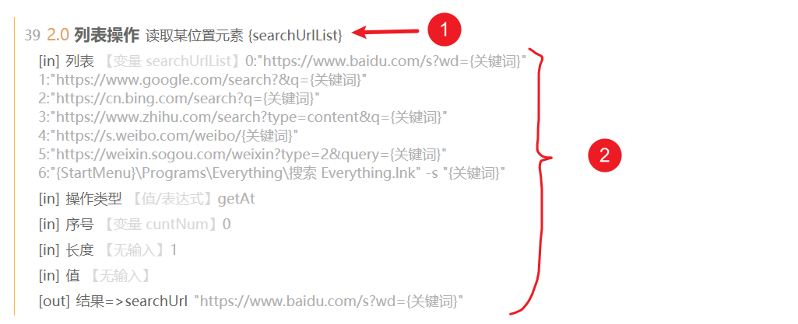

#### 步骤头

（1）运行到当前步骤的时间毫秒数（从动作启动开始）。

（2）步骤序号。点击步骤序号可以在动作编辑窗口中定位步骤。

（3）步骤名称。

（4）步骤摘要或注释。

点击步骤头可以折叠或展开当前步骤的详细记录信息。

#### 步骤详细信息

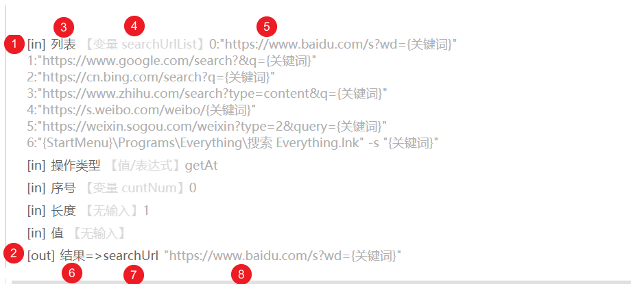

（1）\[in\]表示步骤的输入参数。

（2）\[out\]表示步骤的输出参数。

（3）输入参数的名称。

（4）输入方式，可能为

-   通过变量输入，显示为【变量 *变量名*】
-   制定值或表达式，显示为【值/表达式】。在上面悬浮鼠标，可以查看表达式的原始内容。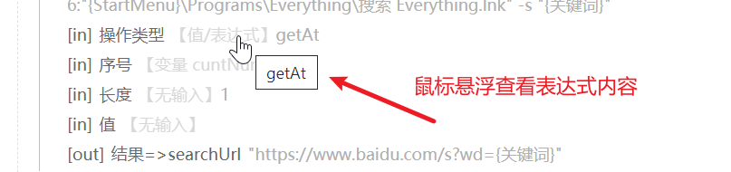

（5）传入的参数值，可能为变量的内容或表达式计算的结果。

（6）输出参数的参数名。

（7）输出到了哪个变量中。

（8）输出的内容。

注：输入输出内容在转换为HTML格式显示的时候，可能会有内容的变化或丢失，这里显示的仅供参考。如需获取准确的原始内容，可以使用其他方式（如将内容写入到文件中）。

#### 线条信息

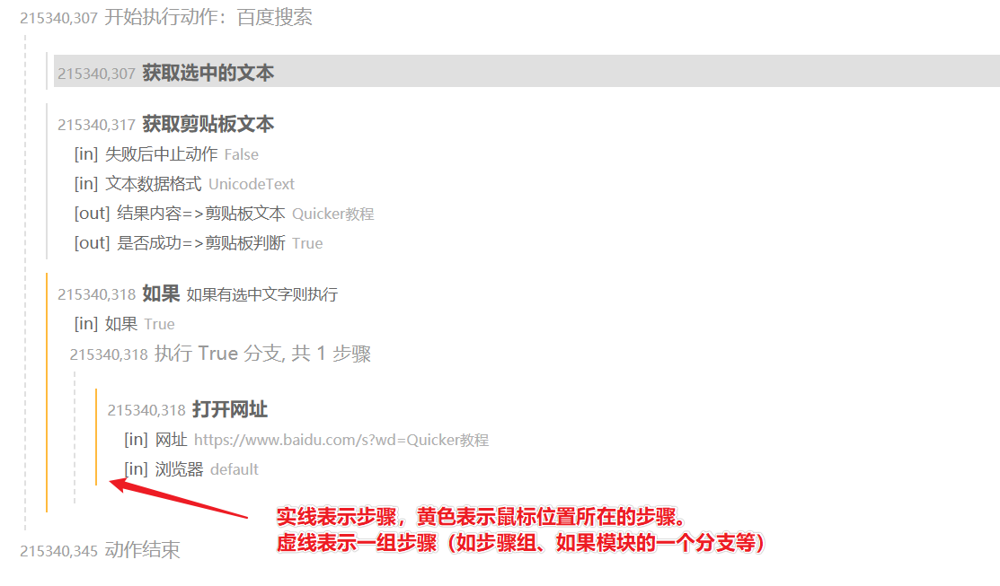

#### 展开和折叠步骤

（1）如果执行步骤较多或者每个步骤的输出信息较多，网页会比较长，不方便查找目标步骤。这时可以通过折叠功能将每个步骤收缩到1行。

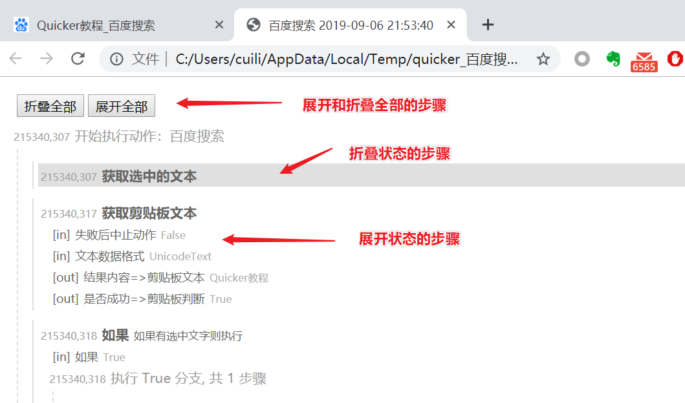

（2）折叠后的步骤会显示为灰色的底色，点击步骤名称可以展开或折叠此步骤。

（3）双击步骤前面的黄线，可以折叠此步骤。

### 分享调试文件

分享前，请确认您的调试文件内容中不包含敏感和隐私信息。

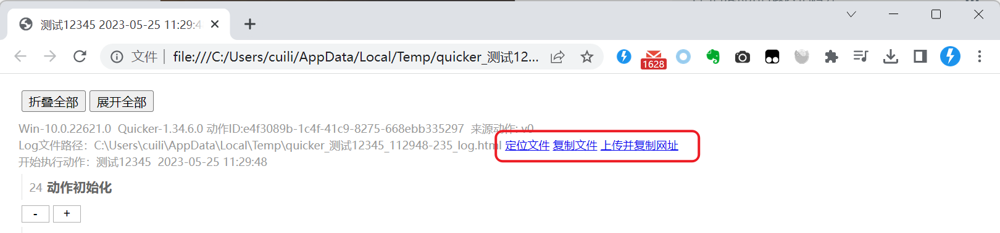

## 相关信息

### 跳过一些步骤的调试

如果动作比较复杂，可以根据需要跳过一些步骤的调试。

（1）步骤组：

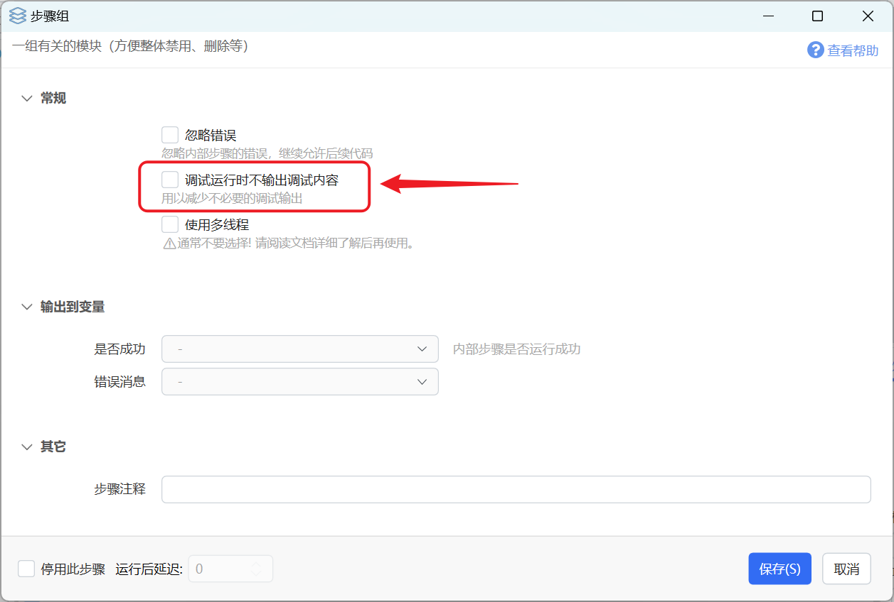

（2）子程序调用：

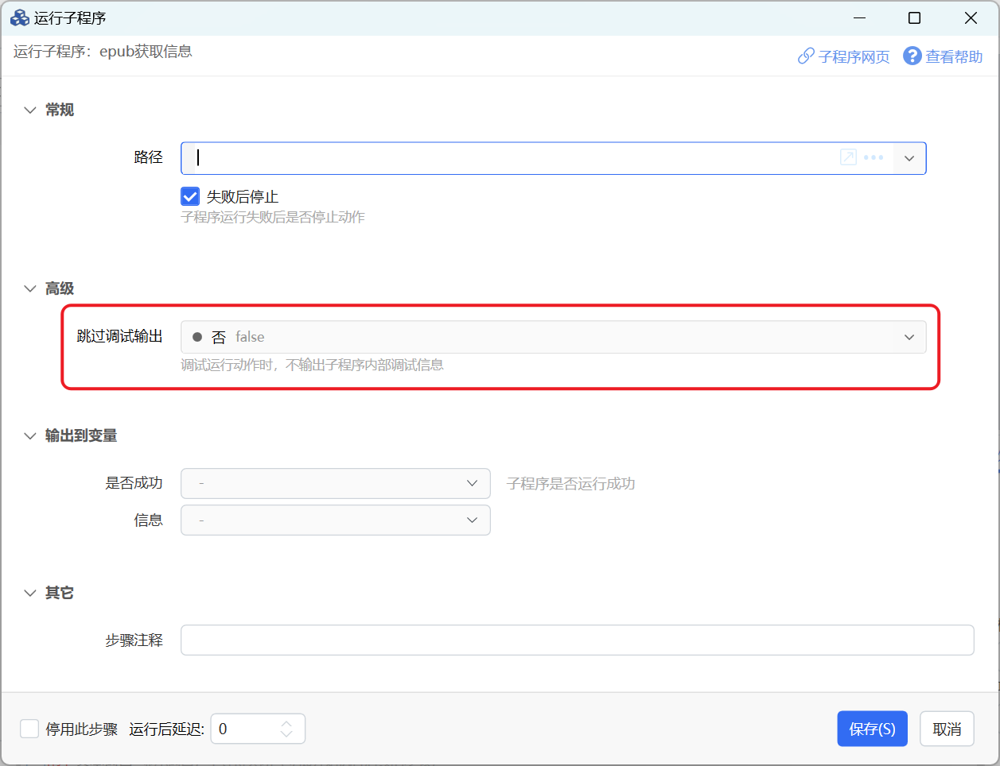

## 更新历史

-   20230525 增加跳过调试的一些说明。
-   20230816 增加自动调试说明。
