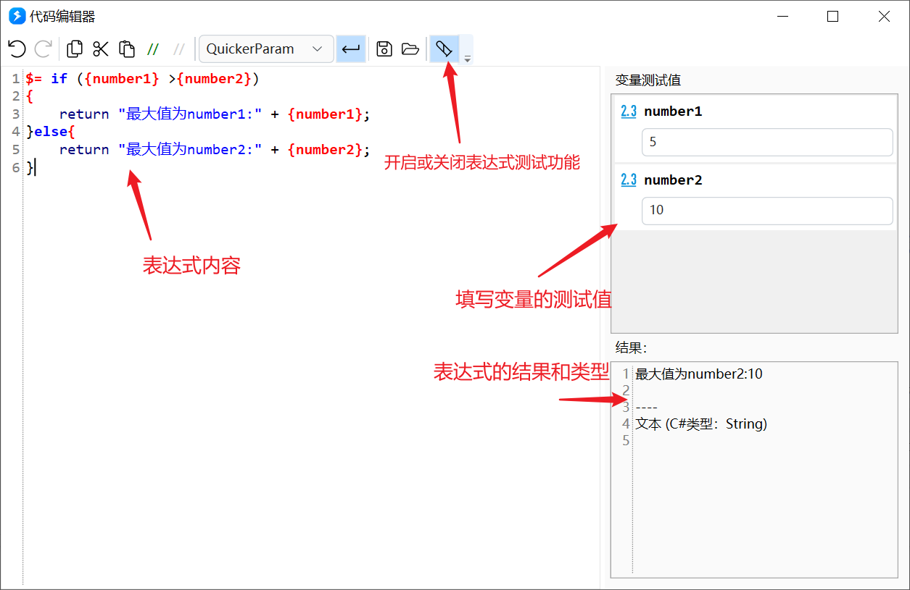
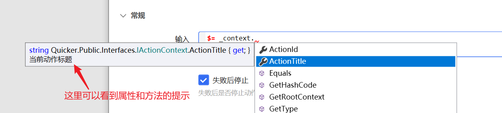

# 表达式高级话题

基础语法见 [表达式](/v2/xaction/concepts/expression)。本页讲复杂写法、编辑辅助和内置对象。

## 简单 vs 复杂

**简单表达式**：相当于赋值语句等号右边，如 `$= {数字变量} + 1`、`$= {数字变量} > 10`。

**复杂表达式**：相当于一个会 `return` 的方法：

```csharp
$=
if ({number1} > {number2})
{
  return "较大值为number1:" + {number1};
}else{
  return "较大值为number2:" + {number2};
}
```

## 辅助编写

参数框里按 **F1** 在原始值、`$$`、`$=` 之间切换，见 [选择或输入步骤参数](/v2/xaction/concepts/edit-step-param)。

### 补全与验证

补全会提示关键词和变量方法。在服务器端算，需要能上网。提示仅供参考：有的补全项表达式里不能用，有的能用的类型没有补全。


开启补全：


### 表达式测试

在代码编辑窗口写表达式时，右侧会列出用到的变量和当前计算结果，可改变量值看结果变化。



### 布尔表达式助手

「如果」等布尔参数右侧的铅笔可打开助手。

<ExpressionAssistPreview
  variable="count"
  operation="大于"
  paramTitle="比较值"
  paramValue="10"
/>


## 内置对象

### `_context`：动作上下文

用来读动作信息；必要时也能改变量，但不建议——改了的值不好调试。



属性：`ActionId`、`ActionTitle`、`IsRootContext`（是否主程序上下文；每个子程序运行时有自己的上下文）。

| 方法 | 作用 |
| --- | --- |
| SetVarValue / GetVarValue | 写 / 读变量 |
| TryGetValue | 没有该变量时返回默认值 |
| IsVarExists | 变量是否存在 |
| GetRootContext | 主程序上下文 |
| GetParentContext | 上一级子程序或主程序（1.37.24+） |
| RunSp | 跑子程序 |
| WriteState / ReadState | 动作状态 |
| WriteCache / ReadCache | 对象缓存（动作结束后仍留在内存，退出 Quicker 失效） |
| UpdateVariablesFromDict | 用词典更新变量，键是变量名（1.26.0+） |
| UpdateVariablesFromJson | 用 JSON 键值更新变量（1.26.0+） |

搜索框触发的动作可用 `$=_context.ExtraData?.ActiveWindowBeforeSearch` 取搜索窗出现前的活动窗口句柄（1.39.10+）。

### `_eval`

用来注册表达式里额外的类型，见 [Eval-expression 文档](https://eval-expression.net/)。要单独一步先注册，后面的步骤才能用。

### `_qk`

内置功能封装。

## 引擎已注册的类型

初始注册：

```csharp
EvalManager.DefaultContext.RegisterType(
                typeof(Regex),
                typeof(Path),
                typeof(System.Linq.Enumerable),
                typeof(JsonConvert),
                typeof(JArray),
                typeof(JObject),
                typeof(JToken),
                typeof(DateTime),
                typeof(CommonExtensions)
                );
```

另外还能用一部分引擎内部类型，例如 `System.IO.File` / `Directory`、`StringBuilder`、`Process`、`Encoding`、`DataTable` / `DataRow` 等。

## 限制与排障

- 补全失败先检查网络，再以实际运行为准。
- 不要在表达式里改变量，除非没有别的办法。
- `_eval` 注册的类型只对后续步骤生效。

## 相关链接

<RelatedDocs
  items={[
    {
      href: '/v2/xaction/concepts/expression',
      label: '表达式',
      description: '基础语法和运算符',
    },
    {
      href: '/v2/xaction/concepts/edit-step-param',
      label: '选择或输入步骤参数',
      description: 'F1 切换模式',
    },
    {
      href: '/v2/xaction/concepts/subprogram',
      label: '子程序',
      description: '_context 在子程序里各有一份',
    },
  ]}
/>
