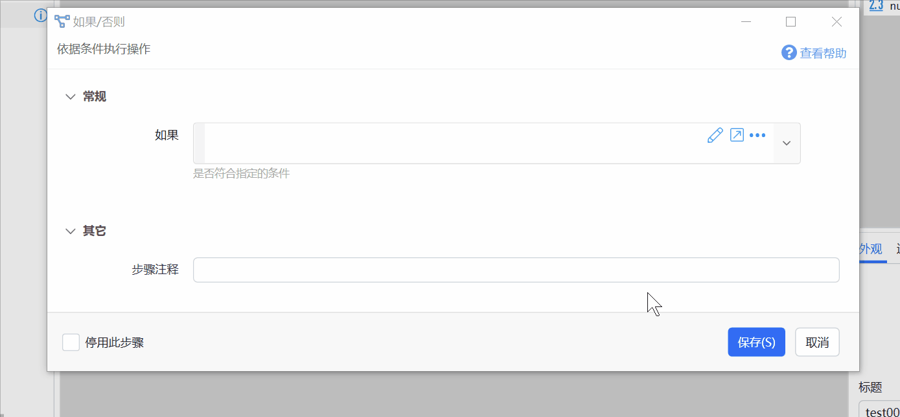

## 概要


### 简单表达式与复杂表达式

**简单表达式**：相当于一个C#赋值语句的等号后面的部分。例如：

-   返回变量值加1的结果：`$= {数字变量} +1`
-   判断变量值是否大于10：`$= {数字变量} > 10`

**复杂表达式**：相当于一个返回特定内容的C#方法。例如：判断两个数字之中的较大值：

```csharp
$=
if ({number1} > {number2})
{
  return "较大值为number1:" + {number1};
}else{
  return "较大值为number2:" + {number2};
}
```

## 辅助编写


### 快速切换到表达式模式

在参数输入框中按F1，可在表达式模式、插值模式、普通值模式之间快速切换。


### 表达式补全提示与验证

补全功能用于自动提示关键词、变量所支持的方法等内容。


**注意事项：**

-   补全功能在服务器端实现，需要您的电脑能正常访问网络。
-   补全内容与验证提示仅供参考。

-   表达式引擎不是一个完整的C#环境，有些补全提示的方法或关键词在表达式中不支持。
-   有一些在表达式中可以使用的类型，没有对应的补全提示。


**开启补全：**


### 表达式测试

在代码编辑窗口中编写表达式时，会自动开启“表达式测试”功能。


开启时，窗口右侧会显示表达式中所使用的变量的列表和表达式的计算结果。

可以修改变量的值，观察计算结果的变化。


### 布尔表达式助手

对于“[如果](/v2/xaction/modules/if)”等模块中需要判断条件的参数（布尔类型），Quicker提供了一个“布尔表达式助手”功能。



点击布尔参数右侧的铅笔图标即可打开。


## 在表达式中使用内置对象

### \_context：动作上下文对象

可以用于在表达式中访问动作信息。

在需要的时候也可以进行一些hack处理，比如通过表达式更新变量的值等。

注：除非特别必要，不要在表达式中更新变量值。通过表达式更新的内容无法调试观察，在遇到问题时不好定位。


属性：

-   ActionId：当前动作ID
-   ActionTitle：当前动作标题
-   IsRootContext：当前是否为主程序的动作上下文。（每个子程序在运行时会有自己的上下文对象）

方法：

-   SetVarValue：更新变量值
-   GetVarValue：获取变量值
-   TryGetValue：尝试获取变量值，如果不存在则返回指定的默认值
-   IsVarExists：变量是否存在
-   GetRootContext：获取主程序的上下文对象
-   GetParentContext：获取上一级子程序（或主程序）的上下文对象，自1.37.24版本提供。
-   RunSp：执行子程序
-   WriteState：写入动作状态
-   ReadState：读取动作状态
-   WriteCache：写入对象缓存。缓存对象在动作结束的时候仍然会保留在内存，可以在下次运行动作时取出。Quicker退出后缓存失效。
-   ReadCache：读取对象缓存。
-   UpdateVariablesFromDict：使用指定的词典对象更新变量。词典里key对应于变量名。(1.26.0+)
-   UpdateVariablesFromJson：根据Json文本中的键值对更新变量。方便使用json文本格式的动作参数更新多个变量的值。(1.26.0+)

搜索框触发的动作，可以在表达式中使用 $=\_context.ExtraData?.ActiveWindowBeforeSearch 获取搜索窗显示之前的活动窗口句柄。(1.39.10+)


### \_eval：表达式引擎对象

可用于在必要的时候注册在表达式中使用的其它类型。请参考表达式组件的[官方文档](https://eval-expression.net/)。

注意：

-   需要单独的步骤注册类型后，在后面的步骤里才可以使用这些类型。


### \_qk: 一些内置功能的封装


## 其它信息


### 表达式中支持的类型

表达式引擎初始注册的类型：

```csharp
EvalManager.DefaultContext.RegisterType(
                typeof(Regex),
                typeof(Path),
                typeof(System.Linq.Enumerable),
                typeof(JsonConvert),
                typeof(JArray),
                typeof(JObject),
                typeof(JToken),
                typeof(DateTime),
                typeof(CommonExtensions)
                );
```

还有一些表达式引擎内部注册的类型可以使用（部分）：

-   System.IO.Directory
-   System.Globalization.CultureInfo
-   System.Linq.Expressions.Expression
-   System.IO.FileInfo
-   System.IO.DirectoryInfo
-   System.IO.File
-   System.Text.RegularExpressions.Match
-   System.Collections.ArrayList
-   System.Text.StringBuilder
-   System.Linq.Enumerable
-   System.Collections.IEnumerable
-   System.Diagnostics.Process
-   System.Text.Encoding
-   System.Dynamic.ExpandoObject
-   DataSet、DataTable、DataRow、SqlDataReader、DataColumn、SqlDataAdapter、DbDataReader、DataView、SqlConnection

注：可以在VisualStudio调试环境中通过EvalContext对象的AliasTypes、AliasExtensionMethods等信息了解表达式中所支持的内容。
