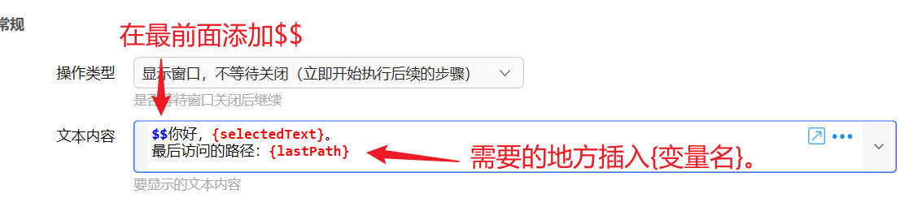

## 使用说明

### 概述

插值是指用**变量的内容**替换文本中的**&#123;****变量名****&#125;**。插值的结果是一段新的**文本**。


当参数输入框的内容以“**$$**”开始时（在输入框的最前面，不是每一行的前面，也不是每个变量的前面），对后面的内容进行插值处理（同时去掉开头的$$）。




#### 示例

假如变量&#123;Text&#125;的值为“Quicker”，那么下面的内容

-   在插值中使用一般变量（文本、数字、日期）

**$$****你好，****&#123;Text&#125;****！**

在插值后变为：

**你好，Quicker！**

-   在插值中使用词典变量

**方法1：****$$****&#123;词典变量\["key1"\]&#125;**

**方法2：****$$****&#123;词典变量.key1&#125;**

-   在插值中使用列表

**方法1：****$$****&#123;列表变量\[0\]&#125;**

**方法2：****$$****&#123;列表变量.0&#125;**


插值后得到的文本可能会做进一步处理才会得到最终的结果，具体的处理过程可以参考“[参数传递](/v2/xaction/concepts/parameters)”章节。

“列表”类型的变量，可以用 **&#123;变量名.序号&#125;** 的方式插入列表某个元素的值。序号以0开始。需要注意中间不能用额外的空白。

“词典”类型的变量，可以用 **&#123;变量名.键&#125;** 的方式插入某个键的对应值。需要注意中间不能用额外的空白。

剪贴板文本，可以使用 **&#123;\[cliptext\]&#125;** 的方式插入。

【注意事项】

-   &#123;&#125; 中的内容前后不能有多余的空格。比如这些都不会被插值处理：&#123; xxx&#125; &#123;xxx &#125; &#123; xxx &#125;。
-   &#123;&#125; 中不能包含“&#123;”或“&#125;”字符。
-   变量名必须紧跟&#123;开始。变量名后面可以为"&#125;"、“.”或“\[”，否则会造成在更改变量名时无法找到。每个&#123;&#125;内只能使用一个变量。
-   如果希望输出`$$`开始的纯文本内容而不是进行插值处理，可以改用表达式进行文本拼接，例如`$="$$" + {name} + "你好！"` 请参考[此贴](https://getquicker.net/QA/Question/10264)。

#### 变量表达式

【以下需1.9.5+版本支持】

有时候需要在输出时对变量内容做简单处理（如进行URL编码），可以通过以下方式进行：

以下红色部分为判断依据。

-   &#123;变量**.**方法(**)**&#125; 例如：

```
{文本变量.UrlEncode()}
可调用的方法以变量所对应的c#类型为准。文本类型另外支持UrlEncode()和UrlDecode()方法。
```


-   &#123;变量**\[**列表序号或词典Key\].....&#125; 例如：

```
{列表变量[0]}
{列表变量[0].ToUpper().UrlEncode()}
{词典变量["key1"]}
{词典变量["key1"].ToString().ToUpper().UrlEncode()}
```


-   &#123;表达式**\=**&#125; 会对表达式进行计算。（请不要在中间使用变量，否则在更改变量名的时候无法找到） 例如：

```
{3+3=} 输出“6”
{DateTime.Now.ToString("yyyy-MM-dd")=}
```


示例动作：[https://getquicker.net/sharedaction?code=aa38d2b9-f95b-4a91-d713-08d827485760](https://getquicker.net/sharedaction?code=aa38d2b9-f95b-4a91-d713-08d827485760)

### 插值嵌套

*自1.4.22版本之后开始支持。*

如果插值后得到的结果文本以“$$”或“$=”开始，则会对结果再次进行1次插值或表达式计算。得到的结果如下：

-   以“**$$$$**”开始：插值后对得到的内容再次插值。
-   以“**$$$=**”开始：插值后对得到的内容进行[表达式计算](/v2/xaction/concepts/expression)。
-   不支持先表达式后插值（$="$$&#123;变量&#125;"）！

### 组合成文本

请参考“[组合成文本](/v2/xaction/modules/formatstring)”模块说明。
