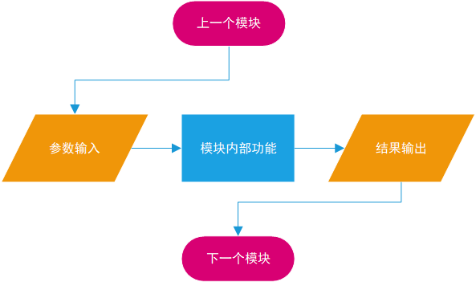
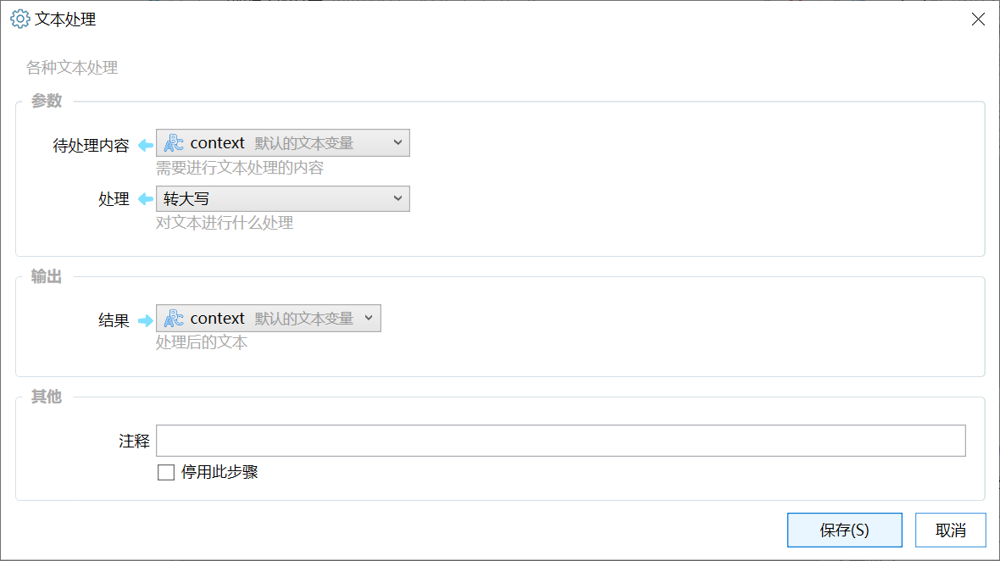
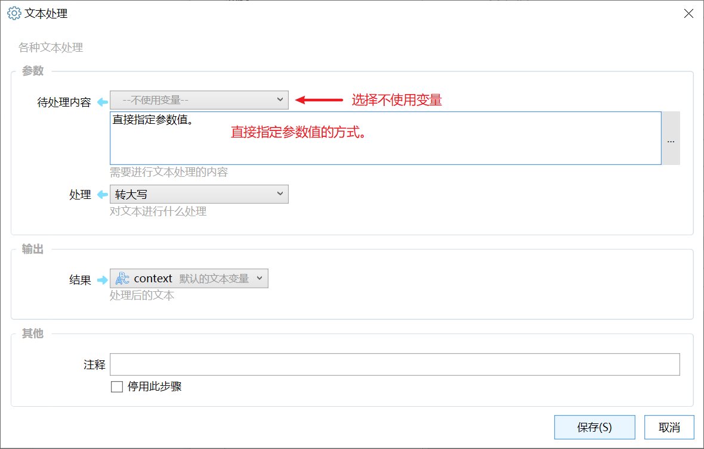
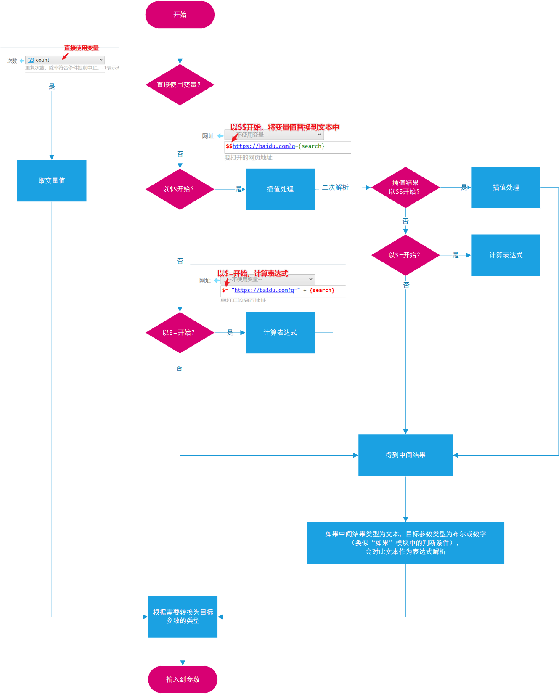
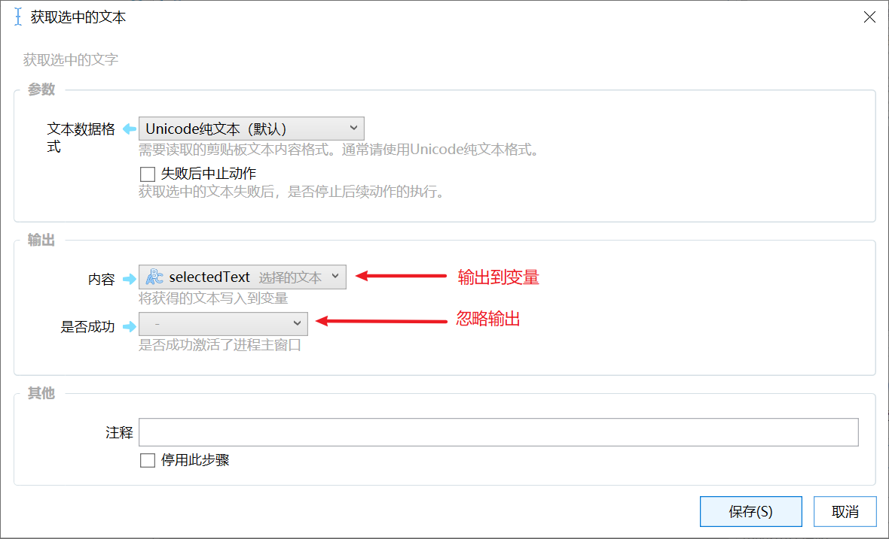

动作模块的作用通常是接受参数后，经过某个操作，将结果输出。

模块的设置窗口通常也是下面这样包含“（输入）参数”和“输出”部分。

## 输入参数

输入参数是提供给模块要处理的数据或控制模块执行的选项。

可以通过两种方式指定参数值：

-   使用变量：直接在变量下拉框中选择即可。
-   在输入框中指定：直接指定参数的值，支持 [$$插值（变量值代入）](/v2/xaction/concepts/interpolation)或 [$=表达式（计算结果）](/v2/xaction/concepts/expression)写法。

### 输入参数的计算过程

以下的参数计算过程适用于1.4.22以上版本。

-   如果使用变量，则取变量的值。
-   如果在输入框中指定，则进行如下处理：

-   如果指定的值以“**$$**”开始：进行插值处理。如果插值处理后的结果仍然以“**$$**”或“**$=**”开始，则进行二次插值或表达式解析。得到**中间结果**。
-   如果指定的值以“**$=**”开始：则进行表达式解析处理。得到**中间结果**。
-   没有以“$$”和“$=”开始，则此内容本身即为**中间结果**。
-   对于**布尔类型**（如“如果”模块的判断条件）**数字类型**（如“重复”模块的循环次数）的参数，则根据情况将中间结果当作计算公式解析。
-   将中间结果转换为目标参数的类型，赋值给参数。

提示：使用$$插值方式得到的中间结果是文本类型，$=表达式计算方式可以是任何类型。

## 输出参数

通常将步骤的结果输出到变量中。

直接选择目标变量即可。如果对某个输出不感兴趣，可以直接忽略（不选任何变量）。

在带有“失败后中止动作”参数的模块中，通常有“是否成功”的输出参数。结合这两个参数可以屏蔽出错时的提示消息，可参考：[https://getquicker.net/KC/Kb/Article/250](https://getquicker.net/KC/Kb/Article/250)

## 更新历史

-   修复暗色模式下文字颜色问题。
