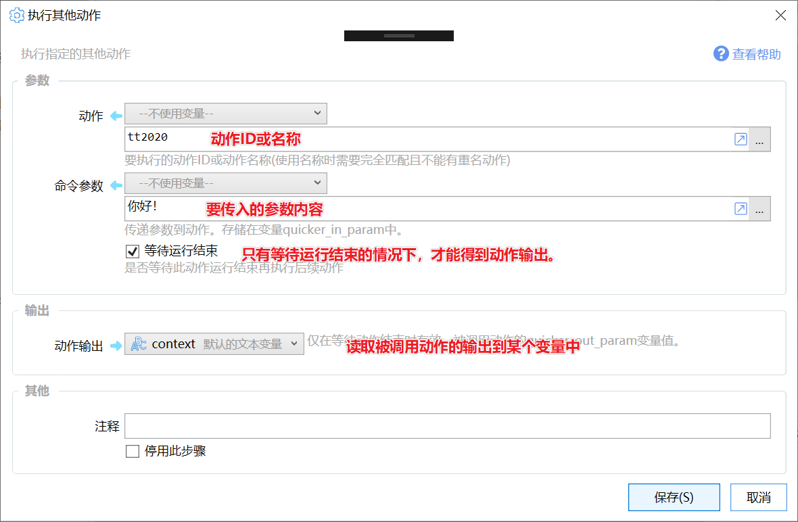
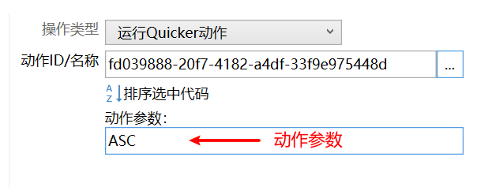
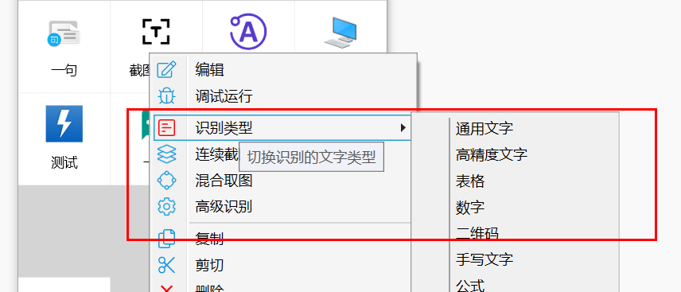
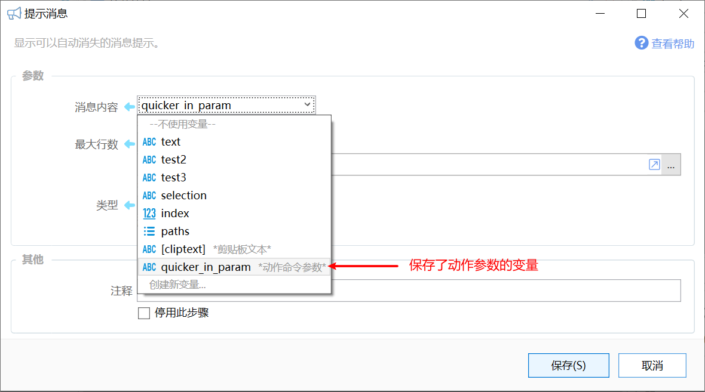
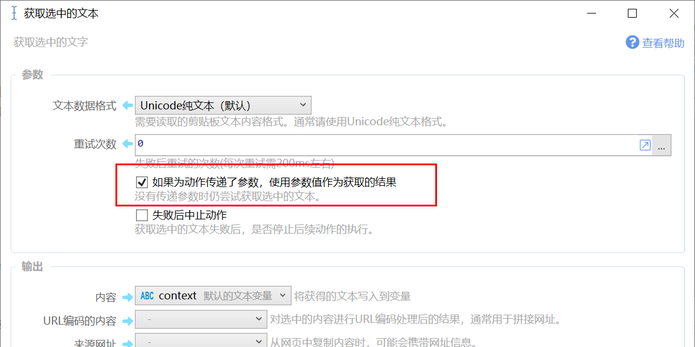
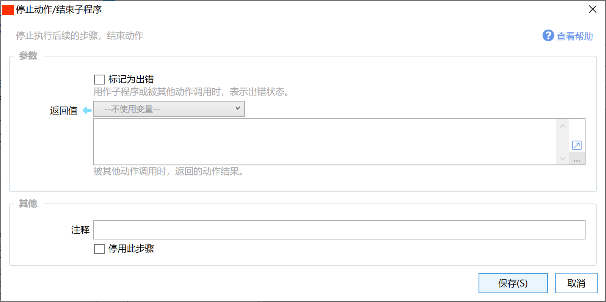
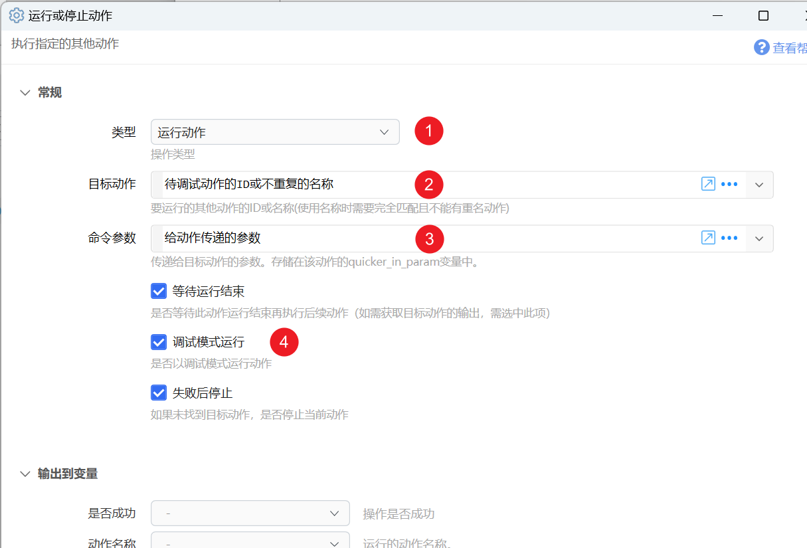

就像使用windows命令行命令一样，现在你也可以为Quicker动作传递参数。

注：从1.4.8版本中开始提供。


动作参数通常可以使用在下面的场景下：

-   为动作传递要处理的数据
-   指示动作执行某项操作（在动作根据参数判断要执行的操作类型）


## 如何给动作传入参数


### 外部调用

使用命令行等方式从Quicker外部调用动作（参考：[https://getquicker.net/kc/manual/doc/quicker-starter](https://getquicker.net/kc/manual/doc/quicker-starter)）：


***quicker:runaction:*****动作名称或ID或动作库ID** **参数内容**(参数前使用**空格**，可以有空格不能有换行)

***quicker:runaction:*****动作名称或ID或动作库ID****?****参数内容**(参数前使用**问号**，可以有空格不能有换行)


注意：使用动作名称调用时，动作名称不能有重复，名称中间不能有空格。


### 使用“运行其他动作”

在动作中调用其他动作时，可以传递参数：[runaction](/v2/xaction/modules/runaction)





### 在扩展热键/文本指令/轮盘菜单中传入参数



使用正则匹配的文本指令，会将匹配到的内容作为参数传递给动作。


### 使用自定义右键菜单传入参数

自定义右键菜单的实现原理是：运行动作并传入指定的参数。在动作中判断参数的值，从而执行对应的操作（如进入动作参数设置界面等）。

请参考：[/v2/xaction/concepts/action-custom-context-menu](/v2/xaction/concepts/action-custom-context-menu)




## 读取传入的参数

在被调用的动作中可以通过2种方式读取从传入的参数。


**方式1：通过quicker\_in\_param变量读取**




**方式2：在“获取选中文本”模块中开启选项“如果为动作传递了参数，使用参数值作为获取的结果”**

这种方式可以让动作同时兼容两种使用场景：

-   处理选中的文本内容（此时动作参数为空，动作取读取选中的内容）
-   处理其他调用传递的数据，如在文本指令中通过正则表达式匹配到的数据（此时动作参数不为空，直接将动作参数作当作选中的文本进行处理）




## 直接将内容传递给动作变量

需 1.41.0 + 版本。

通过特定的方式为动作传递参数，可以让Quicker自动解析并将对应的内容写入动作变量中。

**方式1：**使用QueryString格式，如`quicker:runaction:动作id或不重复的名称?write_to_vars=true&text=Hello&变量名=URL编码的值&...` 将会把“Hello”自动写入动作的“text”变量中。其中，`write_to_vars=true` 用于开启自动写入变量功能。

**方式2：**URL编码的词典json，其中需包含键为`write_to_vars`值为`true`的键值对用于开启写入变量功能。

如将下面的json进行URL编码后作为参数：

```
{
"text":"hello quicker",
"write_to_vars":true
}
```

得到的结果示例：

`quicker:runaction:动作id或不重复的名称?%7b%0d%0a%22text%22%3a%22hello+quicker%22%2c%0d%0a%22write_to_vars%22%3atrue%0d%0a%7d`


## 输出内容

被调用的动作如果需要返回结果，可以使用“[停止动作/结束子程序](/v2/xaction/modules/stop)”模块的“返回值”参数。




## 调试为动作传递参数的情况

创建一个新动作，在其中使用“运行或停止动作”模块。

1）选择运行动作。

2）填写要被调试的动作的ID或名称。

3）设置要传递的参数。

4）然后选中“调试模式运行”。

之后运行这个动作即可。


