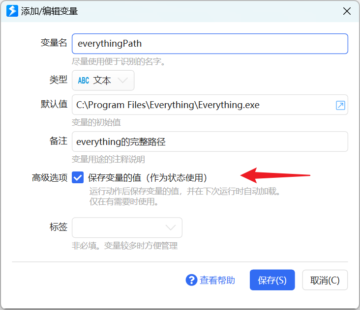
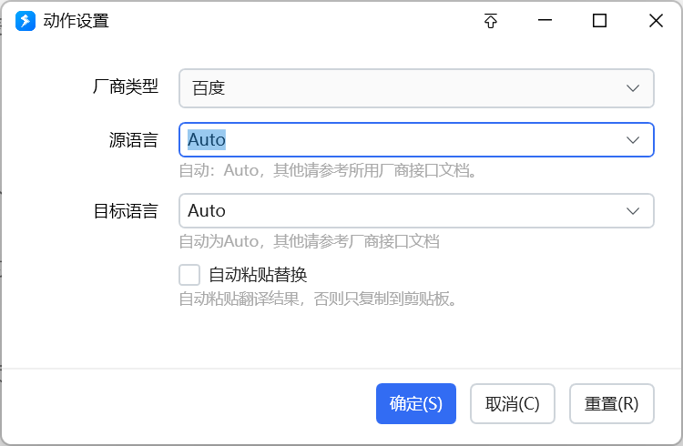
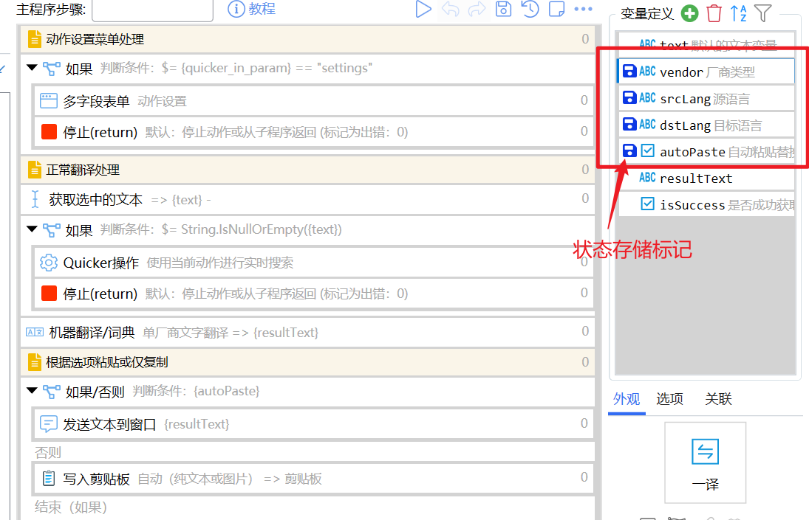
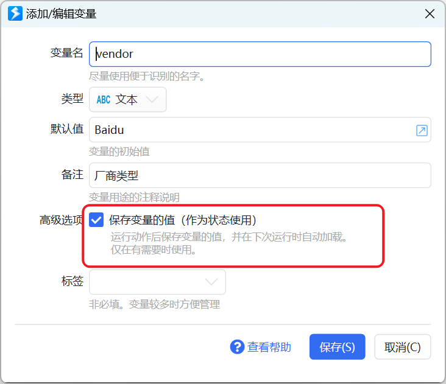
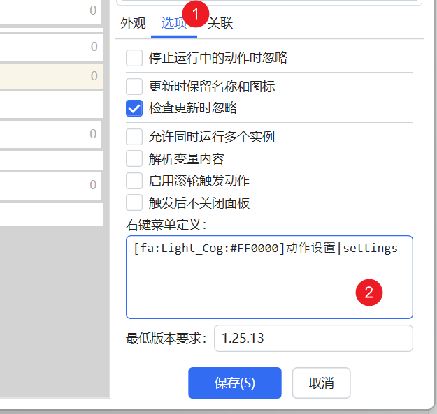
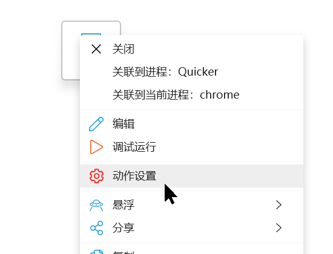
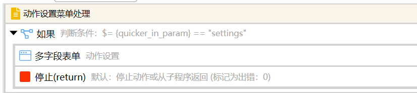
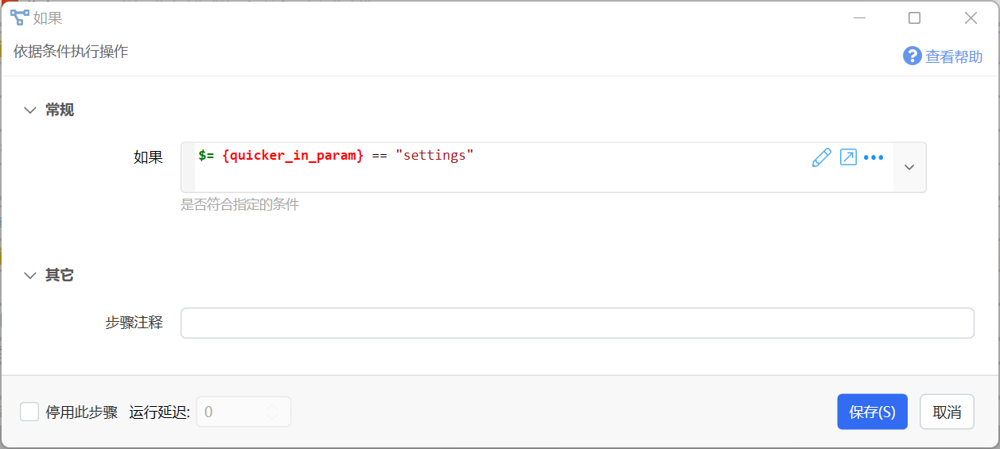
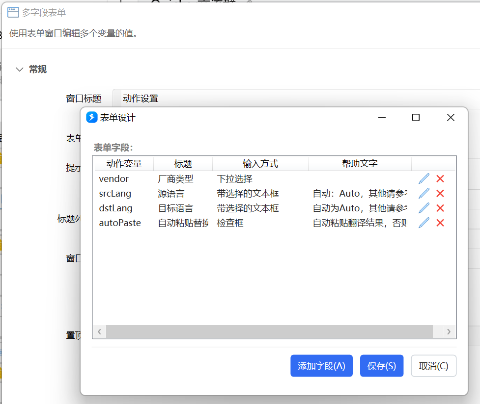
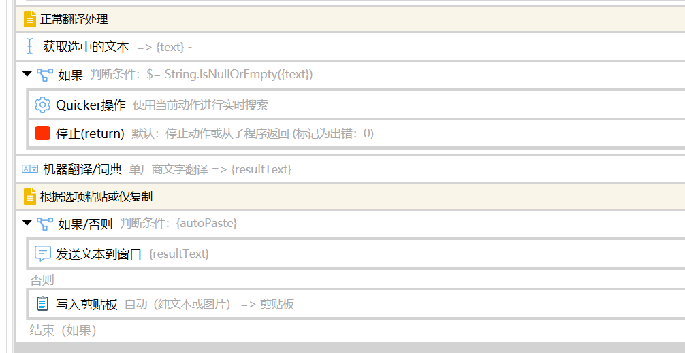

有些动作可能会需要允许使用者做一些自定义的设置，例如：

-   所依赖的某个程序的路径；
-   调用API服务接口所需要的账号凭据；
-   用户习惯设置；

相关内容：

-   [状态存取](/v2/xaction/modules/statestorage)：保存设置信息；
-   [表单](/v2/xaction/modules/form)：修改设置信息的界面；
-   [右键菜单](/v2/xaction/concepts/action-custom-context-menu)：为动作添加设置菜单；
-   [动作参数判断](/v2/xaction/concepts/quicker_in_param)：判断是否应该显示表单；

## 实现原理

**（1）为需要支持自定义设置的变量开启“保存变量的值（作为状态使用）”选项。**

开启此选项后，如果修改了变量的值，则下次运行动作时会自动使用这个值作为变量的初始值。

**（2）必要时，使用表单窗口等用户界面步骤，请用户修改变量的值：**

-   判断变量的值不合法时，如变量中未存储程序路径或路径不合法。
-   用户通过右键菜单启动了设置界面。
-   判断发现用户启动动作时按住了`Ctrl`键等。

## 示例动作

本教程将以“[一译](https://getquicker.net/Sharedaction?code=3b4e1cbc-9fbc-4686-764f-08d950c2afd2)”动作为示例，向您介绍如何在动作中实现自定义设置的存储和设置。

动作简介：使用指定的翻译引擎对选中的内容进行翻译。并根据设定，将翻译结果写入剪贴板或发送到窗口替换掉选择的文字。

在这个动作中，将添加这些用户自定义项：

### 1\. 定义要存储自定义设置的变量

在动作中，使用这些变量存储自定义设置：

-   vendor：存储选择使用的厂商
-   srcLang：翻译内容的源语言
-   dstLang：翻译内容的目标语言
-   autoPaste：是否自动粘贴翻译结果

例如，vendor变量的设置如下图所示：

### 2\. 使用右键菜单触发设置窗口

关于右键菜单，请参考《[为动作设计右键菜单](/v2/xaction/concepts/action-custom-context-menu)》。

在动作选项中，可以看到定义里右键菜单数据：

`[fa:Light_Cog:#FF0000]动作设置|settings`

它用于显示一个带有红色齿轮图标的菜单项“动作设置”，点击该右键菜单后，会触发动作并为动作传递参数settings。

在动作中判断输入参数是否为菜单项的值“settings”，如果是的话，就显示设置界面然后结束动作。

`{quicker_in_param}`是动作收到的参数。判断条件为：

条件符合时，使用[多字段表单](/v2/xaction/modules/form)窗口编辑4个变量值：

当参数值不是“settings”时，执行正常的动作逻辑：获取选中文本-&gt;翻译-&gt;输出结果：

