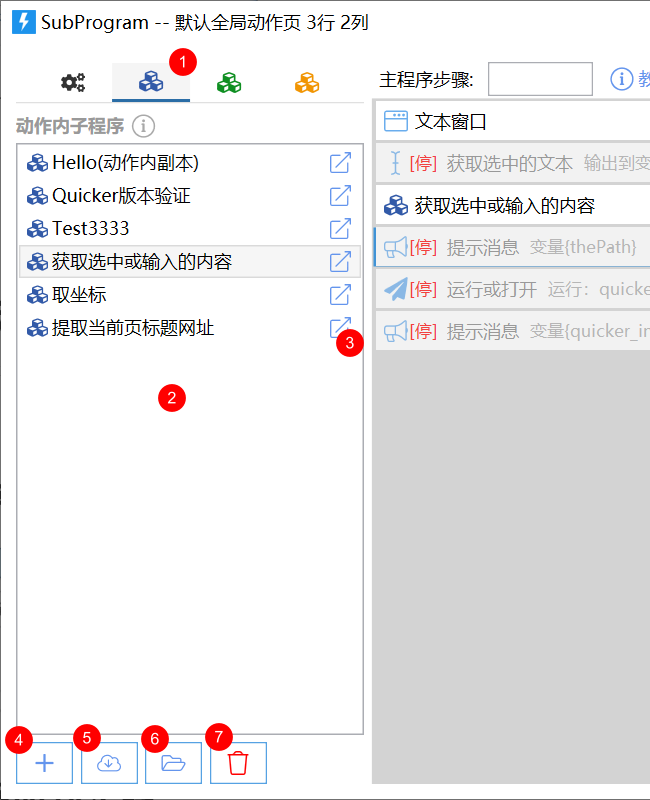

# 子程序

子程序像函数：把一组步骤和变量封成自定义模块。复杂动作才需要它——复用一段功能，或把大问题拆小。

| 类型 | 范围 | 存放 |
| --- | --- | --- |
| 动作内 | 仅当前动作 | 动作内部 |
| 公共 | 你的任意动作 | 动作外部，可同步 |
| 网络共享 | 网站子程序库 | 搜索后拖进步骤 |

用法和普通模块一样：拖到步骤列表，再设输入输出。

<ActionEditorPreview
  focus="toolbox"
  toolboxTab="flow"
  toolboxSearch="子程序"
  toolboxSelected="sys:subprogram"
  actionTitle="调用子程序"
  actionDescription="从工具箱拖入运行子程序"
  caption="将「运行子程序」拖到步骤列表（示意，悬停可暂停）"
  data={{steps: []}}
  dragDemo={{
    moduleKey: 'sys:subprogram',
    targetSlot: 'steps',
    afterData: {
      steps: [{key: 'sys:subprogram'}],
    },
  }}
/>

<ModuleParamPreview
  moduleKey="sys:subprogram"
  focusKeys={['subProgram']}
/>

## 定义与参数

子程序也由步骤和变量组成。它的变量和主程序**彼此独立**：每次运行都会初始化。可以和主程序用同名变量（尽量别这样）。传入列表、词典等复杂对象时，两边指向同一对象，子程序里改了主程序也会变。

给变量打上输入 / 输出标记，外部才能传值和拿结果。开始时给输入变量赋值；结束后把输出变量读回主程序。

<ActionEditorPreview
  caption="带用途标记的变量"
  focus="variables"
  data={{steps: []}}
  actionTitle="子程序示例"
  actionDescription="输入输出变量"
  variables={[
    {name: 'inputText', type: 'Text', usage: ['in']},
    {name: 'result', type: 'Text', usage: ['out']},
    {name: 'temp', type: 'Text'},
  ]}
  selectedVar="inputText"
/>

改了作为输入/输出的变量名后，请打开调用它的「运行子程序」步骤，重新绑参数。

<VariableDefPreview
  name="inputText"
  typeLabel="文本"
  remark="子程序输入"
/>

## 动作内子程序

只存在当前动作里。编辑器有单独标签：列表、新建、从网址/文件导入、清理未使用。

右键可高亮调用它的步骤（只高亮已展开的）、转成公共子程序、删除。

打开方式：列表上的打开钮、步骤行上的打开钮，或双击名称。

公共或网络子程序也可从步骤右键转成动作内，以便改内部定义。列表上还能重命名、复制、建副本；复制后可到别的动作的子程序列表空白处粘贴。

## 公共子程序

本地所有动作都能用。标签页里可筛选、新建、编辑、分享到库、查找哪些动作在用、复制为动作内、高亮、删除。

**不要分享含恶意内容的子程序，否则会停用帐号。**

## 网络共享

库地址：[https://getquicker.net/Share/SubPrograms](https://getquicker.net/Share/SubPrograms)

不会经管理员审核，用前请自己看内容。发现恶意子程序可发 197906@qq.com，奖励 1 年专业版兑换码。

可导入为动作内再改，或在「共享」标签搜索后直接拖进步骤。右键可查看定义或导入。

## 限制与排障

- 子程序变量默认互不影响；列表/词典按引用传，改了会回到主程序。
- 高亮调用步骤时，折叠着的步骤不会亮。
- 改了 IO 变量名却没重绑「运行子程序」，外部会传错或拿不到结果。

## 相关链接

<RelatedDocs
  items={[
    {
      href: '/v2/xaction/modules/subprogram',
      label: '运行子程序',
      description: '步骤上怎么调子程序',
    },
    {
      href: '/v2/xaction/concepts/variables',
      label: '变量',
      description: '输入/输出标记',
    },
    {
      href: '/v2/xaction/concepts/visibility-expression',
      label: '可见性表达式',
      description: '按参数显示或隐藏输入',
    },
    {
      href: '/v2/xaction/concepts/xaction-editor',
      label: '动作编辑器的使用',
      description: '子程序树在编辑器里的位置',
    },
  ]}
/>
