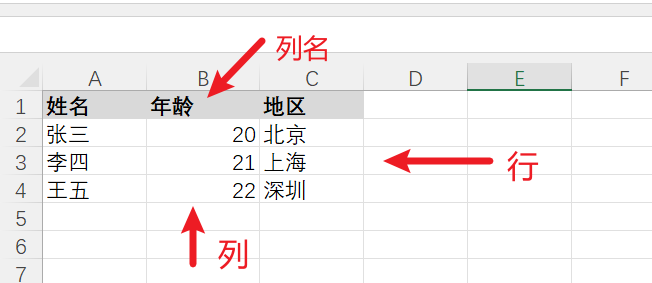
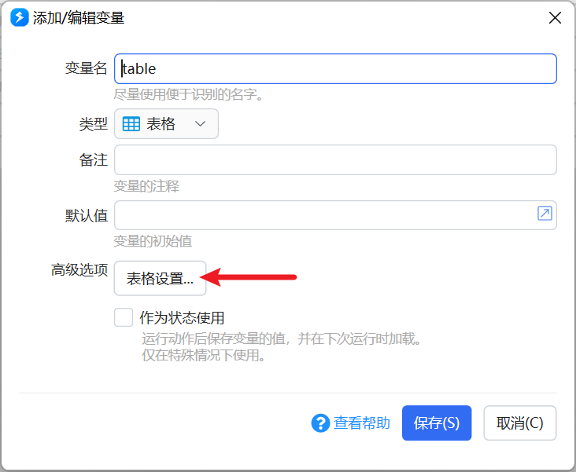
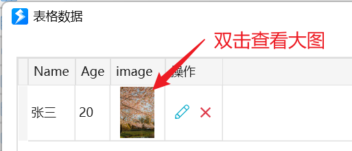
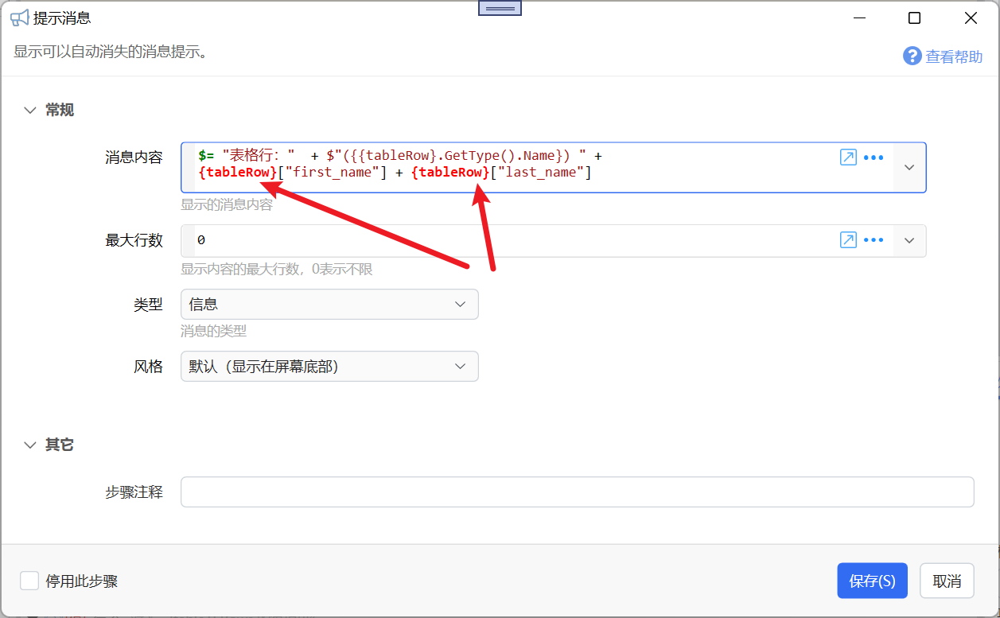

【本功能为预览状态，欢迎反馈问题】文档编写中....

表示一个二维数据表。内部为一个[System.Data.DataTable](https://docs.microsoft.com/en-us/dotnet/api/system.data.datatable?view=net-6.0)对象。

表格变量存储的信息类似于一个包含标题行的Excel工作表，按行存储数据，每一行中的不同列存储一个特定的属性值。

| 列名 → | **姓名** | **年龄** | **地区** |
| --- | --- | --- | --- |
| 行 | 张三 | 20 | 北京 |
| 行 | 李四 | 21 | 上海 |
| 行 | 王五 | 22 | 深圳 |

上表中，表头是**列名**；纵向一列是**列**；横向一条记录是**行**。

**表格大概可以分为两种常见的使用方式：**

（1）在Quicker中管理表格中的数据。需要预先定义好列信息（名称、类型、编辑方式等）。

（2）从数据库或CSV、Excel文件中读取和临时使用表格数据，不需要进行更新和管理。这种情况下不需要预先定义列信息。

**相关操作模块**

-   [表格数据操作](/v2/xaction/modules/tableoperation)
-   [数据库查询（将结果数据输出到表格变量）](/v2/xaction/modules/dboperation)

## 通过Quicker管理简单的表格数据

如果需要在动作中管理数据，可以参考本部分内容。

您需要对数据库相关概念有一些了解。

### 定义表格列信息

[查看演示视频](https://files.getquicker.net/_actionDemos/dbc44023-8781-4dba-fdf7-08d7bd42a32f/20211224092843_%E5%AE%9A%E4%B9%89%E8%A1%A8%E6%A0%BC%E5%AD%97%E6%AE%B5.mp4)

创建或编辑表格变量时，点击“表格设置...”按钮即可打开表格的设置界面。

在表格字段设置窗口中，可以添加、编辑或删除字段（列）。

<TableFieldPreview
  fields={[
    {key: 'Id', title: 'Id', type: '文本', unique: true, autoIncrement: true},
    {key: '名称', title: '名称', type: '文本'},
    {key: '说明', title: '说明', type: '文本'},
    {key: '图标', title: '图标', type: '文本'},
    {key: '注释', title: '注释', type: '文本'},
  ]}
/>

添加或编辑一个列：

<TableFieldPreview
  field={{
    key: '注释',
    title: '注释',
    type: '文本',
    allowNull: true,
    inputMode: '单行文本框',
    maxLength: 0,
  }}
/>

此界面分为两个主要部分，“基础信息”用于设置数据的类型和限制。“编辑设置”用于定义在添加或编辑行的时候所使用的界面（类似于表单模块）。

一些基本的设置参数含义如下：

-   **列名**：内部存储数据时的列名（类似于词典的键，在表达式中访问某一列时，需要使用此列名。建议使用英文单词。）
-   标题：列的显示名。
-   自动计算公式：用于根据其它列的值自动生成本列的值。 内部对应于c# [DataColumn类型的Expression属性](https://learn.microsoft.com/zh-cn/dotnet/api/system.data.datacolumn.expression?view=net-8.0)。这里直接写计算公式，列名可直接用`列名`或`[列名]`，例如：`price * 0.0862`、`price + tax`。注意这里不要写quicker的表达式`$=...`。
-   扩展设置：一些特殊功能支持参数。[示例动作](https://getquicker.net/Sharedaction?code=8ad1e7b0-5ce8-4d57-fa45-08dcdc2c1d1a)

-   `image:50` 在表格的“查看或编辑数据”窗口中，使用图片显示该列的值（文件路径或网址），image后面的数字表示显示缩略图的宽度。双击缩略图可以查看大图。（v1.43.24+版本支持）
-   `link:`将单元格的当做路径或网址打开。（1.43.25+版本）
-   `link:格式化字符串`使用格式化字符串，将单元格的值格式化后得到的结果当做网址或路径打开。格式化字符串中使用`{0}`表示单元格的值。如： `link:https://www.baidu.com/s?wd={0}`点击后使用百度搜索单元格的值。（1.43.25+版本）
-   `link:sp:子程序名`点击后调用子程序，并将当前单元格的值传入`input`输入参数，将当前行的各属性和值作为词典传入`row`输入参数中。子程序尽量避免再使用界面交互，以免造成死锁。（1.43.25+版本）

## 临时存储表格数据

如果不需要对表格数据进行管理，可以不定义表格的列信息。

此时表格仅用于临时存储从其它位置读取的二维数据信息。

### 加载数据到表格变量

（1）通过表格数据操作模块，读取Excel、csv或json数据。

（2）通过 [数据库查询](/v2/xaction/modules/dboperation) 模块，将查询结果存入表格

### 遍历表格数据

可以通过“每个”模块循环循环访问表格的每一行。

在“列表”参数中，通过表达式 `$= {表格}.Rows`传入DataRow的集合。

参数示意（「每个」模块）：

<ModuleParamPreview
  moduleKey="sys:each"
  focusKeys={['input', 'item']}
  values={{input: '$={table1}.Rows'}}
  outputVars={{item: 'tableRow'}}
/>

步骤结构示意（只读）：

<StepProgramView
  showParams
  data={{
    steps: [
      {
        key: "sys:each",
        inputs: {input: "$={table1}.Rows"},
        outputs: {item: "tableRow"},
        note: "遍历表格行",
        ifSteps: [
          {
            key: "sys:notify",
            inputs: {
              message:
                '$= "表格行: " + {tableRow}["first_name"] + {tableRow}["last_name"]',
            },
          },
        ],
      },
    ],
  }}
/>

每次循环，会将一行数据放入“项”输出参数中指定的变量中。

变量可以为词典或对象类型。赋值到词典变量时会进行自动转换，赋值到对象时，内部为DataRow类型。

注意：不可以在循环中修改当前表格中的数据。如果有需要修改原始表格的情况下，可以使用 $= (&#123;表格&#125;.Copy()).Rows 创建临时数据副本进行循环。 请[参考此帖子](https://getquicker.net/Common/Topics/ViewTopic/35134)。

无论哪种类型，都可以在循环内部使用类似于词典变量的方式（`行变量["列名"]`）获取该行中某一列的信息。

例如在循环子步骤里用「提示消息」显示当前行字段（红箭头标出的是行变量）：

## 注意事项

-   表格变量被设计为读取后不会被赋值，只可对其内容进行修改。所以不支持将其它内容赋值给表格变量、不支持通过状态存取等模块将内容放入表格变量。

## 其它信息

表格作为状态存储时使用JSON格式。

## 更新历史

-   20240529 修正拼写错误。
-   20240905 增加自动计算公式的说明。
