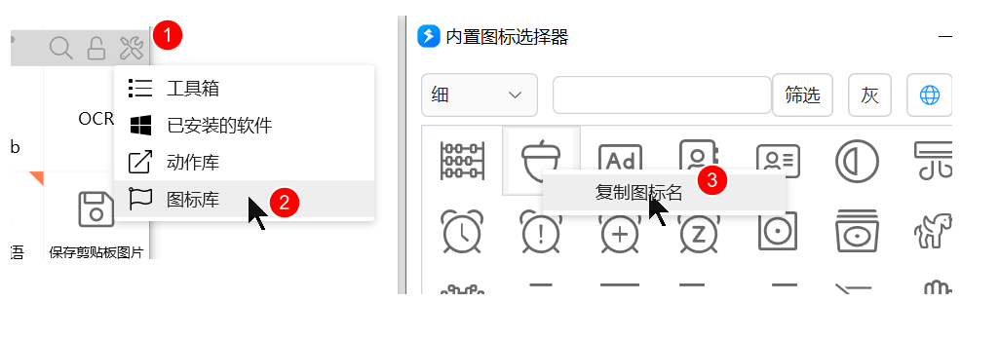

# 在动作中使用图标

很多界面可以给条目加图标：自定义右键菜单、文本窗口菜单、用户选择的选项、搜索结果等。

<ContextMenuPreview
  openPath={['复制']}
  items={[
    {label: '复制', icon: 'fa:Light_Copy:#6aaded'},
    {label: '剪切', icon: 'fa:Light_Cut:#6aaded'},
    {type: 'separator'},
    {label: '用百度搜索', icon: 'fa:Solid_Search:#2b7abf'},
    {label: '打开网址', icon: 'fa:Light_Globe:#39b54d'},
  ]}
/>

常见格式：`[图标]标题文字(Tooltip内容)`。`[图标]` 和 `(Tooltip)` 都可省略。

## 内置矢量图标

- 系统颜色：`[fa:图标名]`，如 `[fa:Solid_Pen]`，颜色跟外观里的「默认矢量图标颜色」。
- 自定义颜色：`[fa:图标名:#RRGGBB]`，如 `[fa:Solid_Pen:#FF0000]`。

面板腰栏工具菜单可打开图标库，复制图标名。

## Windows 系统图标

格式 `[icon:path]`，`path` 可以是：

- 扩展名：`[icon:.docx]`
- 文件名（不必真实存在）：`[icon:一个可能不存在的文件.docx]`
- 文件或文件夹完整路径
- exe / lnk 完整路径
- DLL 里的图标：`[icon:%windir%\system32\mmres.dll,-3017]`

## 网络或本地图片

建议不超过 64×64，以免拖慢界面。本地路径只在你这台电脑上有效，换机或分享后会丢。

格式：`[url:图片网址或本地路径]`。

## 其它

| 写法 | 版本 | 说明 |
| --- | --- | --- |
| `[previmg:图片完整路径]` | 1.28.12+ | 预览较大图，也不锁文件 |
| `[action:动作名称或ID]` | 1.36.17+ | 用动作图标；按名称时不能重名，名称里不能有 `[]` |
| `[text:字符:#RRGGBB:字体]` | 1.40.29+ | 如 `[text:Aa:#FF0000:Arial]`；字体图标用 HTML 编码。只能用在动作内部，不兼容旧版。可省略字体：`[text:Xy:#FF0000]` |

## 限制与排障

- 本地 `[url:…]` / `[previmg:…]` 分享后别人看不到。
- `[text:…]` 不能当动作本身的图标。
- 矢量名写错会变成空白或回退字形。

## 相关链接

<RelatedDocs
  items={[
    {
      href: '/v2/xaction/concepts/action-custom-context-menu',
      label: '为动作设计自定义右键菜单',
      description: '菜单项就用这种图标写法',
    },
    {
      href: '/v2/xaction/modules/userselect',
      label: '用户选择',
      description: '选项也可以带图标',
    },
    {
      href: '/v2/xaction/concepts/public-api',
      label: '公共API',
      description: 'fa: 转 PNG 的辅助服务',
    },
  ]}
/>
