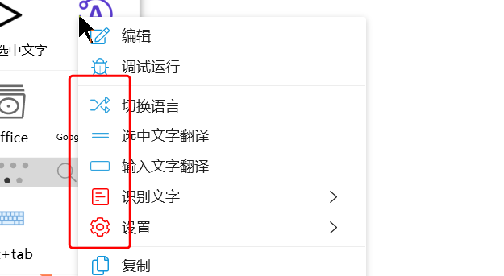
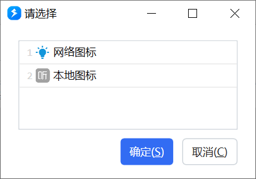

在Quicker的许多地方，可以为界面元素添加图标：

-   动作的自定义右键菜单（如上图所示）
-   文本窗口的自定义操作和菜单
-   用户选择模块的选项
-   搜索结果项
-   等

在这些地方，通常使用`[图标]标题文字(Tooltip内容）`的格式定义相关信息。其中`[图标]`和`(Tooltip文字)`为可选内容。

可以使用如下的内容定义图标：

## 使用内置矢量图标

**格式1，使用系统颜色：\[fa:图标名\]**

如：\[**fa:**Solid\_Pen\] 此时图标的颜色使用系统外观中设置的“默认矢量图标颜色”。

可以在面板窗口腰栏上的工具菜单中打开图标库，然后选择并复制图标名称。

**格式2，使用自定义颜色：\[fa:图****标****名:#RRGGBB\]**

如：\[**fa:**Solid\_Pen**:#FF0000**\]

给图标设定固定的颜色值，格式为#RRGGBB。

## 使用Windows系统图标

可用于显示文件类型图标、文件夹图标，或exe程序、快捷方式的图标。

格式为：\[icon:*path*\]

path可以为：

-   扩展名，如：\[icon:**.docx**\]
-   文件名（不需要一定存在），如：\[icon:**一个可能不存在的文件.docx**\]
-   文件、文件夹的完整路径，如：\[icon:**C:\\Users\\me\\documents\\\_个人\\UI设计草图模版.pdf**\]
-   exe或lnk(快捷方式)文件的完整路径，如：\[icon:**C:\\Program Files\\Quicker\\Quicker.exe**\]
-   DLL文件中的图标，如：\[icon:**%windir%\\system32\\mmres.dll,-3017**\]

## 使用网络图标或本地文件图标

💡 建议图片分辨率不高于64\*64，避免文件太大影响性能。

💡 本地文件图标仅在特殊情况下使用（图标路径仅在您的电脑上存在，更换电脑或分享动作后将无法显示）。

格式为：\[url:**图片网址或本地图标文件路径**\]

例如：\[url:[https://files.getquicker.net/\_icons/16931C1879F45F2388D394803788F8A55287A1E2.png](https://files.getquicker.net/_icons/16931C1879F45F2388D394803788F8A55287A1E2.png)\]

\[url:C:\\Users\\cuili\\AppData\\Local\\Quicker\\ImageCache\\2D1F29BACD274FB67D9BAD7A094407C9841374D4.png\]

## 预览图片文件

（1.28.12+）

格式为：`[previmg:图片文件完整路径]`

此方式可用于预览较大尺寸的图片，也可以避免锁定图片文件。

## 显示动作图标

(1.36.17+)

格式为：`[action:动作名称或ID]`

使用动作名称时，不能存在有重复名称的动作。名称中间不能存在中括号字符。

## 使用文字图标

(1.40.29+)

格式为：`[text:字符:#RRGGBB:字体名称]`，例如`[text:Aa:#FF0000:Arial]`。使用字体图标时，用HTML编码指定图标字符，例如：`[text:&#xE703;:#FF0000:Segoe MDL2 Assets]`。 注意：(1)只能在动作内部使用，不能给动作设置这样的图标；(2)不兼容旧版本Quicker；（3）可忽略字体名称部分，如`[text:Xy:#FF0000]`。
