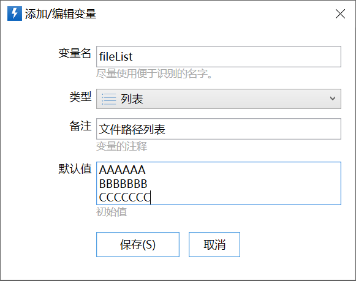

列表类型用于存储一组字符串。

例如选中的多个文件的路径就可以看作一个列表。这个列表的每一项，就是一个文件的完整路径。

列表在实际应用中使用非常广泛。

## 变量定义

创建变量时，选择“列表”类型即可。

列表的默认值可以使用多行文本的方式填写，每行表示列表的一项。

## 列表和多行文本的转换

### 自动转换

-   在需要文本变量的地方输入列表变量，列表会自动转换成多行文本的形式。

### 拆分文本为列表

对于使用某个分隔符分开的一段文本，可以使用“[拆分文本为列表](/v2/xaction/modules/splitstring)”模块将其转换为列表。

例如：

"AA,BB,CC" 可以根据分隔符“,”拆分成包含“AA”“BB”“CC”三项的列表。

### 列表合并成文本

[使用指定的分隔符将列表合并成一段文本](/v2/xaction/modules/joinlist)。

如一个列表包含“AA”“BB”“CC”三项，可以使用“,”分隔符合并为"AA,BB,CC"。

## 在表达式中使用列表

-   获取列表的某一项： $= &#123;列表变量&#125;\[*序号*\]  其中，序号是表示要获取第几项的值，从0开始计数。例如：

-   **$= &#123;列表变量&#125;\[0\]**     取列表第一项的值。
-   **$= &#123;列表变量&#125;\[(int)&#123;序号变量&#125;\]**     使用变量指示获取某一项，序号变量类型需要为整数数字类型。（*后面的内容看不懂也没关系：*）因为整数数字在内部使用了long类型，但是列表的\[序号\]操作不支持long类型，所以需要使用(int)强制转换一下。

-   取列表的长度（项数）：**$= &#123;列表变量&#125;.Count()**

## 相关模块

-   [列表合并成文本](/v2/xaction/modules/joinlist)
-   [拆分文本为列表](/v2/xaction/modules/splitstring)
-   [列表操作](/v2/xaction/modules/listoperations)
-   [获取选择的文件列表](/v2/xaction/modules/getselectedfiles)
-   [获取剪贴板文件列表](/v2/xaction/modules/getclipboardfiles)

## 示例动作

-   [修改列表每一项](https://getquicker.net/Sharedaction?code=840b5f51-e57c-4141-a270-08dc0740f11f)
