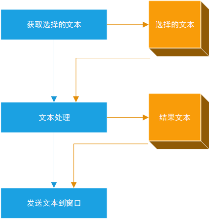
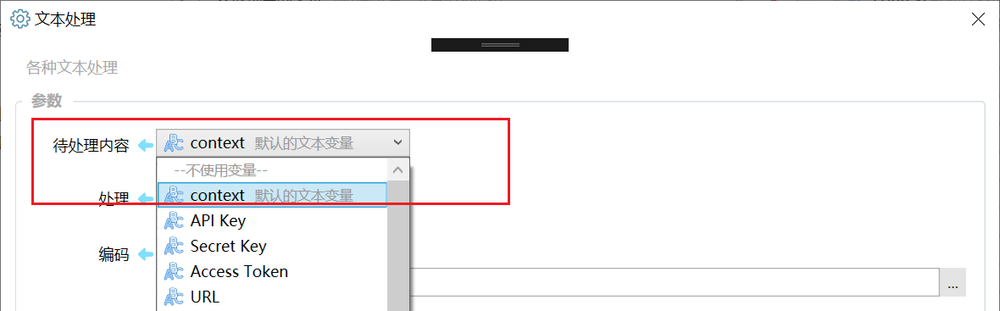
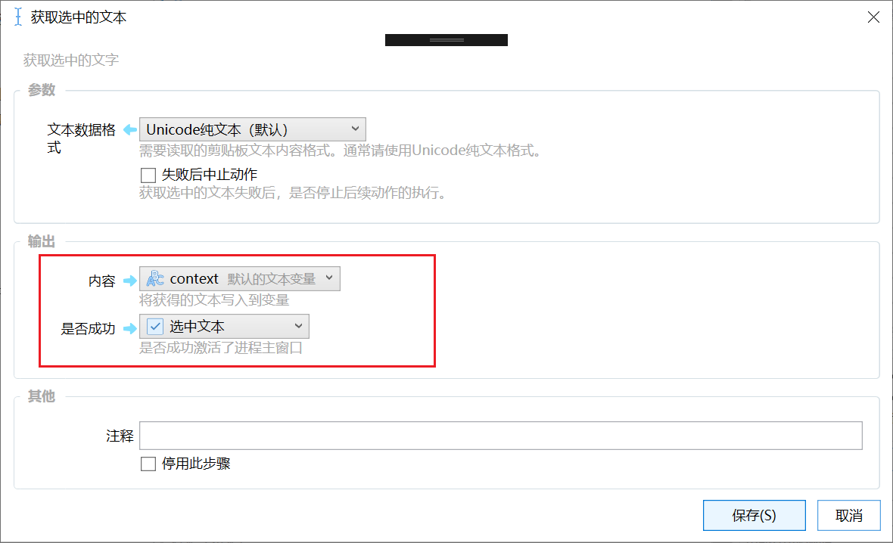
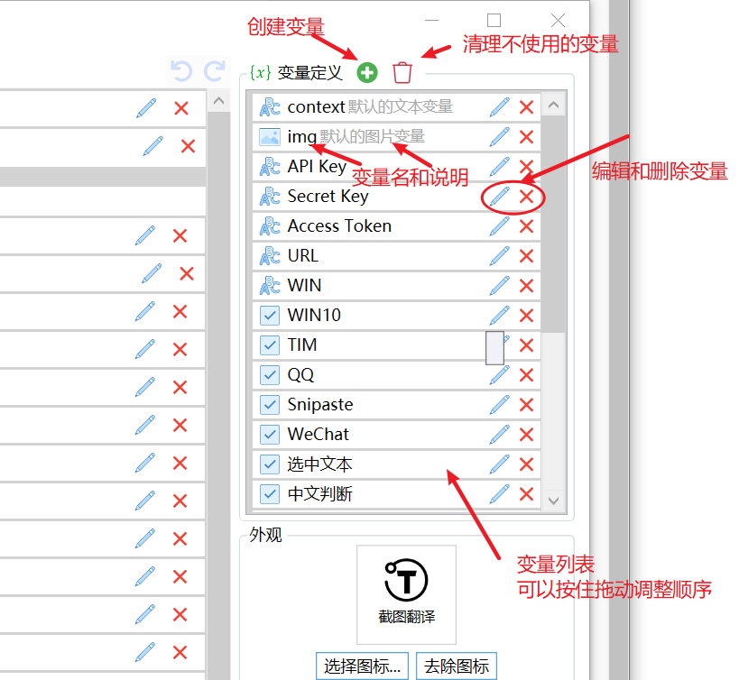
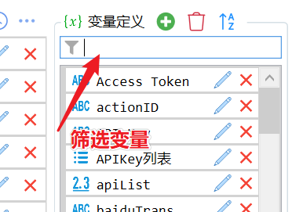
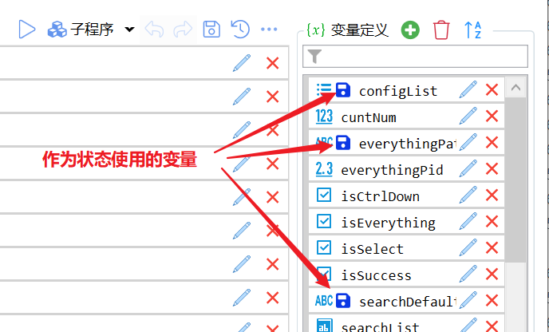
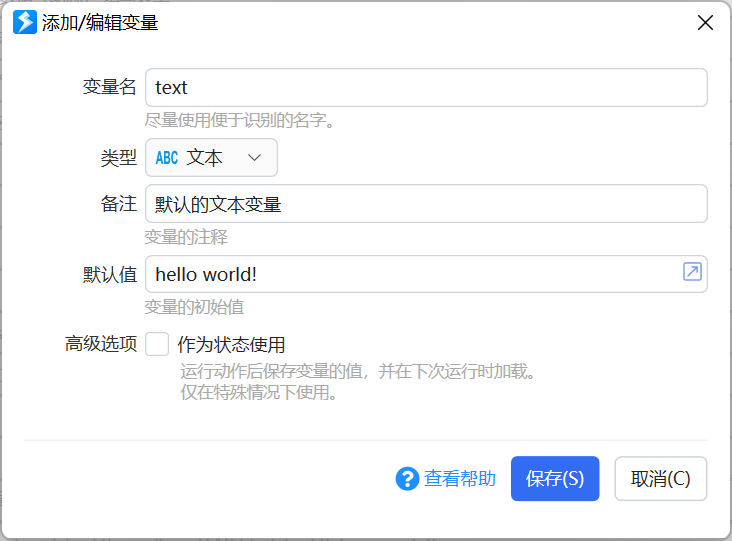
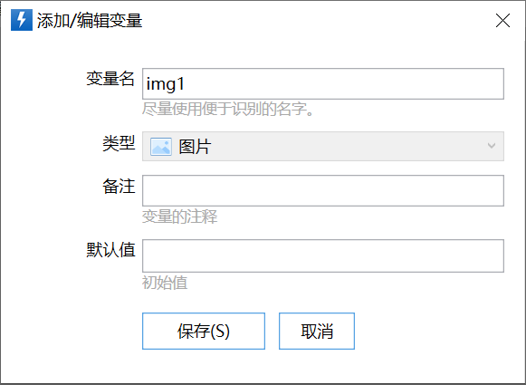
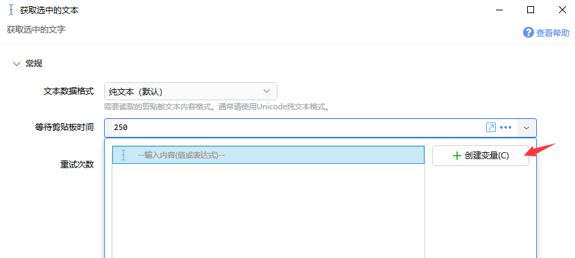

## 概述

变量用于在步骤之间传递信息。前面步骤的输出，保存在变量里，作为后面步骤的输入使用。

### 什么是变量

可以把变量理解成 “盒子” 。变量的值，便是盒子里存放的物品。 变量的 “标识” ，可以理解为给盒子取的名字，或者在盒子上贴的标签，用以区分是哪个盒子。每个变量有一种类型，可以看作这个盒子只能存放某种类型的东西。默认值可以理解为盒子里最初存放的物品。

如下图所示：把“获取选择的文本”的结果输出到了“选择的文本”变量中。然后使用“文本处理”模块，将“选择的文本”处理后输出到“结果文本”变量中。最后通过“发送文本到窗口”模块，将“结果文本”输出。

高级组合动作的每个步骤模块，可以理解为从需要的盒子里取出存放的物品（输入），经过某种处理后，再存放到原来的或另外的盒子里（输出）。

当前所支持的变量类型：

基础类型：

-   文本：字符串；
-   图片：从剪贴板或文件中读取的图片内容；
-   布尔：表示“真/是” 或 "假/否" ；
-   日期时间：表示时间值；
-   数字：浮点数（支持小数）数字值；
-   数字（整数）：整数类型的数字；

高级类型：

-   列表：表示一组字符串，比如选中的多个文件的路径等；
-   词典：键-值对数据类型；
-   动态对象：c# Object对象。

### 变量的使用

#### 将变量的值作为参数输入到模块

模块的输入参数通常可以直接指定或使用变量的值。如下图所示，选择使用了“context”变量的值作为“待处理内容”参数的输入。

#### 将模块的输出写入变量

在模块的“输出”部分，可以选择每个输出要写入哪个变量。如下图所示，选中文字的内容输出到了“context”变量中，操作是否成功的结果输出到了“选中文本”变量中。

## 变量操作

### 变量列表

基本的变量操作：

-   创建变量：点列表上面的十字图标；
-   编辑变量：点击变量后的铅笔图标；
-   删除变量：点击变量后的X图标；
-   调整变量的显示顺序：按住拖动变量条目；
-   清理不使用的变量：点击列表上面的垃圾箱图标；
-   排序变量：按字母顺序排列变量。 （1.2.x版本增加）
-   拖动变量到“+”按钮：快速创建类似变量；

变量列表在变量数量超过10个时显示筛选框。

变量前面可能还会有一些图标显示变量的特殊用途。将鼠标悬浮在图标上可以看到说明提示。

### 创建变量

点击列表上的“”即可开始创建变量。

**变量名**：变量的唯一标识。可以为英文和中文，不要有空格和特殊字符。尽量根据变量的用途（存储的内容）来命名变量。如“selectedText”,"isDone"等。如果动作比较复杂，可以按"前缀\_变量名"的方式命名变量以方便了解变量在什么功能模块中使用，以及分组和查找变量。另外请注意：

-   变量名不要使用纯数字。
-   在插值操作时，会对变量依次替换，请确保在前面的变量插值后不会产生 &#123;后面的变量名&#125; 这样的内容，否则会将这个内容替换为后面变量的值。

**类型**：变量的类型。

**备注**：变量的注释，用于提示自己变量的用途或注意事项等。

**默认值**：变量的初始值。

*注：在1.12之后的版本中，默认值里也可以使用表达式用以动态生成变量初始值。不过需注意，一般不要使用表达式，表示式中尽量避免引用其他变量（不能引用后面变量）。*

**作为状态使用：**在动作运行之后，将变量的值保存在动作中。在下次运行动作时，自动读取状态并写入变量值中。当需要在多次运行动作之间保持变量的值时使用。状态的使用请参考“[状态存取模块](/v2/xaction/modules/statestorage)”。变量的值在状态中保存的key为“$var:变量名”。（1.3.0版本增加）

作为状态使用的变量，只有在动作正常结束以后才会写入状态，因此请不要在长期运行的动作中使用此选项（容易造成变量内容没有写入到动作中）

#### 默认值的写法

| 变量类型 | 默认值写法 | 示例 |
| --- | --- | --- |
| 文本 | 直接写文字内容，支持多行。 | 你好，欢迎使用Quicker！ |
| 图片 | （不支持默认值） |  |
| 布尔 | true或1 表示真 false或0 表示假 | true |
| 数字 | 数字值 | 234.56 |
| 数字（整数） | 整数数字 | 123 |
| 日期时间 | 数字或日期值。 数字表示当前时间增加或减少的天数。日期值表示指定时间。 | 2019-4-1 12:30:00 5 (表示当前时间加5天) |
| 列表 | 多行，每行表示列表的一项 | 北京 上海 广州 深圳 |
| 词典 | 支持两种格式： 简单格式：多行，每行一个键值对。 JSON格式：以json:开始，后面紧跟json内容。 | 简单格式： China:中国 USA:美国 \--- JSON格式： json:&#123;"China":"中国", "USA": "美国"&#125; |
| 对象 | 表示任何的C#对象，可能是简单的数字、文本，也可能是列表等复杂类型。可以在[表达式](/v2/xaction/concepts/expression)中调用对象的方法。 |  |

### 编辑变量

点击变量名后的或双击变量名即可编辑变量。

在变量编辑窗口中输入新的变量信息后保存即可。

### 在编辑模块时创建变量

在添加或编辑步骤模块时，如果在可选的变量列表中没有合适的可用变量，可以点击“创建变量”，创建一个新的变量。

## 更新历史

-   20240429 修改错别字。
