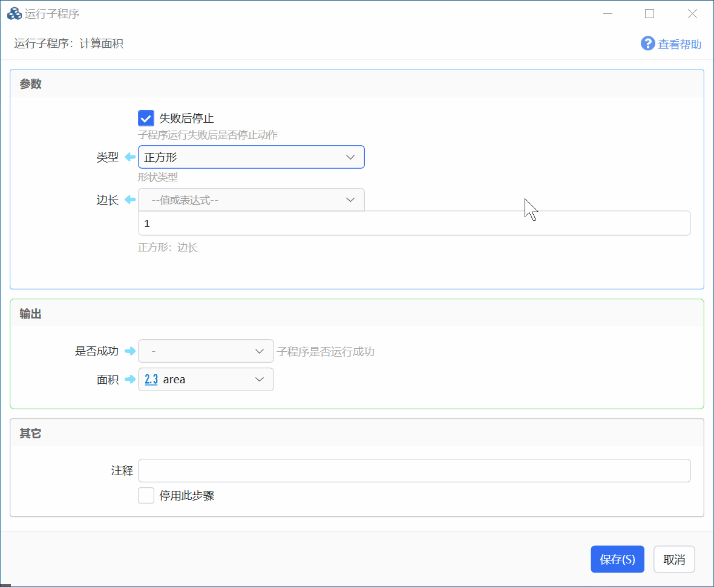
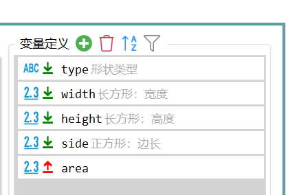
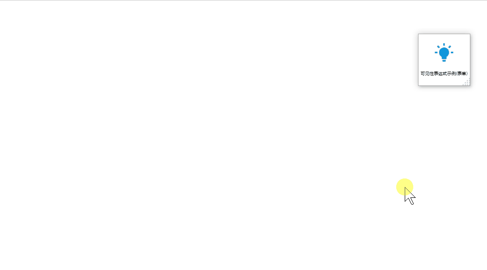
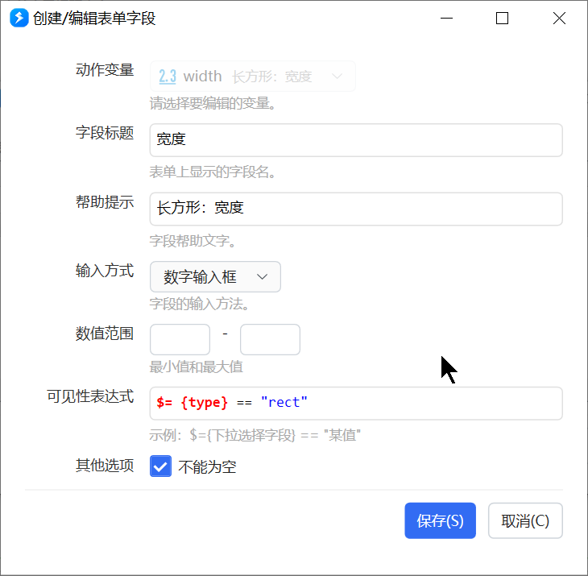

# 可见性表达式

可见性表达式根据一个字段（或变量）的值，控制另一个字段在输入界面上显不显。常用于子程序参数和多字段表单。

目前只支持**根据下拉选择类型的字段**去更新其它字段的可见性。

## 子程序参数

下面这个算面积的子程序：形状是正方形时只显示边长；是长方形时显示宽和高。

四个输入：

| 参数 | 作用 | 可见性 |
| --- | --- | --- |
| `type` | 形状，`square` / `rect` | 始终显示 |
| `width`、`height` | 长方形的宽和高 | `$= {type} == "rect"` |
| `side` | 正方形边长 | `$= {type} == "square"` |

<ShareLinkCard
  code="6a2257de-0666-4365-79e7-08d8fd4af535"
  title="计算面积（可见性示例）"
/>

## 表单

运行时用表单选形状、填尺寸，同样按形状切换字段。

「宽度」「高度」在形状为长方形时显示，表达式写在字段的可见性里：

## 限制与排障

- 只有下拉字段变化会刷新其它字段可见性。用文本框、复选框当条件目前不行。
- 表达式里的名字要和参数/字段名完全一致，含大小写。
- 子程序参数显隐改完后，重新运行子程序才能看到效果。

## 相关链接

<RelatedDocs
  items={[
    {
      href: '/v2/xaction/concepts/subprogram',
      label: '子程序',
      description: '输入参数和可见性',
    },
    {
      href: '/v2/xaction/modules/form',
      label: '多字段表单',
      description: '表单字段的可见性',
    },
    {
      href: '/v2/xaction/concepts/expression',
      label: '表达式',
      description: '可见性里写的就是 $=',
    },
  ]}
/>
