## 概述

组合动作编辑器窗口分为左中右三列。

-   左侧为模块工具箱
-   中间为动作步骤定义区域
-   右侧为变量定义和外观设置区域。

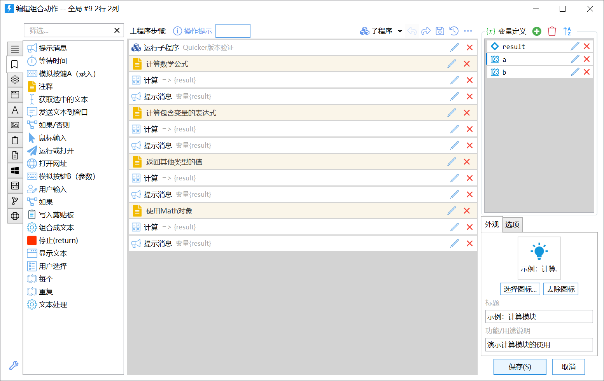

基本的操作过程为：

1.  定义要使用的变量；
2.  从模块工具箱中选取需要的模块，拖放到动作步骤列表中，并设置模块的输入和输出参数；
3.  调整外观（图标和文字标签）；
4.  保存。

## 工具箱

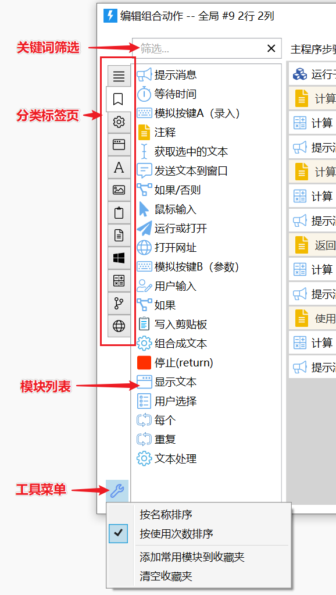

-   点击左侧的标签图标，可以查看不同分类下的模块。（个别模块会属于多个分类）
-    表示所有模块。表示自己收藏的常用模块。
-   鼠标移动到模块上，在提示信息中会显示模块的说明文字。点击右侧的图标可以打开模块的帮助文档。
    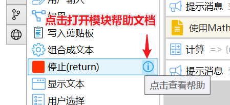

### 搜索模块

输入关键词可快速查找模块。对于模块的名称，可以输入拼音字母进行模糊匹配。`Ctrl+F` 可快速定位到模块搜索框。

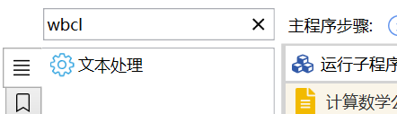

### 调整模块的显示顺序

点击左下方的工具菜单，可以选择模块的排序方式。

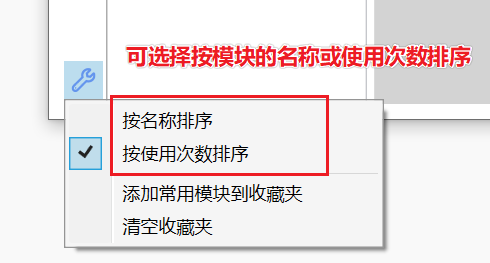

### 模块收藏夹

在模块上点右键，可以添加或取消收藏单个模块。

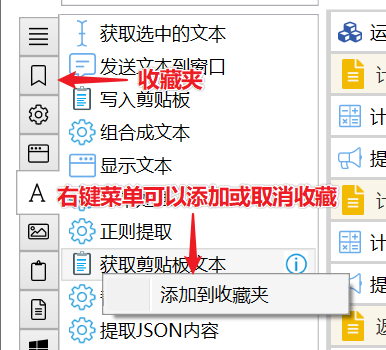

在工具菜单中选择“添加常用模块到收藏夹”，可以让Quicker自动分析你编写的动作，找出最常用的模块添加到收藏夹中。

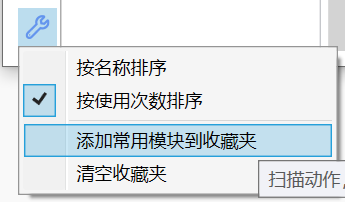

也可以使用工具菜单的“清空收藏夹”命令清除所有收藏的模块。

如果收藏夹不为空，打开动作编辑器后，会自自动选择“收藏夹”标签页。否则会自动选择“常用”标签页。

## 步骤列表操作

步骤列表概览：

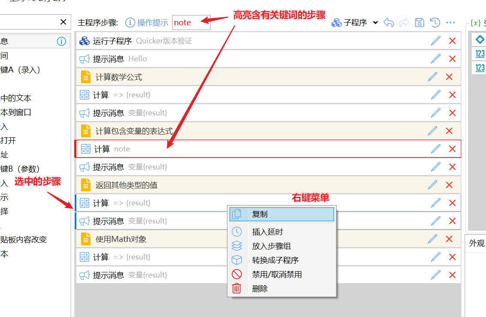

### 添加模块到步骤列表

基本方法：从按住某个模块拖放到步骤列表中的合适位置松开即可。

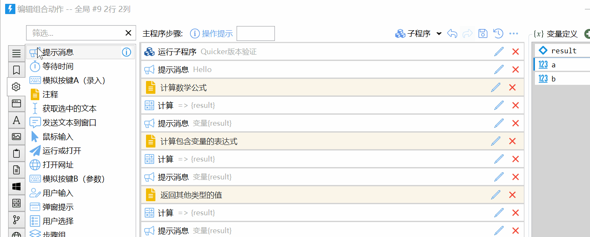

也可以：

-   双击模块，会添加步骤到步骤列表的末尾。
-   复制现有模块：Ctrl+按住现有模块复制拖动。

### 选择步骤

选中的步骤的左侧会显示蓝色边框。

**选择单个步骤**

-   在步骤上点击鼠标即可。

**选择连续的多个步骤**

1.  点击要选择的步骤中的第一个；
2.  按住Shift，点击要选择的步骤中的最后一个；

**选择不连续的多个步骤**

-   按住Ctrl，点击要选择的步骤模块。

### 调整步骤的位置

**移动单个步骤**

-   按住目标步骤模块拖动到合适的位置松开即可。

**移动多个步骤**

1.  选中要移动的多个步骤。
2.  按住其中一个选中的步骤，拖动到合适的位置松开鼠标。

**剪切步骤** 也通过菜单剪切步骤后在合适的位置粘贴。

### 复制步骤

#### 鼠标拖动复制

**复制单个：**

1.  鼠标按住要复制的步骤模块移动，开始拖动。
2.  按住Ctrl，移动到目标位置后松开。

**复制多个：**

1.  选择好要复制的模块。
2.  鼠标按住其中一个选择的模块开始拖动。
3.  按住Ctrl，移动到目标位置后松开。

#### 右键复制粘贴步骤

选中一个或多个步骤后，在选中的步骤上点右键，选择“复制”。
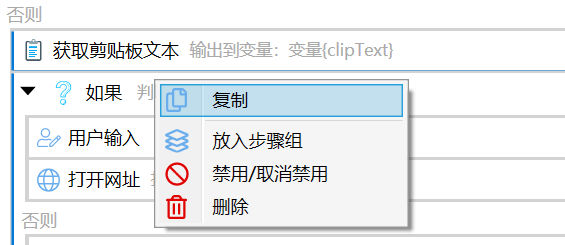

通过右键复制的步骤，可以在其他动作中粘贴。

#### 粘贴步骤

在空白位置点击右键，选择“粘贴”。
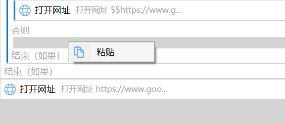

或选中某个步骤模块后，选择在步骤前或模块后粘贴。

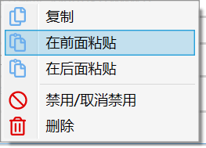

### 编辑步骤

方式1：点击步骤的铅笔图标。

方式2：双击要编辑的步骤。

### 删除步骤

方法1：点击模块后的图标。

方法2：选中1个或多个模块后，按键盘Delete键。

方法3：选择多个步骤模块后，在其中一个上面点右键，在菜单中选择删除。

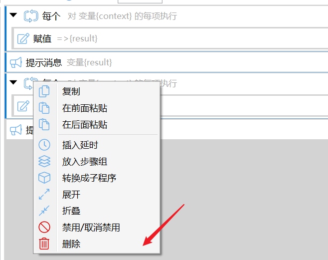

### 停用步骤

执行动作时跳过此步骤。通常用于这些情况：

-   有一些暂时用不到的步骤，又不方便删除（以后可能还用），就可以通过禁用屏蔽它们
-   调试动作时，屏蔽一部分步骤

**停用单个步骤**

方法1：`Alt+点击`模块可以快速停用。再次点击取消用。

方法2：辑步骤对话框中选择“停用此步骤”。

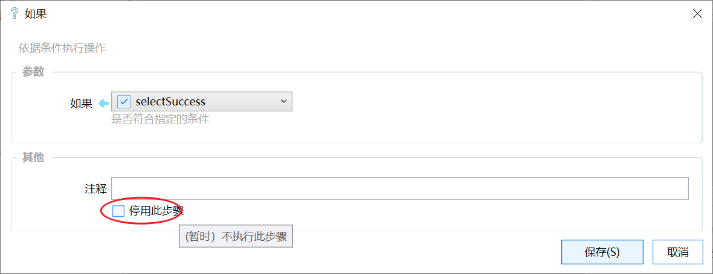

**停用多个步骤**

1.  选中要停用的步骤。
2.  在其中一个选中的步骤上点击右键，在菜单中选择“停用/取消停用”。

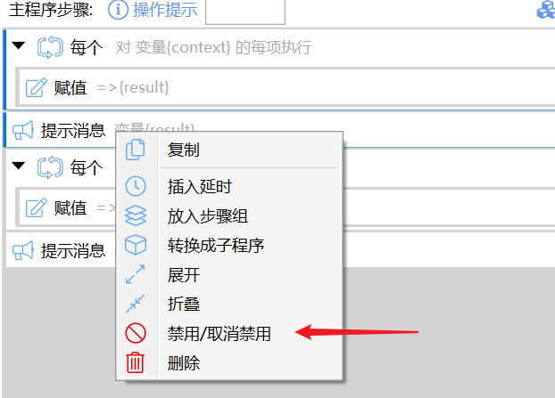

### 展开和折叠步骤

**展开和折叠单个步骤**：点击步骤前的黑色箭头，或按F2键。

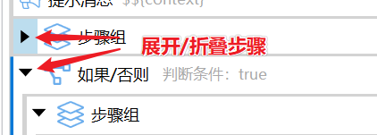

**展开和折叠多个步骤**：选中多个步骤后，在右键菜单中选择“展开”或“折叠”。选中节点的子节点也会被同时展开或折叠。

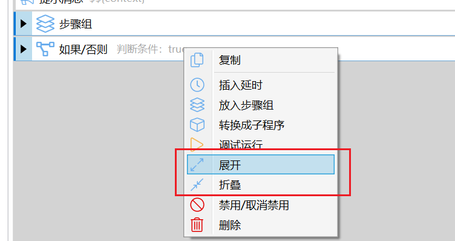

**全部展开或折叠**：从步骤列表右上角的操作菜单中选择“展开所有”或“折叠所有”即可。

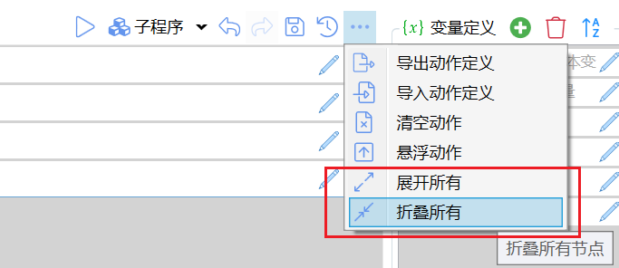

### 高级技巧

#### 快速为步骤添加延迟

对软件界面的操作经常需要加入延时，以等待界面准备好接收下一步的输入。

鼠标放在步骤上，`Ctrl+滚动垂直滚轮`可以快速为步骤添加后续延迟（本步骤完成后，下一步开始前等待的时间）。`Ctrl+Shift+垂直滚轮`可以加大调节幅度。

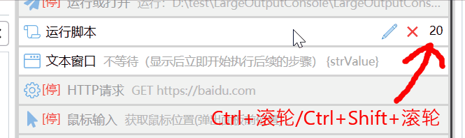

#### 快速插入单独的等待时间步骤

选择模块后右键快速插入“等待时间”。选择单个，插入到该模块后。 选择多个，插入到这些模块中间(如果已经有了，则忽略)。

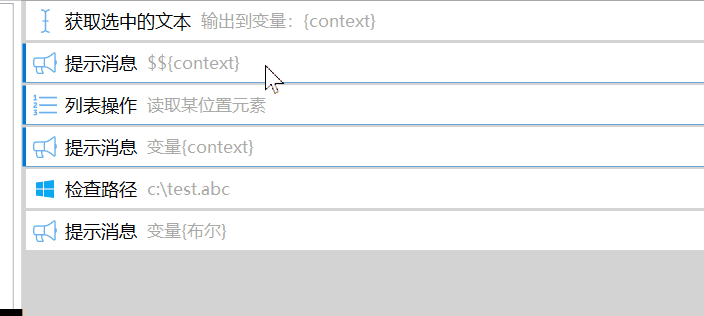

在“等待时间”模块上ctrl+滚轮可快速调整等待时间。

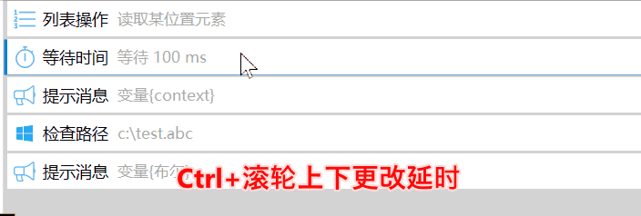

#### 将已有步骤放入一个新增的步骤中作为子步骤

选中多个模块后，点右键，选择“放入...”。可以在多种类型的模块中选择一种。Quicker将自动创建一个步骤并将选择的步骤作为这个步骤的子步骤存入。

#### 保存和恢复历史版本（专业版功能）

在对动作进行大规模修改时，可以保留当前的版本以便于需要的时候恢复。可以点击保存按钮手动保存版本，或点击恢复按钮将动作定义恢复到历史版本中。历史版本数据会在退出帐号时清空。详细说明请参考：[https://www.yuque.com/quicker/help/action-history](https://www.yuque.com/quicker/help/action-history)

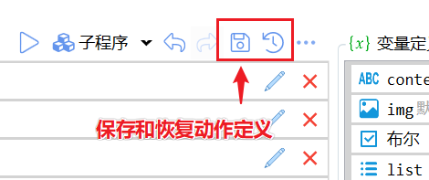

使用Ctrl+S可以快速保存当前版本。

#### 导出和导入动作定义（专业版功能）

将当前的动作定义导出成本地计算机文件或从文件导入。也用于保存动作的历史版本。

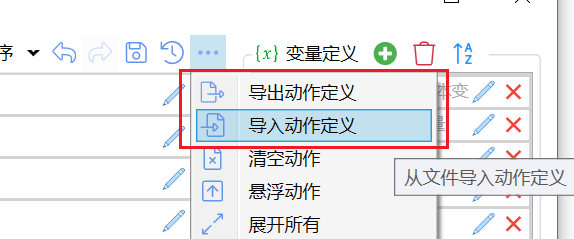

#### 清空动作

完全重新开始编写动作时可以在菜单中快速清空当前的步骤和变量定义。

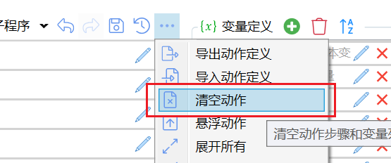

### 键盘操作

需要较新的Quicker版本支持。

-   `Ctrl+C` 复制选中步骤；
-   `Ctrl+V` 在选择的模块后面粘贴；
-   `Ctrl+X` 剪切；
-   `d` 或 `delete` 删除选中步骤；
-   `e` 编辑选中步骤（edit）；
-   `h` 在步骤列表中按`h`高亮相同模块的步骤（highlight）；在变量列表中按`h`高亮使用此变量的步骤（1.42.12+）；
-   `r` 运行选中的步骤（run）（1.44.28+）
-   `Shift+r` 调试运行选中的步骤（1.44.28+）
-   `t` 切换禁用状态（toggle）（1.44.28+）
-   `Ctrl+F` 定位到模块筛选框；
-   `/` 在选择的步骤前面快速插入注释模块（1.28.5+）；
-   `F5` 延迟2秒后调试运行动作（自动最小化编辑窗口）；
-   `Ctrl+F5` 延迟2秒后运行动作（自动最小化编辑窗口）；
-   `F6` 立即调试运行动作 (1.30.4+)；
-   `Ctrl+F6` 立即运行动作；
-   `F2` 对循环和判断步骤：展开或折叠；对运行子程序步骤：打开对应的子程序编辑界面；
-   `Ctrl+G` 将选择的步骤放入“步骤组”(1.40.25+)；
-   `Ctrl+Shift+G`将选中的步骤组解散 （1.44.29+）；
-   `Ctrl+I` 将选择的步骤放入“如果/否则”(1.40.25+)；
-   `Ctrl+Shift+I` 将选择的步骤放入“如果”(1.41.3+)；
-   `Ctrl+R`将选择的步骤放入“重复”(1.40.25+)；
-   `Alt+↑`将选中的步骤上移一行，`Alt+↓`将选中的步骤下移一行 (1.42.14)，

## 其他操作

### 撤销和重做

对步骤或变量修改后，可以通过撤销和重做按钮还原和恢复所做的修改。

也可以使用键盘快捷键：

-   Ctrl+Z：撤销
-   Ctrl+Y：重做

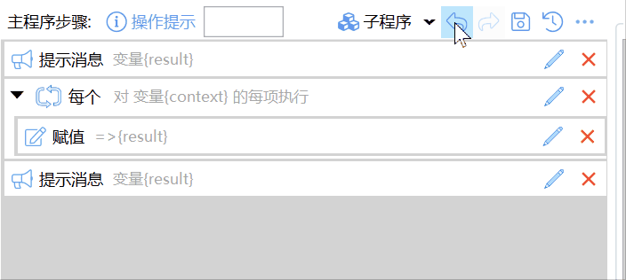

### 保存动作

点击“保存”按钮，保存动作并关闭编辑窗口。

按住Ctrl的同时点击“保存”按钮，只保存，不关闭编辑窗口。

### 调试运行动作

点击▷运行按钮可以执行动作（会自动最小化编辑窗口，然后延迟3秒钟开始。这段时间里，您可以做必要的准备，如选中文本、将焦点移动到目标位置等）。

Ctrl+▷ 可立即执行动作（不等待，也不最小化编辑器窗口。）

Shift+▷ 可调试运行动作（等待时间并最小化编辑窗口）。

Ctrl+右键点击▷可以立即以调试模式运行动作，不等待时间也不最小化编辑器窗口。

右键点击▷可显示调试运行工具菜单：

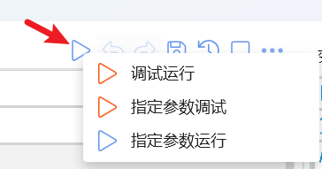

### 调试运行选择的步骤

选中多个步骤后，在右键菜单中选择“调试运行”，可以只运行选中的步骤。

点击菜单的时候按Ctrl，可以自动最小化窗口并延迟3秒后执行。

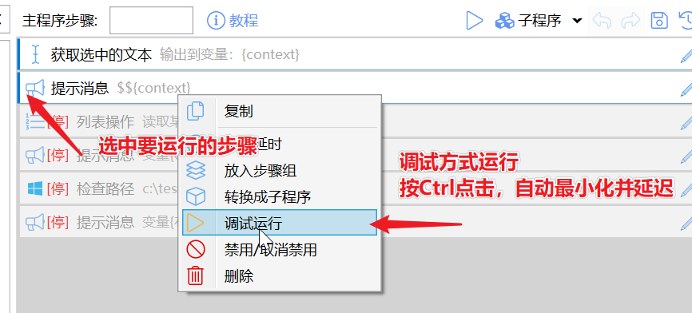

### 设置图标

可以通过以下方式为动作添加图标：

-   点击**动作预览按钮**或“**选择图标...**”按钮，从已上传的图标中选择或选择本地图标文件。
    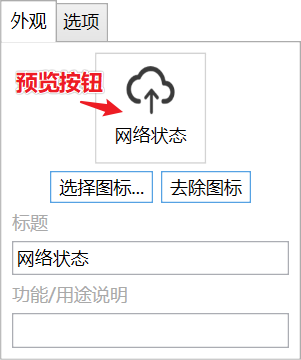
-   在资源管理器中复制图标文件后，在预览按钮的右键菜单中选择“粘贴图标”菜单项。
    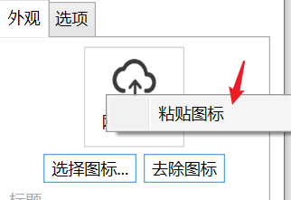
-   复制已有动作的图标网址（动作右键菜单-&gt;信息-&gt;复制图标网址）后，在预览按钮的右键菜单中选择“粘贴图标”菜单项。
    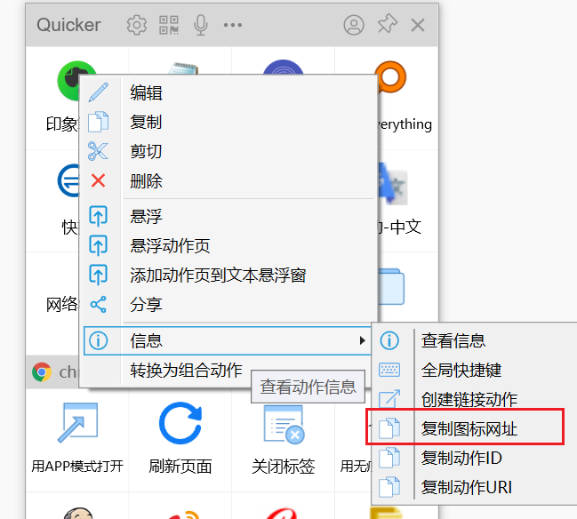

### 设置动作选项

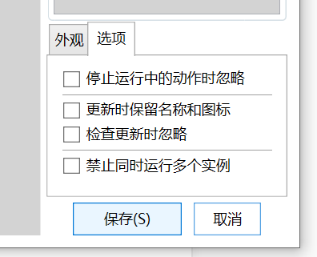

-   停止运行中的动作时忽略：在使用快捷键或托盘菜单停止运行中的动作时，忽略当前动作。通常用于极个别需要长期后台运行的动作。
-   更新时保留名称和图标：用于保留自己对动作所单独设定的图标和名称，避免更新动作时被覆盖。
-   检查更新时忽略：在“[批量更新动作](https://www.yuque.com/quicker/help/install-action)”时，是否忽略此动作。如果对动作做了比较大的自定义修改，可能需要选中此项以避免自己的修改被不小心覆盖成动作库的原始版本。
-   禁止同时运行多个实例：避免动作被重复执行。也可以通过“获取系统和动作信息”模块获取正在运行的当前动作实例个数做更复杂的处理。
-   最低版本要求：设定此动作需要的最低Quicker版本。

## 子程序操作

请参见[单独的章节](/v2/xaction/concepts/subprogram)。

## 变量操作

请参见[单独的章节](/v2/xaction/concepts/variables)。

提示：

-   将变量拖动到步骤列表中，可以自动创建一个“赋值”步骤，并将结果输出到此变量。
-   按住Ctrl，将列表类型的变量拖入步骤列表中，自动创建一个对此列表变量进行循环的“每个”步骤。(1.42.14+)

## 模板动作

1.27.7 + 版本支持：

在某个动作页里创建一个名称为“\_template\_”的动作。之后创建动作时，会自动从此动作复制变量和步骤作为初始动作内容。

## 示例

下面的操作演示创建了一个打开谷歌的动作。如果选中文字，则对文件进行搜索。如果未选中文字，则直接打开谷歌网站。

此处为语雀视频卡片，点击链接查看：[组合动作\_打开谷歌或搜索.mp4](/v2/xaction/concepts/xaction-editor)

## 更新历史

-   20230206 更新调试运行按钮右键菜单说明。
-   20230310 展开折叠步骤增加F2按键说明。
-   20231228 增加新的快捷键的说明。
-   20240225 增加`h`高亮相似步骤功能。
-   20240227 增加`Alt+上下`向上向下移动选中步骤的功能；Ctrl+拖动列表变量到步骤，自动创建“每个”步骤的功能；
