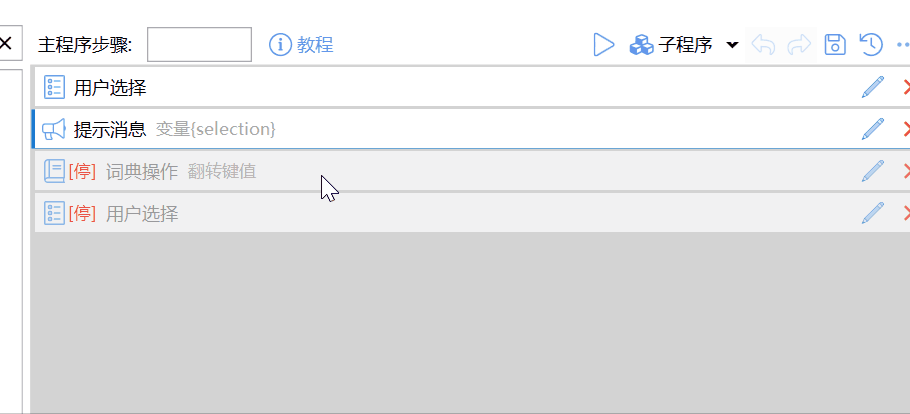
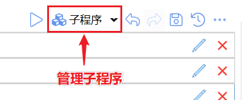

# 动作编辑器的使用

组合动作在这个窗口里编写。左中右三栏：

- 左侧：模块工具箱
- 中间：步骤列表（上方是运行 / 保存）
- 右侧：变量列表；未选中变量时是动作外观

<ActionEditorPreview
  caption="组合动作编辑器"
  toolboxSelected="sys:getSelectedText"
  selectedIndexes={[0]}
  selectedVar="selectedText"
/>

基本过程：

1. 需要的话，先在右侧定义变量。
2. 从工具箱把模块拖进步骤列表，设好输入和输出。
3. 改图标和标题。
4. 保存。

## 工具箱

左侧按分类列出模块。点左侧标签切换分类（个别模块会落在多个分类里）。

<ActionEditorPreview
  caption="模块工具箱"
  focus="toolbox"
  toolboxTab="basic"
  toolboxSelected="sys:notify"
/>

- **所有**：全部模块。
- **收藏**：自己常用的模块。收藏夹不为空时，打开编辑器会先停在这一页；否则停在「常用」。
- 鼠标停在模块上会显示说明；部分模块右侧有帮助入口。

### 搜索模块

搜索框支持模块名和拼音。`Ctrl+F` 把焦点放到搜索框。

<ActionEditorPreview
  caption="搜索模块"
  focus="toolbox"
  toolboxSearch="文本"
  toolboxSelected="sys:getSelectedText"
/>

### 排序和收藏

工具菜单里可以按名称或使用次数排序，也可以把常用模块扫进收藏夹，或清空收藏夹。

<ContextMenuPreview
  openPath={['按使用次数排序']}
  items={[
    {label: '按名称排序'},
    {label: '按使用次数排序'},
    {type: 'separator'},
    {label: '添加常用模块到收藏夹'},
    {label: '清空收藏夹'},
  ]}
/>

在模块上右键，可以添加或取消收藏单个模块。

## 步骤列表

中间是步骤定义。选中的步骤左侧有强调条。

<ActionEditorPreview
  caption="步骤列表"
  focus="steps"
  selectedIndexes={[1]}
/>

### 添加步骤

- 从工具箱拖到列表里的目标位置。
- 双击模块：加到列表末尾。
- `Ctrl` + 拖动已有步骤：复制。

拖入过程见下（离散示意，悬停可暂停）：

<ActionEditorPreview
  focus="toolbox"
  toolboxTab="basic"
  toolboxSearch="提示"
  toolboxSelected="sys:notify"
  actionTitle="添加步骤"
  actionDescription="从工具箱拖入模块"
  caption="从工具箱拖到步骤列表"
  data={{steps: []}}
  dragDemo={{
    moduleKey: 'sys:notify',
    targetSlot: 'steps',
    afterData: {
      steps: [{key: 'sys:notify', inputs: {msg: '提示'}}],
    },
  }}
/>

### 选择步骤

| 操作 | 做法 |
| --- | --- |
| 单个 | 点击该步骤 |
| 连续多个 | 点第一个，按住 `Shift` 点最后一个 |
| 不连续多个 | 按住 `Ctrl` 点要选的步骤 |

### 移动与复制

- 拖动步骤到新位置。多选时，按住其中一个选中项拖动。
- 复制：开始拖动后按住 `Ctrl`，到目标位置松开。
- 也可以右键 **复制(_C)** / **剪切(_X)**，再到空白处或某一步前后粘贴。复制出的步骤可以贴到别的动作里。

<ContextMenuPreview
  openPath={['复制(_C)']}
  items={[
    {label: '复制(_C)', icon: 'fa:Light_Copy:#6aaded'},
    {label: '剪切(_X)', icon: 'fa:Light_Cut:#6aaded'},
    {type: 'separator'},
    {label: '插入延时(_T)', icon: 'fa:Light_Clock:#6aaded'},
    {
      label: '放入...(_F)',
      icon: 'fa:Light_ObjectGroup:#6aaded',
      children: [
        {label: '步骤组(_G)', icon: 'fa:Light_LayerGroup:#6aaded'},
        {label: '循环：每个(_E)', icon: 'fa:Light_Repeat:#6aaded'},
        {label: '循环：重复(_R)', icon: 'fa:Light_Repeat:#6aaded'},
        {label: '如果/否则 的 “如果” 分支(_I)', icon: 'fa:Light_ProjectDiagram:#6aaded'},
        {label: '如果/否则 的 “否则” 分支(_F)', icon: 'fa:Light_ProjectDiagram:#6aaded'},
        {label: '如果(_S)', icon: 'fa:Light_ProjectDiagram:#6aaded'},
      ],
    },
    {label: '转换成子程序(_S)', icon: 'fa:Light_Cube:#6aaded'},
    {label: '运行(_R)', icon: 'fa:Light_Play:#f5b042'},
    {label: '停用/取消停用(_P)', icon: 'fa:Light_Ban:#E00000'},
  ]}
>
  <StepProgramView
    selectedIndexes={[0]}
    data={{
      steps: [
        {
          key: 'sys:getSelectedText',
          outputs: {output: 'selectedText', isSuccess: 'selectSuccess'},
        },
        {
          key: 'sys:if',
          inputs: {condition: '{selectSuccess}'},
          ifSteps: [
            {
              key: 'sys:openUrl',
              inputs: {url: '$$https://www.google.com/search?q={selectedText}'},
            },
          ],
          elseSteps: [
            {key: 'sys:openUrl', inputs: {url: 'https://www.google.com'}},
          ],
        },
      ],
    }}
  />
</ContextMenuPreview>

### 编辑与删除

- 双击步骤，或点步骤行上的铅笔，打开参数窗。
- 删除：点步骤上的 ×、按 `Delete`，或右键删除。

2.2.0 起，步骤参数编辑窗口可以手动拉伸或贴靠到完整屏幕高度，不再受首次自动布局时的高度限制。

### 停用步骤

停用后运行时跳过。适合暂时不用、又不想删的步骤，或调试时屏蔽一段。

- `Alt+点击` 快速切换单个步骤。
- 参数窗勾选 **停用此步骤**。
- 多选后右键 **停用/取消停用(_P)**。

<ModuleParamPreview
  moduleKey="sys:if"
  values={{condition: '{selectSuccess}'}}
  stepDisabled
  focusKeys={['condition']}
/>

### 展开和折叠

带分支或子步骤的模块，点行前箭头或按 `F2` 展开/折叠。多选后右键 **展开** / **折叠**。列表右上角菜单有 **展开所有** / **折叠所有**。

## 高级技巧

### 代码编辑器折叠

2.1.26 起，动作编辑器里的代码输入框支持 `#region` / `#endregion` 和 `//#region` / `//#endregion` 区域折叠。区域可以嵌套；除作为独立区域标记的 `//#region` 行外，写在字符串或普通注释里的同名文本不会被当成折叠标记。

### 给步骤加后续延迟

鼠标停在步骤上，`Ctrl+滚轮` 给「本步完成后、下一步开始前」加等待，行右侧出现毫秒数；`Ctrl+Shift+滚轮` 加大步进。

<StepProgramView
  wheelDelay={{from: 0, to: 200, step: 20}}
  data={{
    steps: [
      {key: 'sys:notify', inputs: {msg: '准备点击'}},
      {key: 'sys:mouse', inputs: {type: 'left'}},
    ],
  }}
/>

选中步骤后右键 **插入延时(_T)**：选一个插在它后面；选多个插在它们中间。在等待时间步骤上 `Ctrl+滚轮` 调毫秒数。

<StepProgramView
  wheelDelay={{from: 100, to: 350, step: 50}}
  data={{
    steps: [{key: 'sys:delay', inputs: {delayMs: '100'}}],
  }}
/>

### 把已有步骤放进新步骤

多选后右键 **放入...(_F)**，选步骤组、循环或如果/否则。Quicker 会新建那一步，把选中的步骤收成子步骤。

### 历史版本与导入导出（专业版）

大规模改动作前，可以手动保存一版，需要时再恢复。`Ctrl+S` 保存当前版本。退出帐号会清掉历史。

右上角菜单还有 **导出动作定义** / **导入动作定义**（存成本地文件），以及 **清空动作**（清掉当前步骤和变量，重新写）。

## 键盘操作

| 快捷键 | 作用 |
| --- | --- |
| `Ctrl+C` / `Ctrl+X` / `Ctrl+V` | 复制 / 剪切 / 在选中步骤后粘贴 |
| `Delete` 或 `D` | 删除选中步骤 |
| `E` | 编辑选中步骤 |
| `H` | 步骤列表：高亮相同模块；变量列表：高亮使用该变量的步骤 |
| `R` | 运行选中步骤 |
| `Shift+R` | 调试运行选中步骤 |
| `T` | 切换停用 |
| `Ctrl+F` | 定位到模块搜索框 |
| `/` | 在选中步骤前插入注释 |
| `F5` | 延迟约 2 秒后调试运行整段动作（会最小化编辑窗） |
| `Ctrl+F5` | 延迟后普通运行 |
| `F6` / `Ctrl+F6` | 立即调试 / 立即运行 |
| `F2` | 循环和判断：展开或折叠；运行子程序：打开对应子程序 |
| `Ctrl+G` / `Ctrl+Shift+G` | 放入步骤组 / 解散步骤组 |
| `Ctrl+I` / `Ctrl+Shift+I` | 放入「如果/否则」/ 放入「如果」 |
| `Ctrl+R` | 放入「重复」 |
| `Alt+↑` / `Alt+↓` | 选中步骤上移 / 下移一行 |

## 其他操作

### 撤销和重做

改步骤或变量后，用工具栏撤销 / 重做，或 `Ctrl+Z` / `Ctrl+Y`。连续操作见下（悬停可暂停）：

<ActionEditorPreview
  caption="连续撤销 / 重做"
  focus="steps"
  showRun={false}
  historyDemo={{
    frames: [
      {
        action: 'idle',
        selectedPath: '1/if/0',
        data: {
          steps: [
            {key: 'sys:notify', inputs: {msg: '{result}'}},
            {
              key: 'sys:each',
              inputs: {input: '{context}'},
              ifSteps: [{key: 'sys:assign', outputs: {output: 'result'}}],
            },
            {key: 'sys:notify', inputs: {msg: '{result}'}},
          ],
        },
      },
      {
        action: 'undo',
        selectedIndexes: [1],
        data: {
          steps: [
            {key: 'sys:notify', inputs: {msg: '{result}'}},
            {key: 'sys:each', inputs: {input: '{context}'}, ifSteps: []},
            {key: 'sys:notify', inputs: {msg: '{result}'}},
          ],
        },
      },
      {
        action: 'undo',
        selectedIndexes: [1],
        data: {
          steps: [
            {key: 'sys:notify', inputs: {msg: '{result}'}},
            {key: 'sys:notify', inputs: {msg: '{result}'}},
          ],
        },
      },
      {
        action: 'redo',
        selectedIndexes: [1],
        data: {
          steps: [
            {key: 'sys:notify', inputs: {msg: '{result}'}},
            {key: 'sys:each', inputs: {input: '{context}'}, ifSteps: []},
            {key: 'sys:notify', inputs: {msg: '{result}'}},
          ],
        },
      },
      {
        action: 'redo',
        selectedPath: '1/if/0',
        data: {
          steps: [
            {key: 'sys:notify', inputs: {msg: '{result}'}},
            {
              key: 'sys:each',
              inputs: {input: '{context}'},
              ifSteps: [{key: 'sys:assign', outputs: {output: 'result'}}],
            },
            {key: 'sys:notify', inputs: {msg: '{result}'}},
          ],
        },
      },
    ],
  }}
/>

### 保存

点 **保存** 会保存并关闭窗口。按住 `Ctrl` 再点保存：只存不关。

### 运行与调试

中间栏工具条上的运行 / 调试按钮对应整段动作。点运行会先最小化编辑窗、再稍等几秒，方便你选中文字或切到目标窗口。

- `Ctrl+点击`：立即运行，不最小化。
- `Shift+点击`：调试运行（会等待并最小化）。
- `Ctrl+右键`：立即调试。
- 右键运行按钮：调试 / 指定参数调试 / 指定参数运行。

<ContextMenuPreview
  openPath={['调试']}
  items={[
    {label: '运行', icon: 'fa:Light_Play:#39b54d'},
    {label: '调试', icon: 'fa:Light_Bug:#f5b042'},
    {type: 'separator'},
    {label: '指定参数调试'},
    {label: '指定参数运行'},
  ]}
/>

只跑一部分步骤：多选后右键 **运行(_R)**。按住 `Ctrl` 再点菜单，会最小化并延迟约 3 秒。详见 [调试运行组合动作](/v2/xaction/concepts/debug)。

<ContextMenuPreview
  openPath={['运行(_R)']}
  items={[
    {label: '复制(_C)', icon: 'fa:Light_Copy:#6aaded'},
    {label: '剪切(_X)', icon: 'fa:Light_Cut:#6aaded'},
    {type: 'separator'},
    {label: '插入延时(_T)', icon: 'fa:Light_Clock:#6aaded'},
    {label: '放入...(_F)', icon: 'fa:Light_ObjectGroup:#6aaded'},
    {label: '转换成子程序(_S)', icon: 'fa:Light_Cube:#6aaded'},
    {label: '运行(_R)', icon: 'fa:Light_Play:#f5b042'},
    {label: '停用/取消停用(_P)', icon: 'fa:Light_Ban:#E00000'},
  ]}
>
  <StepProgramView
    selectedIndexes={[0, 1]}
    data={{
      steps: [
        {
          key: 'sys:getSelectedText',
          outputs: {output: 'context', isSuccess: 'ok'},
        },
        {key: 'sys:notify', inputs: {msg: '$${context}'}},
      ],
    }}
  />
</ContextMenuPreview>

### 图标和外观

未选中变量时，右侧是动作外观：标题、说明、图标。

<ActionEditorPreview
  caption="动作外观"
  focus="appearance"
  rightTab="appearance"
  actionTitle="谷歌搜索"
  actionDescription="选中文字则搜索，否则打开首页"
/>

也可以：

- 点预览或「选择图标…」，从已上传图标或本地文件选。
- 在资源管理器复制图标文件，或从已有动作右键 **信息 → 复制图标网址**，再在预览按钮右键 **粘贴图标**。

### 动作选项

在外观旁边的选项里：

| 选项 | 作用 |
| --- | --- |
| 停止运行中的动作时忽略 | 用快捷键或托盘停动作时，放过当前动作。给需要长时间挂着的动作用。 |
| 更新时保留名称和图标 | 更新分享动作时，不覆盖你改过的名字和图标。 |
| 检查更新时忽略 | 批量更新时跳过此动作，避免本地大改被盖掉。 |
| 禁止同时运行多个实例 | 避免同一动作叠着跑。更细的判断可用「获取系统和动作信息」。 |
| 最低版本要求 | 此动作需要的最低 Quicker 版本。 |

## 子程序和变量

子程序树在编辑器里另有一栏，操作见 [子程序](/v2/xaction/concepts/subprogram)。

变量列表见 [变量](/v2/xaction/concepts/variables)。

- 把变量拖进步骤列表，会自动加一条赋值，结果写到该变量。
- 按住 `Ctrl`，把列表类型变量拖进步骤列表，会自动加一条「每个」循环。

## 模板动作

在某个动作页里建一个名叫 `_template_` 的动作。之后在同一页新建动作时，会复制它的变量和步骤当初始内容。

## 限制与排障

- 拖模块进列表放不准时，先点一下目标位置附近的步骤再拖，或改用双击加到末尾再移动。
- 运行按钮会先最小化编辑窗。若目标窗口来不及准备，改用 `Ctrl+点击` 立即运行，或先看 [调试运行](/v2/xaction/concepts/debug)。
- 收藏夹空时不会停在收藏页。右键收藏至少一个模块后再打开。
- 历史版本、导出导入是专业版功能；退出帐号会清掉历史。

## 相关链接

<RelatedDocs
  items={[
    {
      href: '/v2/xaction/concepts/xaction-intro',
      label: '组合动作基础',
      description: '步骤、变量和分支怎么串起来',
    },
    {
      href: '/v2/xaction/concepts/basic',
      label: '模块和步骤',
      description: '模块从哪来、参数怎么填',
    },
    {
      href: '/v2/xaction/concepts/edit-step-param',
      label: '选择或输入步骤参数',
      description: 'F1 切换原始值、插值和表达式',
    },
    {
      href: '/v2/xaction/concepts/variables',
      label: '变量',
      description: '右侧列表和创建对话框',
    },
    {
      href: '/v2/xaction/concepts/subprogram',
      label: '子程序',
      description: '编辑器里的子程序树',
    },
    {
      href: '/v2/xaction/concepts/debug',
      label: '调试运行组合动作',
      description: '运行钮、选中步骤和日志',
    },
  ]}
/>
