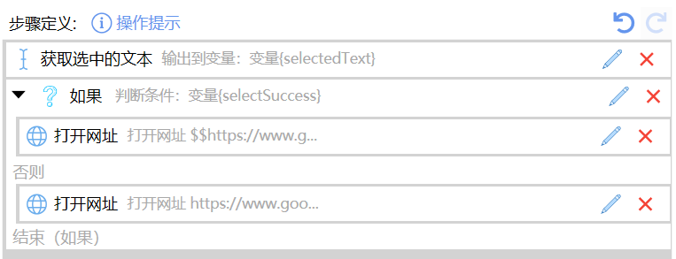

import Mermaid from '@theme/Mermaid';

## 使用说明

组合动作通过按顺序执行一系列步骤来实现某个特定的操作功能。

比如我们开发一个“谷歌搜索”的动作，希望实现的功能为：如果选择了文字，就搜索这些选择的文字，否则就打开谷歌网站。操作流程示意图：

<Mermaid value={`flowchart TD
  start([开始]) --> getText[/获取选择的文本/]
  getText --> ok{"成功?"}
  ok -->|是| search[搜索选择的文字]
  ok -->|否| openSite[打开搜索网站]
  search --> stop([停止])
  openSite --> stop

  classDef terminal fill:#C2185B,stroke:#880E4F,color:#fff
  classDef io fill:#FB8C00,stroke:#EF6C00,color:#fff
  classDef decision fill:#C2185B,stroke:#880E4F,color:#fff
  classDef action fill:#1E88E5,stroke:#1565C0,color:#fff
  class start,stop terminal
  class getText io
  class ok decision
  class search,openSite action
`} />

通过 Quicker 的组合动作实现：

