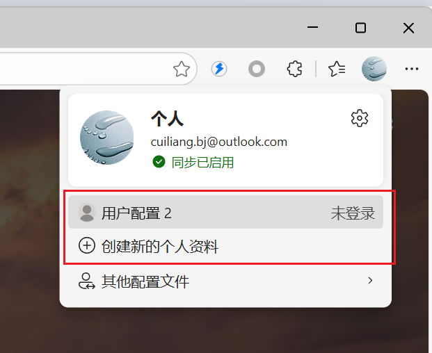
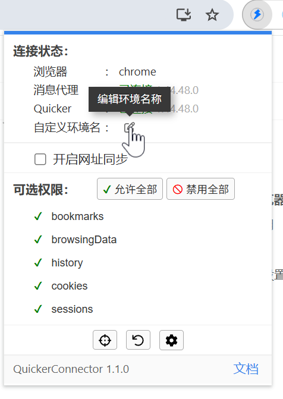
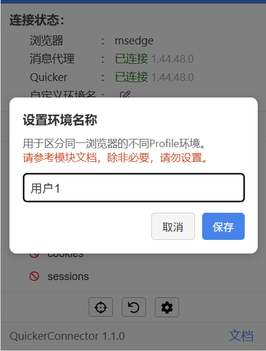

Profile 在Edge中称为“用户配置”，在Chrome中称为“个人资料”。表示一个浏览器同时使用2个账号，每个账号有自己的数据、扩展、网页的登录状态等。

Quicker 1.44.48 版本，结合浏览器扩展 1.1.0 版本，可允许设定“浏览器控制”模块所连接的浏览器和Profile。

## 一个浏览器支持多个profile账号的2种方式

**1） 每个账号使用单独的数据目录，通过命令行参数启动各自的浏览器进程。**

可参考此[帖子](https://getquicker.net/QA/Question/36904)，如：

```text
"C:\Program Files (x86)\Microsoft\Edge\Application\msedge.exe" --user-data-dir=d:\user_data1
"C:\Program Files (x86)\Microsoft\Edge\Application\msedge.exe" --user-data-dir=d:\user_data2
"C:\Program Files (x86)\Microsoft\Edge\Application\msedge.exe" --user-data-dir=d:\user_data3
```


此种情况下，每个profile账号有一个单独的主进程。同时连接到Quicker时，Quicker可以通过主进程的id进行区分。

2**）直接在浏览器中添加和切换profile。**

如在Edge浏览器中：



这种情况下，多个profile的浏览器窗口使用相同的主进程。 Quicker中无法识别和区分。

## 如何使用

### 前提

-   Quicker 软件 1.44.48 + 版本。
-   浏览器扩展 1.1.0 + 版本。
-   每个profile，都安装浏览器扩展，并且按要求设置好权限、允许运行用户脚本、开发者模式等选项。

## 使用

#### 1） 在各个Profile的Quicker扩展中设置自定义环境名称。

在浏览器窗口中，点击Quicker扩展按钮，在弹出的窗口中设置自定义环境名称。建议设置成与浏览器Profile名称一样，方便识别。






注：之所以需要手动设置环境名称，是因为浏览器没有提供API或其它获取Profile名称的方式。

设置完成后，在 Quicker面板窗口的菜单 - 工具 - 修复浏览器扩展连接窗口 中可以看到已连接的浏览器，设置过自定义环境名称的，该名称会在括号中显示。


#### 2）在“浏览器控制模块”中指定浏览器和目标环境名。

<PreviewMarks
  marks={[
    {key: 'browser', label: '选择要连接的浏览器'},
    {key: 'envName', label: '填写扩展环境名'},
  ]}
>
  <ModuleParamPreview
    moduleKey="sys:chromecontrol"
    focusKeys={['operation', 'browser', 'mainProcessId', 'envName', 'stopIfFail']}
    values={{
      operation: 'SetBrowser',
      browser: 'msedge',
      mainProcessId: '0',
      envName: '用户1',
      stopIfFail: 'true',
    }}
  />
</PreviewMarks>

在【自定义环境名】参数中填写要连接的Profile中所设置的“环境名”。留空表示“空”的环境名，通常用在浏览器的默认Profile中。填写`*`表示可连接任意环境名（这时候可以结合主进程id）等信息判断。


设置完成后，后续的浏览器控制步骤，将会尝试控制这个Profile的浏览器窗口。

上述截图中，【主进程id】参数可用于通过命令行参数启动多个浏览器实施的方式。但是因为每次启动进程id会变化，所以使用起来比较麻烦。
