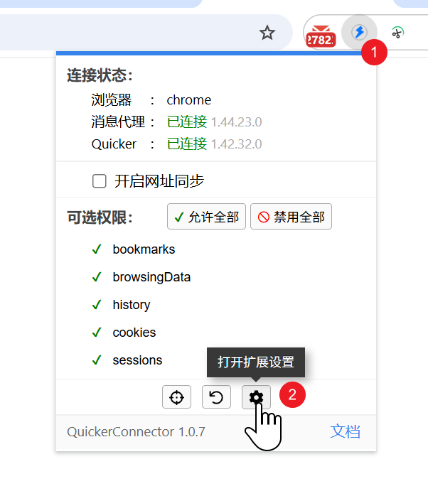
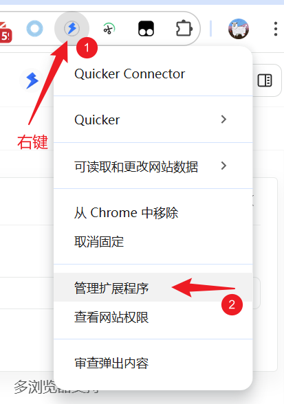
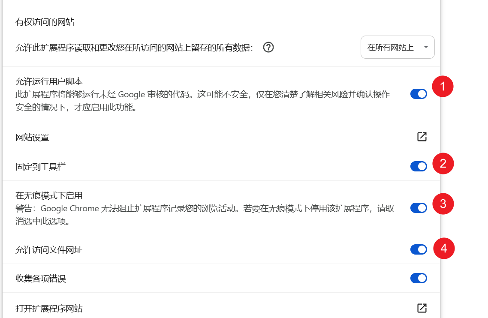
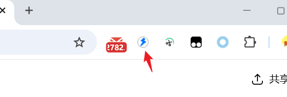

## 使用说明

为能够正常使用浏览器扩展插件，请参考如下步骤设置扩展。

### 打开扩展设置界面

1.0.7 之后的版本，可以从这里快速打开扩展设置：

更早版本，在扩展按钮上右键，选择“管理扩展程序”

### 设置扩展

1） 允许运行用户脚本（**重要！**）

用于“对标签页执行脚本”功能、获取网页元素的css选择器等功能。

2）固定到任务栏

将扩展按钮显示在浏览器任务栏，如下图所示：

3） 在无痕模式下启用

是否在无痕模式（隐私模式）下启用扩展。

4） 允许访问文件网址

浏览器打开本地文件网页时是否仍然生效。
