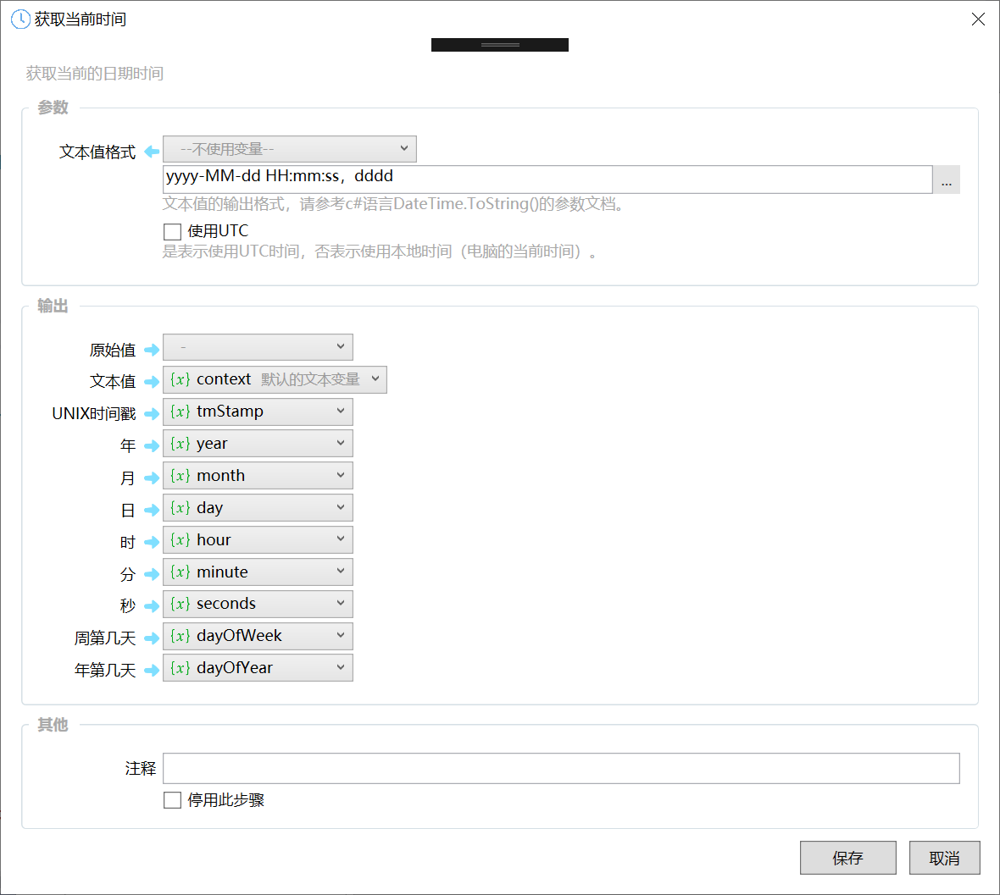
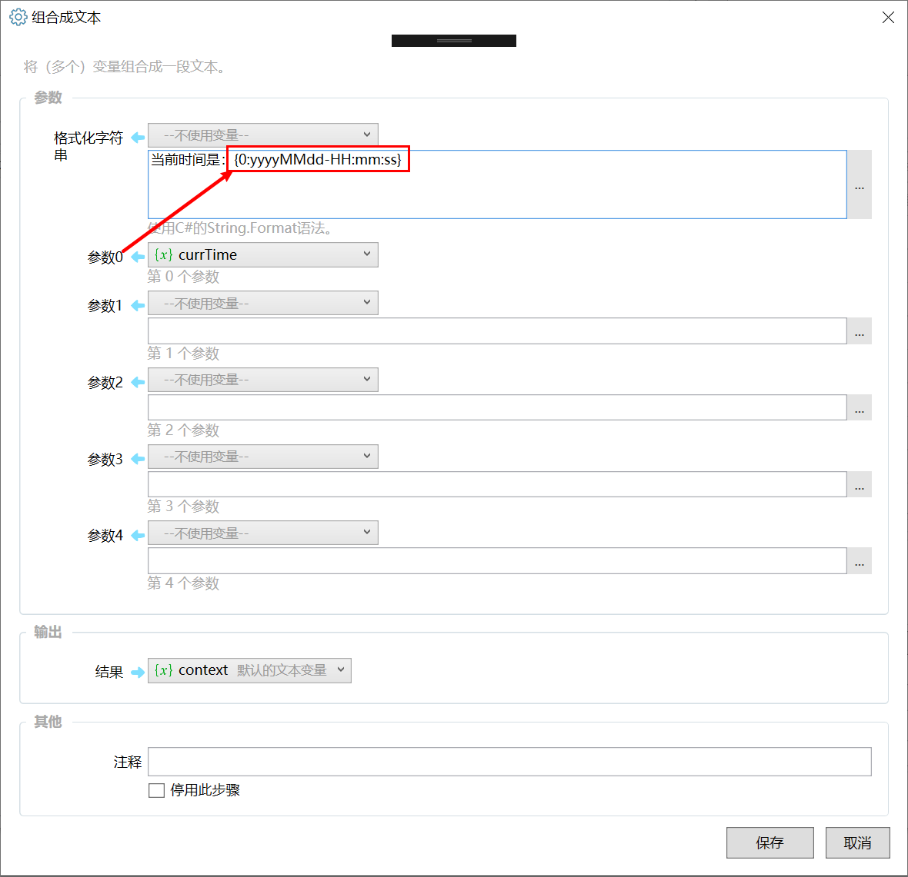

## 使用说明

### 获取当前时间

使用 “获取当前时间” 模块，可以得到当前时间值。

【本截图为0.9.16版本，之前的版本只有原始值一个输出】

### 将时间转换为文本

方式一：【0.9.16之后的版本】可以在 “获取当前时间” 中指定 “文本值格式” 参数，并从 “文本值” 输出中直接得到文本格式的值。

方式二：使用 “组合成文本” 模块。

除此以外，也可以直接在文本参数中使用插值插入 日期时间类型的变量。这时候将使用默认格式转换为文本。

### 格式控制

Quicker在内部使用c#语言的 DateTime.ToString() 函数将日期时间值转换成文本。

常用格式控制字符：

| 符号 | 说明 |
| --- | --- |
| yy | 年份后两位 |
| yyyy | 4位年份 |
| MM | 两位月份；单数月份前面用0填充 |
| dd | 日数 |
| ddd | 周几 |
| dddd | 星期几 |
| hh | 12小时制的小时数 |
| HH | 24小时制的小时数 |
| mm | 分钟数 |
| ss | 秒数 |
| ff | 毫秒数前2位 |
| fff | 毫秒数前3位 |
| ffff | 毫秒数前4位 |
| 分隔符 | 可使用分隔符来分隔年月日时分秒。 包含的值可为：-、/、:等非关键字符 |

参考：[https://www.c-sharpcorner.com/blogs/date-and-time-format-in-c-sharp-programming1](https://www.c-sharpcorner.com/blogs/date-and-time-format-in-c-sharp-programming1)

http://www.cnblogs.com/polk6/p/5465088.html

### 其他

将Unix时间戳转换为时间：可以在“计算”模块中使用自定义函数 UnixTimestampToDateTime(unix时间戳数字)
