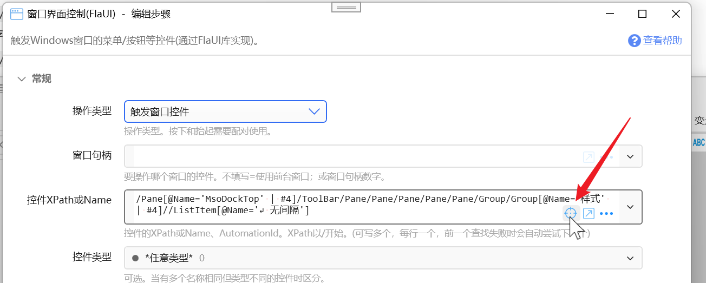
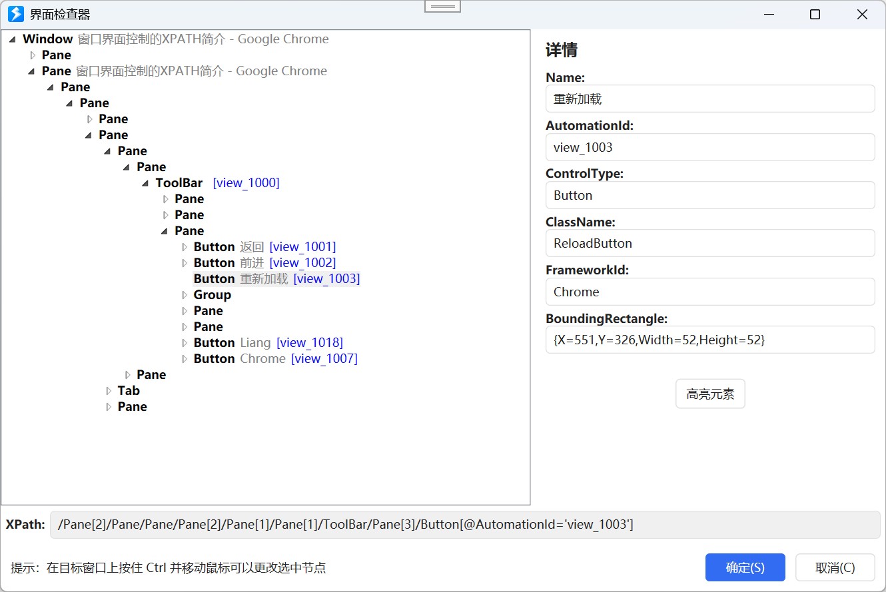
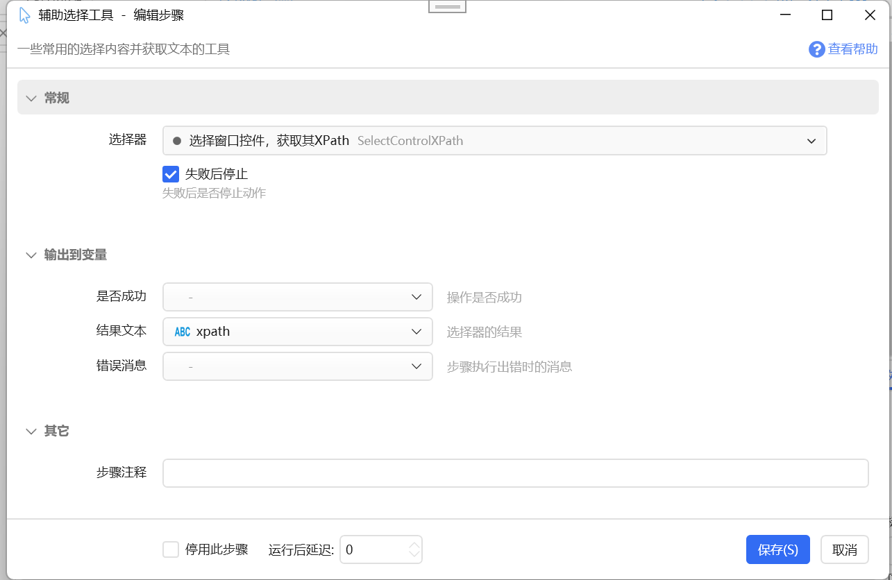

XPATH用于在窗口中定位某个特定控件。

1.44.54 版本对xpath语法做了一些扩展。

## XPATH简介

xpath表示如何抵达一个控件的路径。

示例：`/Pane/Pane[3]/Button[4]`

表示：窗口下的 **第1个Pane控件** 下的 **第3个Pane 控件** 下的 **第4个按钮控件**。

-   `/`表示直接子元素。也有可能使用`//`表示任意下级元素（性能较差，通常比较少使用）。
-   `Pane`、`Button`是元素的类型。
-   `[3]`表示这一层级相同种类元素中的第几个，从1开始。如果父控件下只有一个此类型控件，就可以省略此序号。当界面布局发生变化，某一层级节点的序号改变了，旧的XPATH就会失效。

除了`[序号]`这种筛选条件，xpath也支持“属性”过滤条件。如某个层级的节点：

-   `/Button[@Name='样式']` 表示Name属性值为“样式”的按钮。Name属性通常对应于控件上显示的文字，可能是会变化的。
-   `/Button [@AutomationId='btnSubmit']` 根据AutomationId确定按钮。 在同一个父控件下，AutomationId通常是唯一且不变的。

为了更好的适应界面变化， 在Quicker 1.44.54 版本中，对XPATH语法进行了扩展：

-   `[序号]`支持负数序号，表示倒数第几个。 例如`/Pane[2]/Button[-2]`表示第2个Pane下面的倒数第2个按钮。在按钮顺序会发生变化，但从后向前计数的顺序不变的情况下可以使用。
-   支持属性条件加序号条件，如`/Pane[2]/Button[@Name = 'Save' | #3]` 表示第2个Pane下的Name为`Save`的按钮，如果找不到这个按钮，则查找第2个Pane下的第3个按钮控件。在按钮的名称或顺序，有其中一个可能发生变化时仍然可以找到控件。

## 获取控件的XPATH

如果在设计动作时需要获取控件的XPATH，可以直接点击xpath参数输入框中的按钮。

在选取控件时，如果使用右键点击确认选择，可以打开“界面检查器”窗口，进一步查看和调整要选择的控件。

如果在运行动作中需要动态获取控件的XPATH，可以使用此步骤（也支持右键选择控件后显示“界面检查器”窗口）：

