## 使用说明

**Hello, World**是指在电脑上显示“Hello, World!”（你好，世界！）字符串的程序。因为写法简单可见，是很多初学者首次接触编程时会撰写的程序。下面一起来学习Quicker的“Hello, World!”是怎么实现的。

#### 1\. 新建动作

按下鼠标中间键（滚轮），弹出Quicker面板。中键是软件默认的弹出面板方式，更多弹出方式请[点此了解弹出和隐藏面板](https://www.yuque.com/quicker/help/activate)。

点击Quicker面板上的空白动作按钮，选择“**新建组合动作**”。

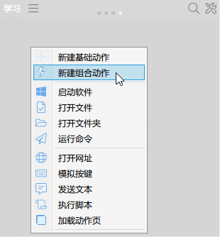

#### 2\. 显示文本输出“Hello World!”

[文本窗口模块](/v2/xaction/modules/showtext)的功能是使用窗口的形式显示一段文本。

-   **在左边的动作模块区域找到“文本处理”（图标是一个A字母）→“文本窗口”。**

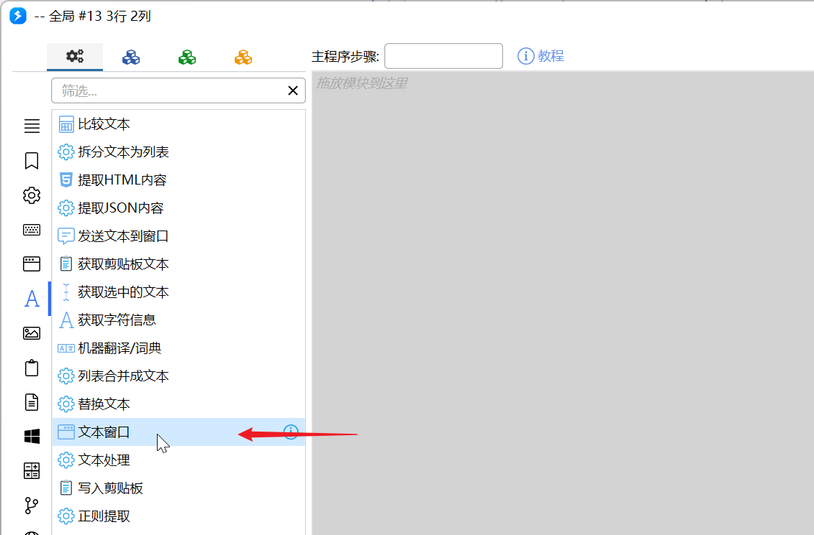

-   **将“文本窗口”拖动到步骤定义区域，自动弹出设置窗口。**

<ActionEditorPreview
  focus="toolbox"
  toolboxTab="text"
  toolboxSearch="文本窗口"
  toolboxSelected="sys:showText"
  actionTitle="我的第一个Quicker动作"
  actionDescription="Hello World"
  caption="将「文本窗口」拖到步骤列表（示意，悬停可暂停）"
  data={{steps: []}}
  dragDemo={{
    moduleKey: 'sys:showText',
    targetSlot: 'steps',
    afterData: {
      steps: [
        {
          key: 'sys:showText',
          inputs: {text: 'Hello World！', title: '我的第一个Quicker动作'},
        },
      ],
    },
  }}
/>

-   **填写文本内容。**

在文本内容处填写：**Hello World！**

在窗口标题处填写：**我的第一个Quicker动作**

填写完成后点击**“保存”**。

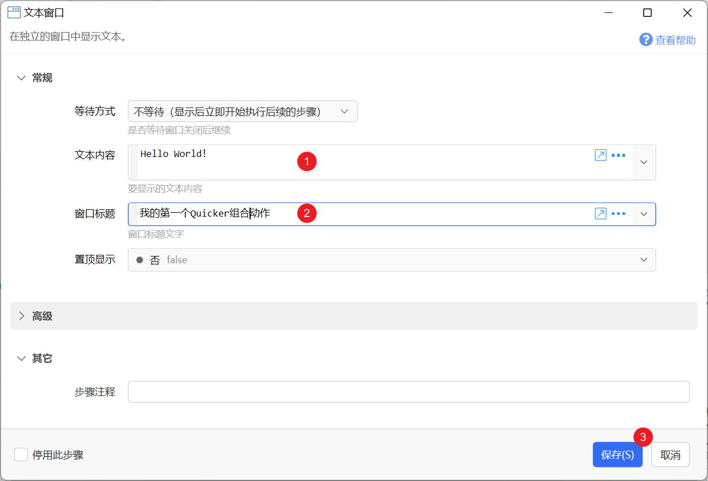

#### 3\. 保存动作

在右下角“标题”处给动作取一个名字，填写：**Hello World**

点击**“保存”。**

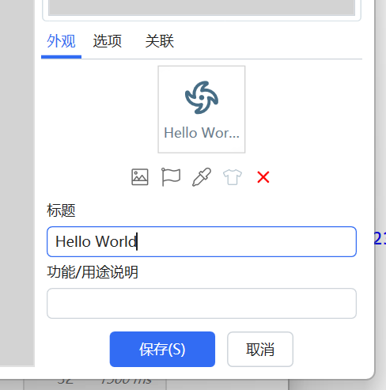

#### 4\. 运行动作

保存后动作会自动保存到刚才新建组合动作的地方，按下中键弹出面板，点击**Hello World**动作。

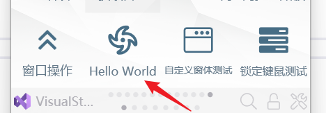

运行后你将会看到如下标题是**我的第一个Quicker动作**，内容是**Hello World**！的文本显示窗口，说明动作编写 成功。

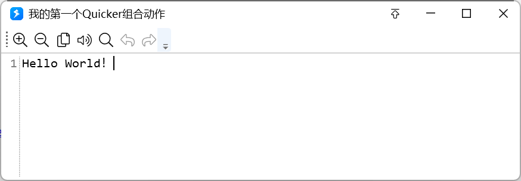

这正是Quicker的强大之处，你不需要像编程语言一样学习复杂的语法和代码，Quicker用模块化的方式，只需要拖动模块再填写关键信息，即可实现很多强大的程序功能。

#### 5\. 提示消息输出“Hello World！”

除了窗口显示文本之外，还可以使用**“提示消息”、“弹窗提示”**等方式输出文本，下面学习**“提示消息”**。

-   **按下中键弹出面板，右击****Hello World→点击编辑，****进入编辑界面。**

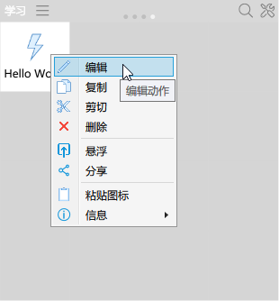

-   **在左边的动作模块区域找到“基础”****（图标是一个齿轮）****→“提示消息”。**
-   **将“****提示消息****”拖动到步骤定义区域，自动弹出设置窗口。**

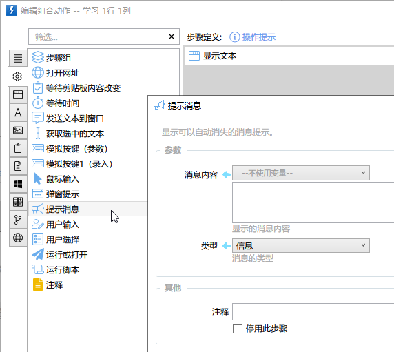

-   **在消息内容处填写：****Hello World！，填写完成后点击“保存”编辑。**

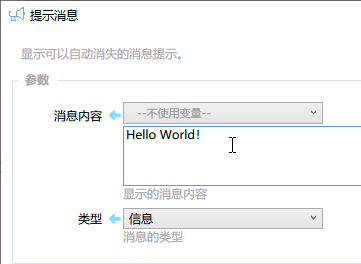

-   **点击动作编辑窗口右下角“保存”****动作****。**

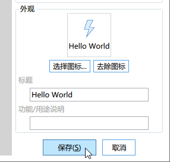

#### 6\. 完成效果

重复第4步学习的动作运行方法，启动**Hello World**。

动作运行后你将会看到标题是**我的第一个Quicker动作**，内容是**Hello World**！的文本显示窗口，和一个蓝色背景带感叹号的提示消息。文本窗口需要手动关闭，提示消息会在3秒内自动关闭。

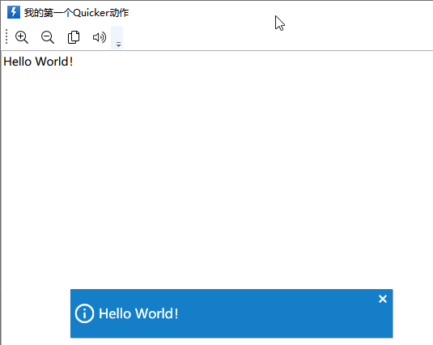

#### 7\. 提交作业

-   **右击刚才编写好的动作，选择“分享”。**

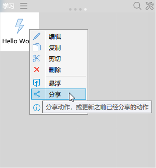    

-   **填写分享信息**

提示填写：**我的第一个Quicker动作**

备注填写：**作业**

分类选择：**其他**

其他选项保持默认即可。

填写完成后点击**“分享”**。

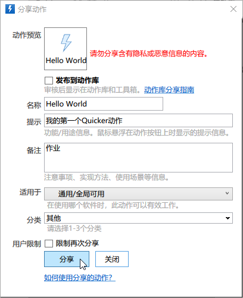

分享成功后，会出现“复制链接”和“打开页面”按钮，其他人可以通过动作链接下载使用动作。

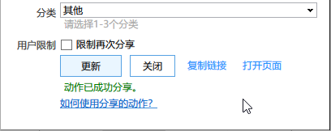
