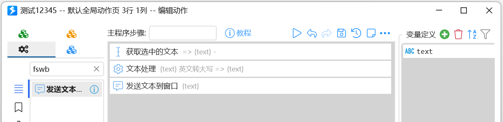

## 推荐的组合动作学习路径

1.  了解组合动作的基本概念和工作原理；
2.  了解什么是变量，以及如何传递变量；
3.  了解一些基础模块；
4.  了解文本插值和表达式；
5.  概要了解有哪些模块和每个模块大概实现的功能；（这时候不需要详细阅读每个模块的文档，仅需了解大概）
6.  根据需求编写动作，理清逻辑，在需要时详细阅读所用模块的文档；
7.  在逐步熟悉后，进一步了解更复杂的内容；

## 组合动作的基本原理

基本原理：

（1）按照从上到下的顺序执行步骤。

（2）每个步骤，使用一个特定的模块，根据指定的输入参数，完成一个特定的操作，并将结果输出到“变量”中。

（3）变量作为中介，用于保存和传递信息。

如下面将选中文本变为英文大写的动作：

-   从上到下依次执行；
-   获取选中的文本后，保存到了text变量中；
-   使用文本处理模块，将text变量中的内容进行英文大写的转换，并将结果再次输出到text变量中。
-   使用发送文本到窗口模块，将文本结果写回窗口。
