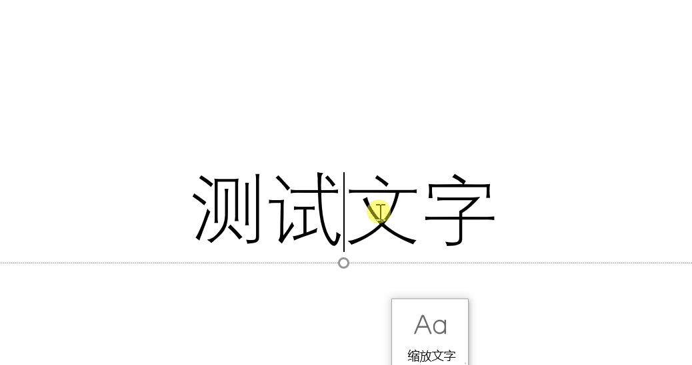
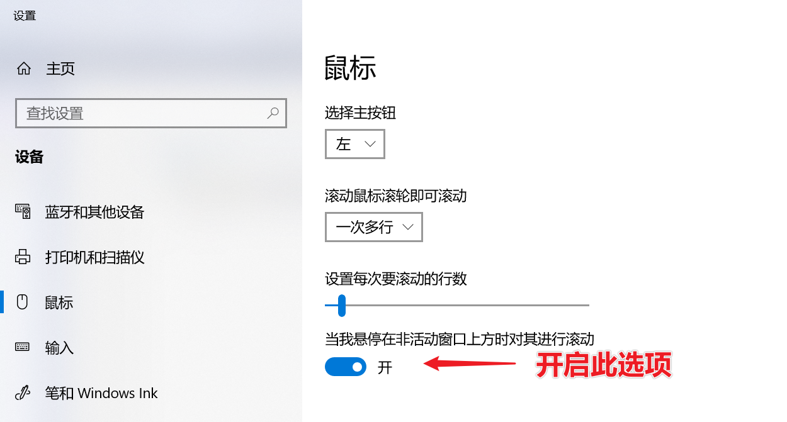
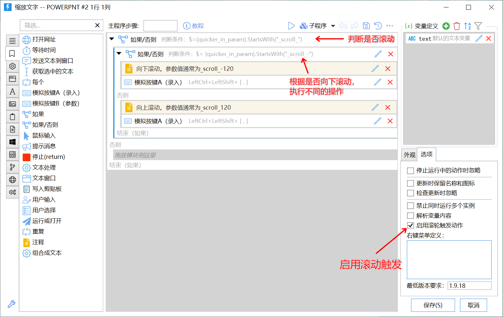

**注意：**

-   因本功能无法在面板窗口触发（面板上滚动用于翻页），建议通过[高级鼠标触发功能](https://getquicker.net/kc/manual/doc/adv-mouse-actions)来实现类似的连续触发需求。
-   Win7 不支持此功能。

## 概述

使用滚轮可以更方便的连续触发操作。

在一些需要连续调节的场景，如果软件本身未提供通过滚轮调节的能力，可以使用Quicker将滚动操作转换为快捷键等调用方式。

滚动触发与悬浮动作按钮结合起来效果更佳。

在面板窗口使用时，因为滚轮用于动作页翻页，所以需要按Shift或Ctrl+滚轮才能触发动作。在悬浮按钮上则可以直接滚动触发。

### Windows设置

在Windows10中，需要开启“当我悬停在非活动窗口上方时对其进行滚动”选项，Quicker才能检测到滚轮消息。

### 如何工作

为动作开启滚轮触发选项以后，在动作上滚轮时，Quicker将执行动作并传入参数 “\_scroll\_delta数字”delta数字通常为120（滚动远离身体方向，向上）或-120（滚动朝向身体方向，向下）。

通过动作参数，即可判断是向上滚动还是向下滚动，或者是点击动作（参数为空）。

## 动作设计

参考示例：

-   滚轮缩放：[https://getquicker.net/sharedaction?code=c7f75269-ce56-4157-7da6-08d836212fc7](https://getquicker.net/sharedaction?code=c7f75269-ce56-4157-7da6-08d836212fc7)
-   快速调整PPT文字：[https://getquicker.net/sharedaction?code=51f02047-9897-4881-7da7-08d836212fc7](https://getquicker.net/sharedaction?code=51f02047-9897-4881-7da7-08d836212fc7)
-   滚轮切换虚拟桌面：[https://getquicker.net/sharedaction?code=ada1704a-2866-4952-7da5-08d836212fc7](https://getquicker.net/sharedaction?code=ada1704a-2866-4952-7da5-08d836212fc7)

在动作设置中，选中“启用滚轮触发动作”选项。

下面的表达式可用于判断是否通过滚动方式触发了动作（判断条件：参数内容是否以“\_scroll\_”开始）：

**$=&#123;quicker\_in\_param&#125;**.**StartsWith**("\_scroll\_")

下面的表达式可用于判断是否向下滚动（判断条件：参数内容是否以“\_scroll\_**\-**”开始）：

**$=** **&#123;quicker\_in\_param&#125;**.**StartsWith**("\_scroll\_-")

\_
