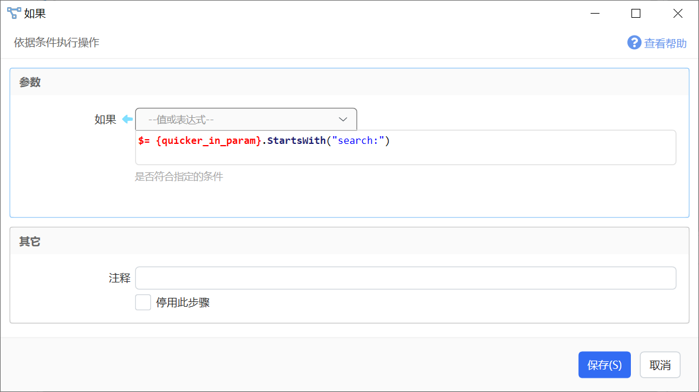
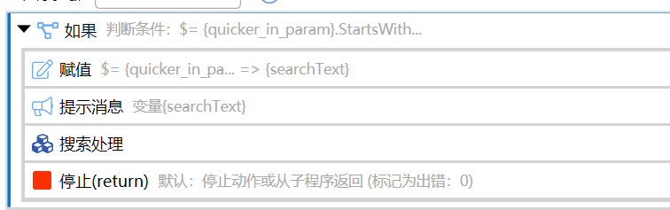
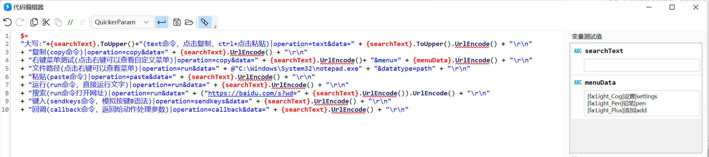
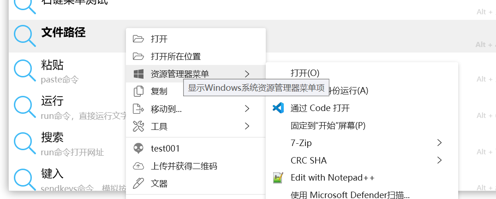
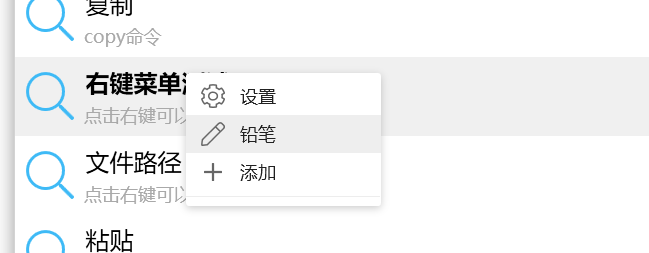
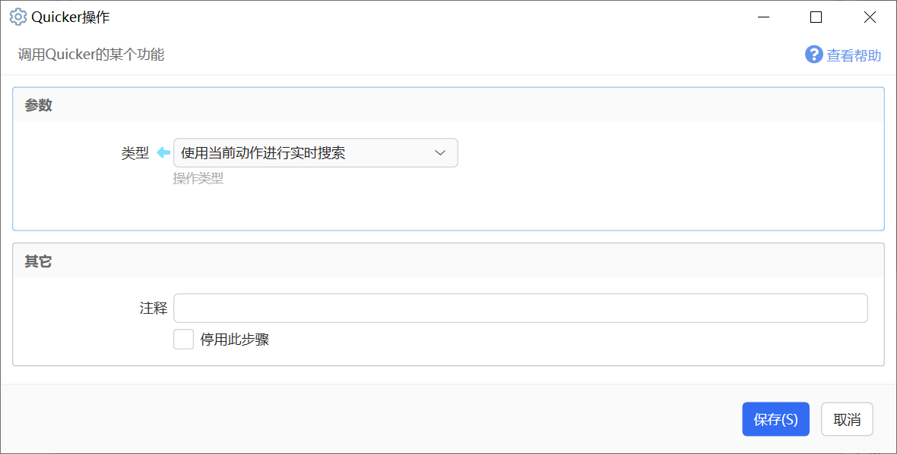

## 简单传递

操作方式：

-   输入动作关键词，找到动作后按Tab键选定动作
-   输入要传递给动作的参数，按回车运行动作。

<SearchBoxPreview mode="pick" selectedAction="翻译" query="翻译" animate />

在动作中：

-   可以通过 `{quicker_in_param}` 变量读取输入的参数。
-   也可以在“获取选中的文本”模块中开启“如果为动作传递了参数，使用参数值作为获取的结果”选项，使动作既可以使用普通操作方式（选中文本后运行动作），也可以直接在搜索框里输入要操作的文本。

## 实时搜索

*以下内容基于版本1.25.0。*

在搜索框输入内容时调用动作并传入参数 `search:搜索词` 。根据动作返回的内容生成结果条目。

[示例动作](https://getquicker.net/sharedaction?code=98b9522b-b97e-48ed-afd8-08d8f6743496)

<SearchBoxPreview
  mode="live"
  query="h"
  results={[
    {title: '大写', description: '转为大写', icon: 'fa:Solid_Font:#2b7abf'},
    {title: '复制', description: '复制到剪贴板', icon: 'fa:Light_Copy:#6aaded'},
    {title: '粘贴', description: '粘贴剪贴板', icon: 'fa:Light_Paste:#6aaded'},
    {title: '运行', description: '运行匹配项', icon: 'fa:Light_Play:#39b54d'},
  ]}
  animate
/>

### 实现步骤

#### 1）在动作中开启支持实时搜索的选项。

#### 2）判断如果是否为搜索框传入的参数

如果是实时搜索传参，则对搜索内容进行处理并返回结果。

表达式：`**$=** **{quicker\_in\_param}**.**StartsWith**("search:")`    

#### 3) 返回搜索结果数据

目前支持两种格式的返回数据：多行文本格式、JSON数据格式。

##### A. 多行文本格式

每行输出一个结果选项。

`[图标]文字(描述文字)|operation=选择选项后的操作&data=要操作的值的URL编码` 

-   图标格式与“用户选择”“文本窗口菜单”等位置一样。
-   |后面的内容需要是合法的querystring，因此data数据通常需要进行url编码。
-   operation表示选择选项后执行的操作类型。
-   data：结果数据的内容。
-   datatype：可选，指定data数据的内容类型。可选值为`path`、`text`、`custom`。

-   值为`path`时，Quicker会自动给搜索结果项添加右键菜单：
    
-   类型为`text`时，会自动添加文本内容上下文菜单。
-   类型为 `custom`时，不会自动添加菜单项。(需版本1.36.7+)

-   menu：可选，URL编码后的自定义菜单项数据。格式与动作右键菜单相同。点击右键菜单时，将使用 `menu:菜单项的值:结果项data` 作为参数调用动作。

##### B. JSON数据格式

返回数据为C#对象`CustomSearchResult`的JSON序列化。类的定义请参考这里的代码：[https://gist.github.com/cuiliang/8475a0b5420a78bfff52c8030450329a](https://gist.github.com/cuiliang/8475a0b5420a78bfff52c8030450329a)

CommonOperationItem 类将作为一个通用类用于更多场景的数据传输。

在这里，它的Children属性用于存储结果项的右键菜单。

&#123;
  "Items": \[
    &#123;
      "Score": 80,				// 批量程度
      "NoHide": false,		// 选择选项后是否自动隐藏搜索框。 仅在结果项用于继续触发搜索框时使用，以避免搜索框闪烁。
      "Title": "结果项标题",
      "Description": "结果项描述",
      "Icon": "fa:Light\_Cog", // 主图标
      "SecondaryIcon": "fa:Solid\_History", // 角标
      "Data": "内容数据",
      "DataType": "text",
      "Operation": null, 		// 无意义
      "Action": null,		 		// 无意义
      "IsSeparator": false, // 无意义
      "ExtraData": null,  	// 用于传递额外数据的词典
      "Children": \[ 				// 子项数据，这里用于存储额外的右键菜单项
        &#123;
          "Icon": "fa:Light\_Cog", //菜单图标
          "Title": "菜单项1",	// 菜单标题
          "Data": "settings",  // 菜单KEY
          "Description": "tooltip", // 菜单提示
          "DataType": null,
          "Operation": null,
          "Action": null,
          "IsSeparator": false,  // 是否为分割线
          "ExtraData": null,
          "Children": null
        &#125;
      \]
    &#125;,
    ...
  \]
&#125;

也可通过表达式直接返回CustomSearchResult类型的对象：

$=new CustomSearchResult()&#123;
  Items = new List&lt;CustomSearchResultItem&gt;()&#123;
    new CustomSearchResultItem()&#123;
      Title = "结果项标题",
      Icon = "fa:Light\_Cog",
      SecondaryIcon = "fa:Light\_history",
      DataType = "text",
      Data = "Hello World",
            //.....其他属性，可以通过补全查看...
    &#125;

&#125;&#125;;

### 通过面板或快捷键触发动作时进入搜索模式

如果动作的主要功能为实时搜索，可能会希望通过快捷键直接启动搜索框并使用这个动作开始搜索。

可以在动作中增加“Quicker操作”模块，类型选择“使用当前动作进行实时搜索”操作类型。

在动作中可以使用这样的判断过程：

-   如果动作参数以 `search:` 开始，表示正在搜索框中进行实时搜索。此时处理搜索内容并返回结果即可。
-   如果动作参数为空，表示是通过其他方式启动动作，可以使用上述模块开启搜索模式。

### 如何调试实时搜索

可以另外创建一个组合动作，在其中使用“运行或停止其它动作”模块。

## 更新历史

-   20221116：datatype增加`custom`类型（v1.36.7）。
