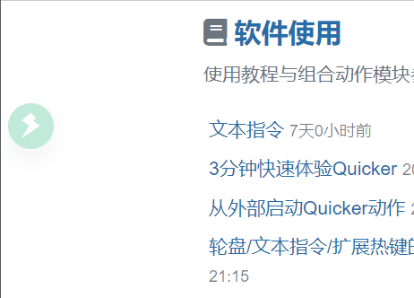
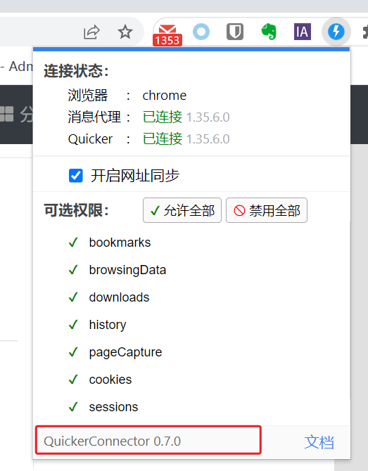
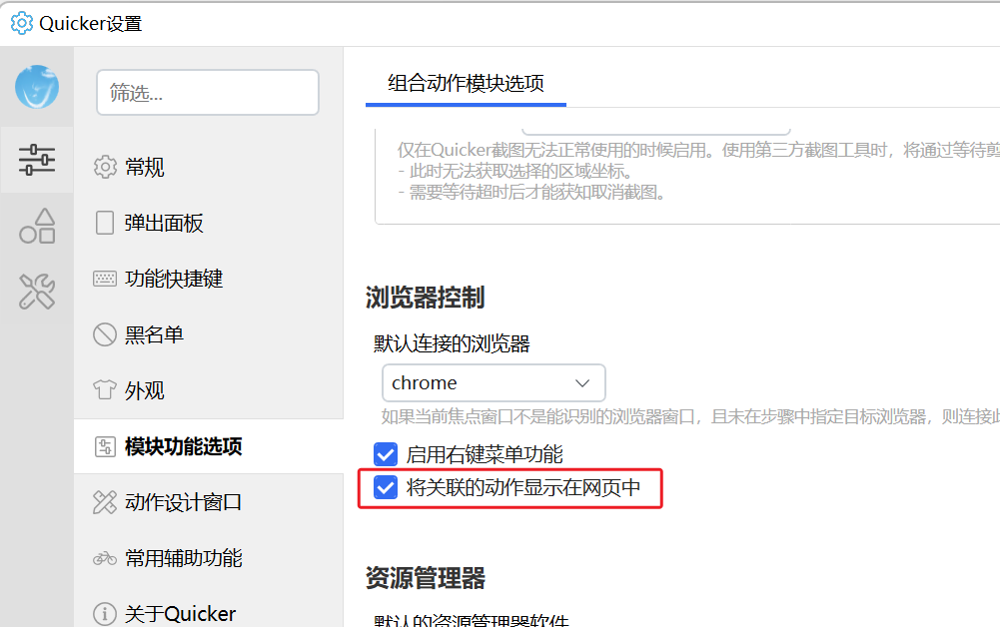
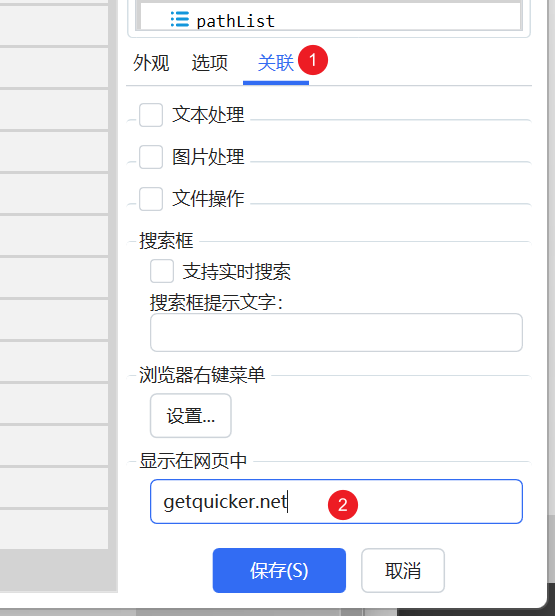
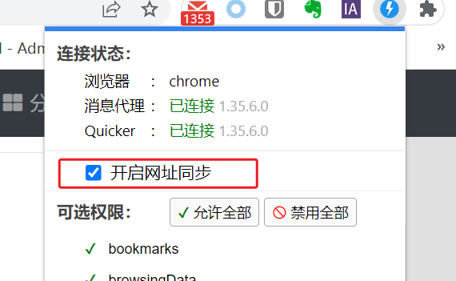
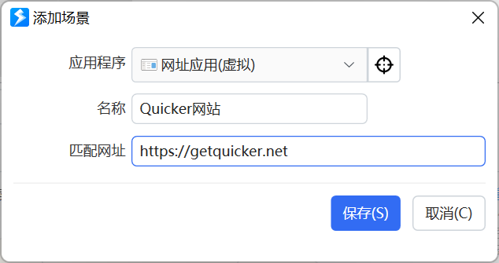
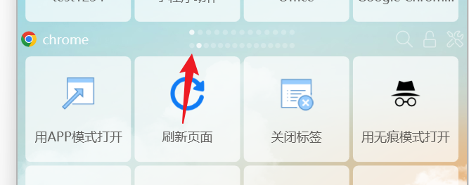
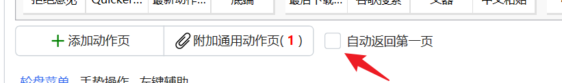

## 一、将动作显示在网页中

### 效果和目的

将与某个网址相关的动作，直接显示在网页中（如自动登录某个系统），避免查找动作的过程。

### 设置和使用

1）chrome 浏览器，Quicker浏览器扩展已升级到 **0.7.0+ 版本**。

2）在设置中开启 “将关联的动作显示在网页中” 选项。

3） 在需要的动作中，设置关联网址（支持通配符\*表示0个或多个任意字符，或者regex:正则表达式）。

这里的正则表达式将会在浏览器环境中进行匹配，请使用JavaScript语法的正则表达式。

更详细说明请参考：[将动作关联到浏览器右键菜单时，如何写匹配网址 - Quicker](https://getquicker.net/KC/Kb/Article/1101)

## 二、网址关联的场景

1） 开启浏览器扩展的网址报告选项

2）添加 “网址应用” 虚拟场景。

匹配网址支持如下格式：

-   `regex:正则表达式`
-   网址的一部分（会根据此内容按如下规则生成正则表达式：将`.`替换为`\.`，将`?`替换为`\?`，将`*`替换为`.*`）

在网页上弹出面板时，网址场景动作页会自动添加到浏览器动作页的前面。使用滚轮向前翻页即可。

如果浏览器场景设置了自动返回第一页，则网址场景将会出现在第一个。

网址关联的动作页中的动作也会自动显示在网页中。
