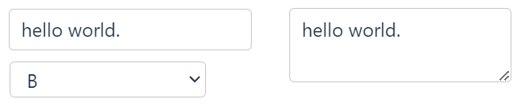
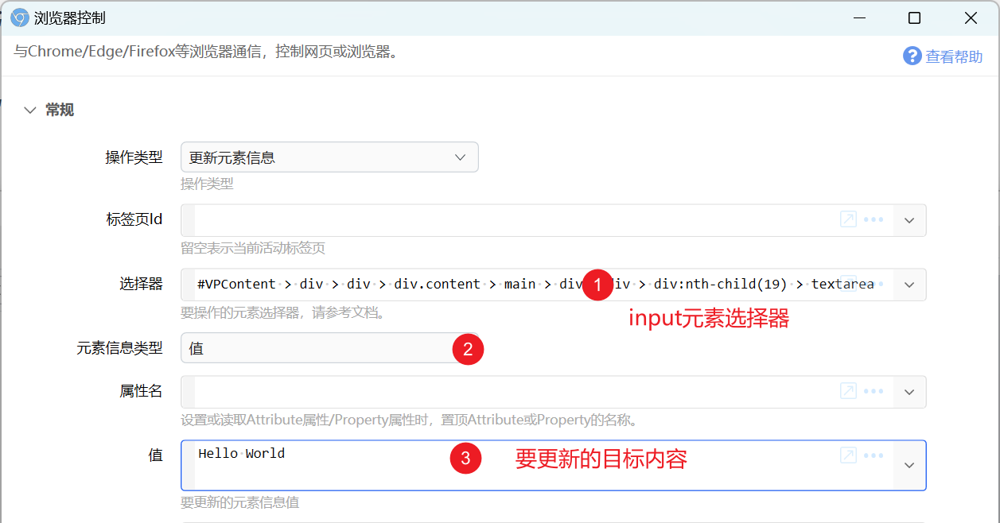
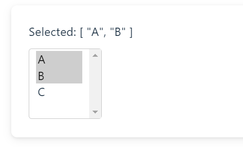
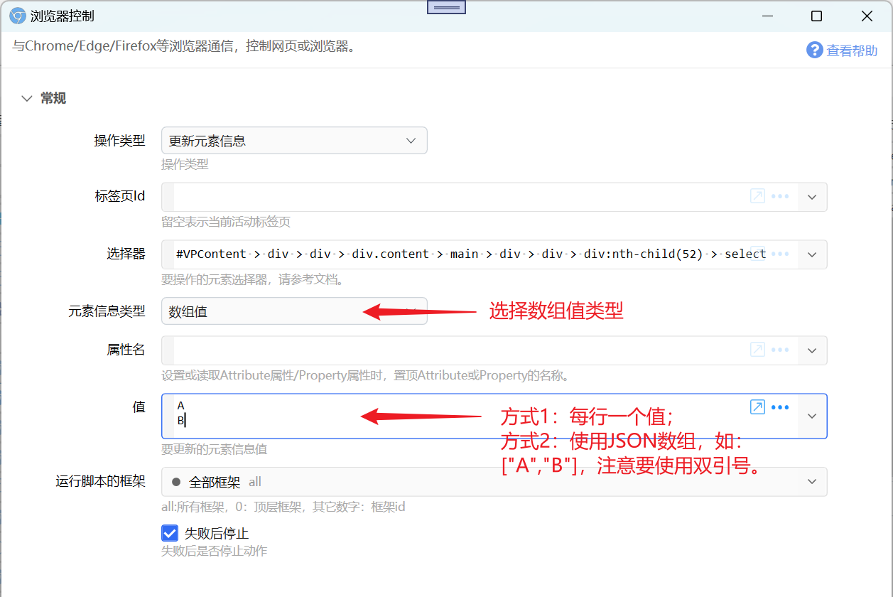

本页保留逐个读取、修改或触发网页元素的传统示例，适合维护旧动作或处理少量单元素操作。

:::tip 新动作优先使用专用操作
批量提取列表、连续翻页或填写多个表单字段时，建议使用新版“提取网页列表数据”和“填写网页表单”。扩展可以可视化生成模板，通常不需要手写选择器。参见[网页列表提取与表单填写](/v2/xaction/guides/web-data-and-form-automation)。单元素点击、填写或选择则优先使用“操作网页元素（推荐）”。
:::

## 网页填表

#### 普通输入框、文本域、单选列表

在获取选择器的时候，务必选择input元素本身的选择器，不要选到它的外层元素。

#### 检查框、单选按钮(Radio)

对应的HTML元素类型&lt;input type='checkbox'&gt;和&lt;input type='radio'&gt;，需更新其checked属性为true或false。

<PreviewMarks
  marks={[
    {key: 'selector', label: '单个检查框或单选按钮的选择器'},
    {key: 'updateElementInfo', label: '更新 checked 属性'},
    {key: 'attrName', label: '属性名 checked'},
    {key: 'updateElementValue', label: '值为 true 或 false'},
  ]}
>
  <ModuleParamPreview
    moduleKey="sys:chromecontrol"
    focusKeys={[
      'operation',
      'tabId',
      'selector',
      'updateElementInfo',
      'attrName',
      'updateElementValue',
      'frame',
      'stopIfFail',
    ]}
    values={{
      operation: 'UpdateElement',
      tabId: '',
      selector: '#demo-john',
      updateElementInfo: 'Property',
      attrName: 'checked',
      updateElementValue: 'true',
      frame: 'all',
      stopIfFail: 'true',
    }}
  />
</PreviewMarks>

#### 多选形式的列表

此时需要更新“数组值”类型。在“值”参数中分行填写每个要选择的值，或使用JSON数组格式填写。（注意在JSON中，每个值需要使用双引号包围）

#### 文件选择控件

文件控件不会进入表单模板。新版 Quicker 请直接使用“浏览器控制”中的“上传文件到网页（安全）”操作；仅支持拖放的网页使用“向网页拖放文件（安全）”。文件路径每行一个，并建议填写页面地址约束，避免在错误网页上传。

## 在网页上下文运行脚本

浏览器扩展具有独立的上下文，因此是无法对网页里的对象和变量进行修改的。有一个变通的方式是在网页文档中插入一个&lt;script&gt;元素。

const scriptElement = document.createElement('script');
scriptElement.innerHTML = `
  console.log('Dynamic script loaded');
  // Execute code here
  window.confirm = function()&#123;return true;&#125;
`;
document.body.appendChild(scriptElement);

上面的代码重写了网页的confirm方法，使得可以跳过网页里的确认窗口。
