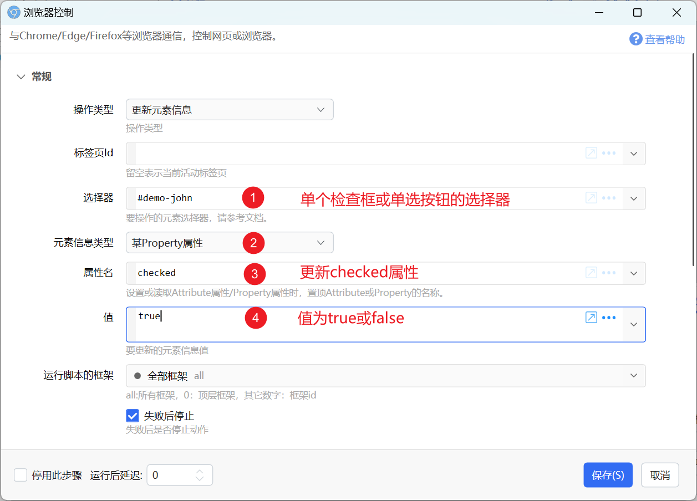

对通过浏览器控制的一些使用示例。

## 网页填表

#### 普通输入框、文本域、单选列表

在获取选择器的时候，务必选择input元素本身的选择器，不要选到它的外层元素。

#### 检查框、单选按钮(Radio)

对应的HTML元素类型&lt;input type='checkbox'&gt;和&lt;input type='radio'&gt;，需更新其checked属性为true或false。

#### 多选形式的列表

此时需要更新“数组值”类型。在“值”参数中分行填写每个要选择的值，或使用JSON数组格式填写。（注意在JSON中，每个值需要使用双引号包围）

#### 文件选择控件

由于安全限制，无法直接触发&lt;input type='file'&gt;，可以尝试下面的方案：

-   使用鼠标输入模块，先点击一下网页中某个位置，再使用触发点击事件；
-   为控件触发“获得焦点”事件，然后在模拟回车或空格；

## 在网页上下文运行脚本

浏览器扩展具有独立的上下文，因此是无法对网页里的对象和变量进行修改的。有一个变通的方式是在网页文档中插入一个&lt;script&gt;元素。

const scriptElement = document.createElement('script');
scriptElement.innerHTML = `
  console.log('Dynamic script loaded');
  // Execute code here
  window.confirm = function()&#123;return true;&#125;
`;
document.body.appendChild(scriptElement);

上面的代码重写了网页的confirm方法，使得可以跳过网页里的确认窗口。
