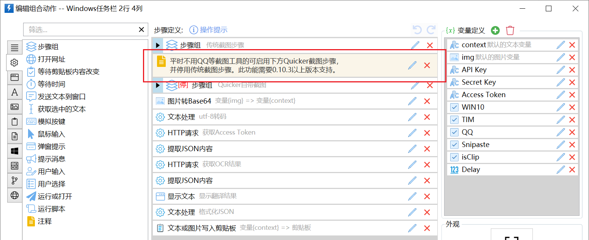
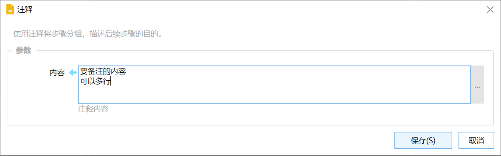
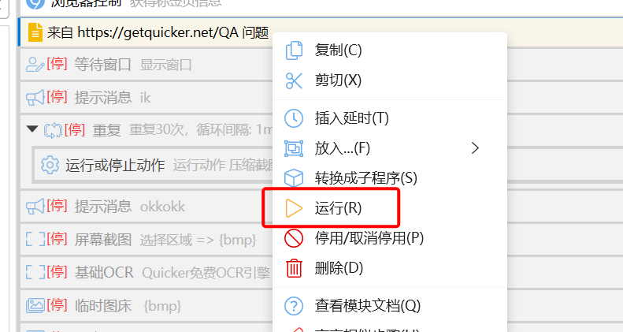

# 注释

使用注释将步骤分组，描述后续步骤的目的。

## 当前模块定义

<XActionModuleMeta moduleKey="sys:comment" />

## 概述

用于在步骤列表中插入一段注释文字，给予自己或其他人必要的信息。如：

-   后续一组步骤的功能用途；
-   如何根据自身需求定制动作；
-   方便以后修改动作的信息等...

## 参数

**内容：**显示在注释模块上的文字。

（版本1.37.24+）如果注释中包含网址，可以点击右键，选择“运行”直接打开注释中的每个网址。

