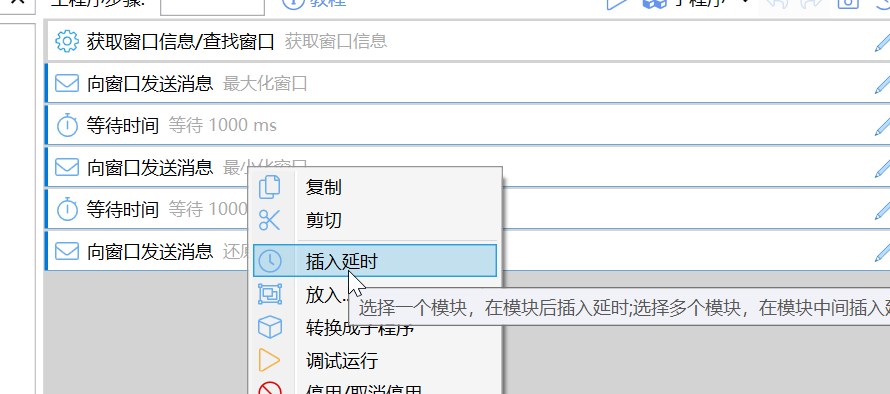

# 等待时间

等待指定的毫秒数

## 当前模块定义

<XActionModuleMeta moduleKey="sys:delay" />

## 概述

功能：等待一段时间（指定毫秒数）再继续后面的动作步骤。

<ModuleParamPreview moduleKey="sys:delay" />

## 参数说明

**等待时间**：要等待的毫秒数。实际等待的时间可能会存在误差（多等待0-20ms）。

**等待窗口关闭时取消**：结合“[等待窗口](/v2/xaction/modules/showwaitwin)”模块，在“等待窗口”被关闭时提前结束等待。

## 快速操作

**快速插入等待时间**

选择多个连续步骤，点击右键，选择“插入延时”即可。

**快速调整延时**

在步骤列表中，在“等待时间模块”上**Ctrl+鼠标滚轮**上下滚动，可以以50ms为单位快速调整等待的毫秒数。

## 应用场景

-   等待界面响应前面的操作，如

-   等待界面切换
-   等待菜单弹出
-   等待操作执行完成等

-   等待程序启动完成等
