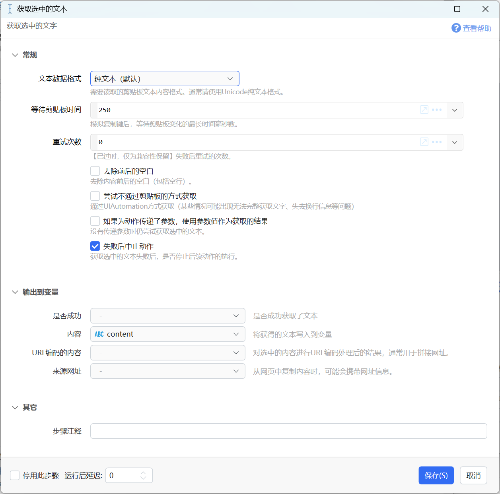

# 获取选中的文本

获取选中的文字

{/* xaction-metadata:start */}
## 当前模块定义

- 模块 Key：`sys:getSelectedText`
- 分类：基础（`Basic`）
- 类型：`Action`
- 风险操作：否
- 专业版：否

## 输入参数

| Key | 名称 | 类型 | 默认值 | 必填 | 变量模式 | 条件 | 说明 |
| --- | --- | --- | --- | --- | --- | --- | --- |
| `format` | 文本数据格式 | `Enum` | UnicodeText | 是 | `Input` |  | 需要读取的剪贴板文本内容格式。通常请使用Unicode纯文本格式。 |
| `waitMs` | 等待剪贴板时间 | `Integer` | 250 | 否 | `UseVarOrInput` |  | 模拟复制键后，等待剪贴板变化的最长时间毫秒数。 |
| `repeat` | 重试次数 | `Integer` | 0 | 否 | `Input` |  | 【已过时，仅为兼容性保留】失败后重试的次数。 |
| `tryNoClipboard` | 尝试不通过剪贴板的方式获取 | `Boolean` | false | 否 | `Input` |  | 通过UIAutomation方式获取（某些情况可能出现无法完整获取文字、失去换行信息等问题） |
| `useActionParam` | 如果为动作传递了参数，使用参数值作为获取的结果 | `Boolean` | false | 否 | `Input` |  | 没有传递参数时仍尝试获取选中的文本。 |
| `trim` | 去除前后的空白 | `Boolean` | false | 否 | `Input` |  | 去除内容前后的空白（包括空行）。 |
| `stopIfFail` | 失败后中止动作 | `Boolean` | true | 否 | `Input` |  | 获取选中的文本失败后，是否停止后续动作的执行。 |

## 输出参数

| Key | 名称 | 类型 | 条件 | 说明 |
| --- | --- | --- | --- | --- |
| `isSuccess` | 是否成功 | `Boolean` |  | 是否成功获取了文本 |
| `output` | 内容 | `Text` |  | 将获得的文本写入到变量 |
| `cleanHtml` | 去除封装的HTML | `Text` | 仅：Html | 剪贴板HTML的主要内容&lt;!--StartFragment--&gt;和&lt;!--EndFragment--&gt;之间的部分 |
| `outputEncoded` | URL编码的内容 | `Text` |  | 对选中的内容进行URL编码处理后的结果，通常用于拼接网址。 |
| `url` | 来源网址 | `Text` |  | 从网页中复制内容时，可能会携带网址信息。 |

## 选项值

### `format` 文本数据格式

| Value | 名称 | 说明 |
| --- | --- | --- |
| `UnicodeText` | 纯文本（默认） |  |
| `Rtf` | Rtf |  |
| `Html` | Html |  |
| `CommaSeparatedValue` | 逗号分隔的值（csv） |  |
{/* xaction-metadata:end */}

## 概述

获取当前选中的文本内容。也可用于接收动作参数。

实现原理为：模拟ctrl+c，待剪贴板发生变化后，读取剪贴板内容。

有许多情况可能导致获取选中文本失败，请参考：[https://getquicker.net/kc/help/doc/cannot\_get\_selected\_text](https://getquicker.net/kc/help/doc/cannot_get_selected_text)

## 输入参数

【文本数据格式】从剪贴板读取内容时，从哪种格式读取数据。支持的格式：unicode纯文本（默认）、rtf、html、csv。
注：剪贴板里可能会同时保存多种格式的内容。

【等待剪贴时间】模拟Ctrl+C后，需要等待目标软件响应按键并将内容写入剪贴板。不同的软件和选择内容的多少不同，所需的时间也会有差别（比如PDF软件，可能需要较长时间）。 请根据使用场景，在必要时增大此参数。

【重试次数】失败后重试次数。

【去除前后的空白】去除获取到内容前后的空白字符。

【尝试不使用剪贴板的方式获取】尝试使用UIAutomation方式获取选中的文本内容。此方式不会污染剪贴板，但是在某些情况下会出现一些兼容性问题，已知的例子：

-   在Word中，无法完整获选择的多个单元格中的文本。
-   在Chrome中，有的地方获取到的内容会失去换行。

【如果为动作传递了参数，使用参数值作为获取的结果】如果希望同一个动作既可以处理选中的文本，也可以通过传递参数的方式指定待处理内容的话，可以使用此选项。如果动作参数中有数据，则直接返回动作参数的内容，否则执行默认的获取文本操作。（版本1.8.0中增加）

【失败后中止动作】读取失败后是否停止动作。

## 输出参数

【内容】返回获取的文本内容。

【URL编码的内容】返回经过URL编码处理后的选中内容。在通过拼接URL网址时，可能会需要对参数内容进行URL编码。使用此输出可以减少额外的编码步骤。

【来源网址】在浏览器等位置获取文本时，可以输出内容所在的网页地址。

【是否成功】操作是否成功。

## 附加说明

此功能是通过模拟Ctrl+C然后读取剪贴板来实现的。请确保没有安全软件拦截Quicker发送按键，并且正则使用的软件支持Ctrl+C复制（比如百度文库等网页里，是不支持ctrl+c复制的）。

## 更改历史

-   1.5.7 增加URL编码结果输出。
-   1.8.0 增加读取动作参数的功能。
-   1.38.21 增加不适应剪贴板的方式。
