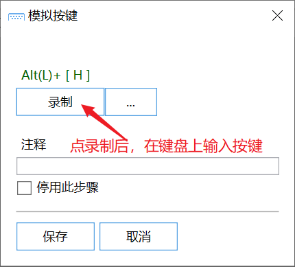

# 模拟按键A（录入）

模拟键盘输入

## 当前模块定义

<XActionModuleMeta moduleKey="sys:keyInput" />

## 概述

模拟按键模块用于向当前窗口发送固定的键盘按键操作，如快捷键等。可以参考基础动作“[模拟按键](https://getquicker.net/KC/Manual/Doc/keyboard-input)”的说明。

如需发送复杂或动态变更的按键序列，请使用“[模拟按键B（参数）](/v2/xaction/modules/sendkeys)”模块。

添加模块时，点击“录制”按钮后，在键盘上按下要模拟的按键组合即可。也可以点击右侧的“...”按钮选择按键组合。

### 提示

-   模拟按键有可能会受到输入法影响，如果运行时效果不对，可以切换输入法到英文状态。
-   在模拟按键前，应确保要输入的窗口状态已准备好，可根据需要在前后增加延时（等待时间）。
-   本模块不支持模拟鼠标按键。
-   部分软件使用了特殊的快捷键机制，可能不支持本模块模拟的按键。此时可以：

-   尝试使用“模拟按键B”模块；
-   （使用按键操作模块）分别模拟按键的按下和抬起，并在中间增加一些延迟时间；
