# 鼠标输入

模拟鼠标输入

## 当前模块定义

<XActionModuleMeta moduleKey="sys:mouse" />

## 概述

本模块用于移动鼠标指针、模拟鼠标点击等操作。支持多种操作类型。

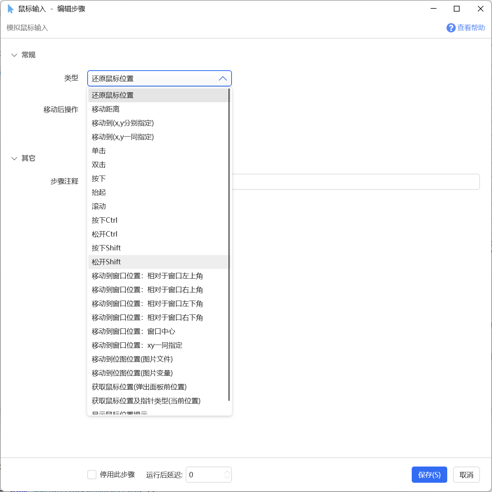

### 屏幕坐标

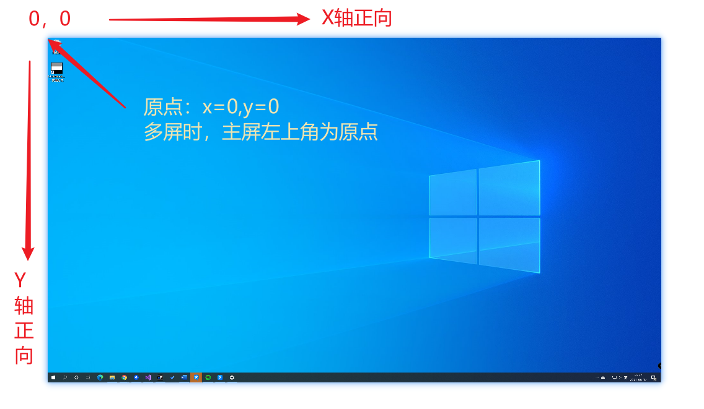

主屏幕的左上角为原点，X=0, Y=0。多屏幕时，主屏的左上角为原点。

X表示水平坐标，向右为正值增加。

Y表示垂直坐标，向下为正值增加。

### 通用参数说明

【移动后操作】

通过移动距离、移动到目标位置等方式移动鼠标坐标后，需要执行的操作，可选：`无、左键单击、左键双击、右键单击、右键双击`。

【操作完成后恢复鼠标位置】

移动鼠标并模拟点击后，是否还原鼠标位置。

【逐渐移动到目标】

分多次逐渐移动到目标位置，用于在特定情况下触发一下目标软件的鼠标移动消息。

【窗口句柄】

相对于窗口移动鼠标时，指定目标窗口的句柄。[什么是窗口句柄？](https://getquicker.net/KC/Kb/Article/1108)

留空或0表示前台窗口（即当前具有输入焦点的窗口）。

## 各操作类型说明

#### 还原鼠标位置

将鼠标指针还原到弹出Quicker面板前的位置。

因为弹出面板、选择动作时，会移动鼠标指针到动作位置，如果希望在弹出面板前的位置执行鼠标操作可以使用此操作。

通过悬浮按钮/悬浮面板/快捷键等方式触发动作时，因为无法获得弹出面板前的位置，会导致此模块无法正常操作。

#### 移动距离

将鼠标指针从**当前位置**移动一定的距离（单位为像素）。X正值表示向右移动，负值表示向左移动。Y正值表示向下移动，负值表示向上移动。

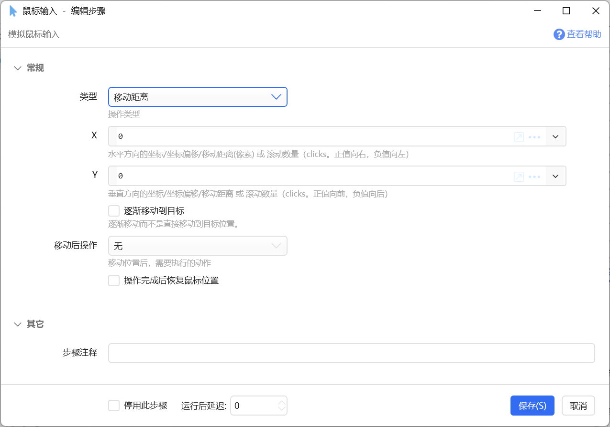

#### 移动到（x,y分别指定）

移动到某个屏幕坐标，通过2个参数分别传递x和y的坐标数值。

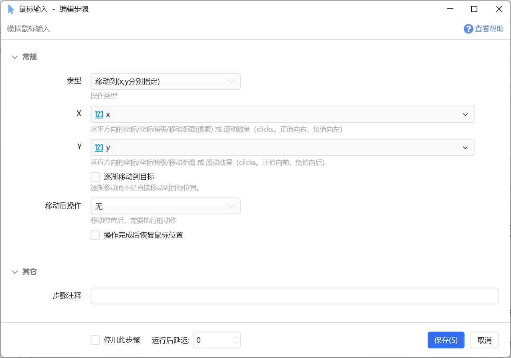

#### 移动到（x、y一同指定）

移动到某个屏幕坐标，使用`x坐标,y坐标`格式的文本指定目标位置，如`100,200`。也可以使用百分比方式指定，如：`50%,50%`表示屏幕中心，或`50%,100`表示水平方向屏幕中心，y=100的位置。

可以使用Snipaste等工具查看某个位置的绝对坐标。也可以使用输入框右侧的小工具进行选择。

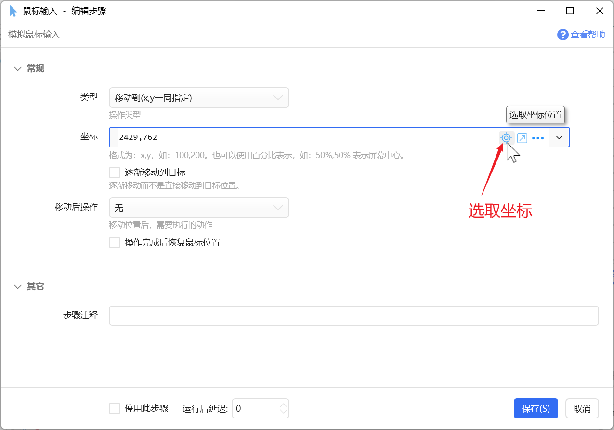

#### 单击、双击、抬起、按下

模拟鼠标按键事件。

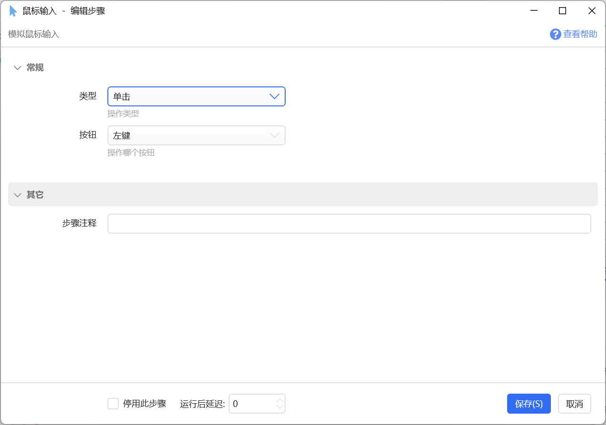

#### 滚动

模拟鼠标滚动事件。

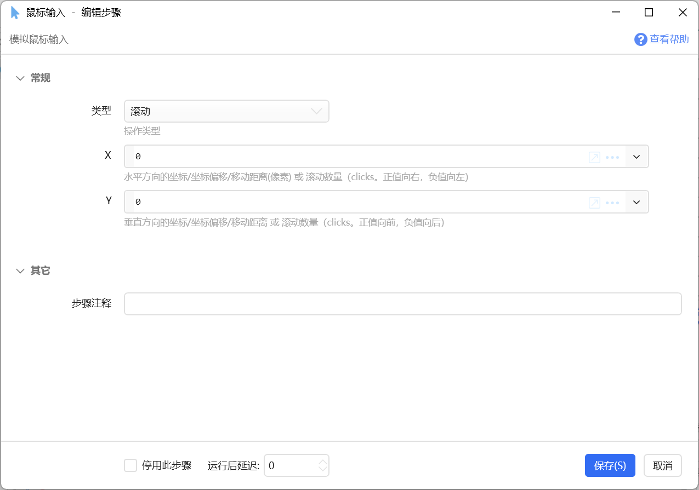

此时可以在X、Y参数中填写数字，表示水平和垂直方向的滚动距离。

Y表示垂直滚动的click数量，正值表示向前（向上翻页），负值表示向后（向下翻页）。

X表示水平滚动的click数量，正值表示向右，负值表示向左。

（1 click，一般情况下等于鼠标滚轮的一格，一个顿挫感）

滚动只对鼠标指针所在位置的窗口有效。因此，不要使用悬浮按钮来触发模拟滚动的动作。使用面板窗口触发时，如果动作开始时就滚动，需要增加延时以等待面板窗口关闭。

有一些软件需要使用循环模拟多次滚动消息才有效果。

#### 按下Ctrl、松开Ctrl、按下Shift、松开Shift

用于模拟类似于“Ctrl+鼠标点击”的情况。

通常先模拟按下按键后，再模拟鼠标输入，再松开按键。

本功能也可以用单独的模块《[按键操作](/v2/xaction/modules/keyoperation)》实现。

#### 移动到窗口位置（左上角、右上角等）

当窗口位置或尺寸可能会变化，但是目标位置相对于窗口是固定的，可使用本功能。

可选的参考点类型：

-   窗口左上角
-   窗口右上角
-   窗口左下角
-   窗口右下角
-   窗口中心

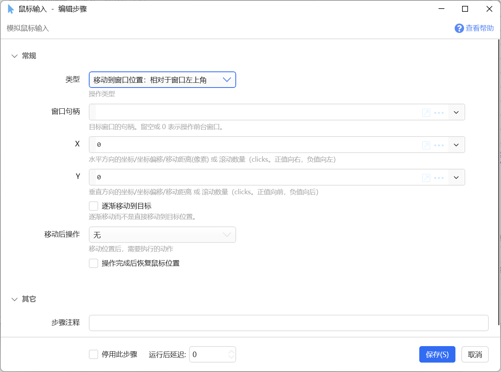

【X】和【Y】参数

表示相对于窗口参考点的偏移。X正值向右，Y正值向下。

比如在使用相对于右下角的方式时，X和Y分别为负值，才能定位到窗口内。

#### 移动到窗口位置（xy一同指定）

效果类似于“移动到窗口位置：相对于窗口左上角”，但是使用字符串方式一同指定相对坐标。

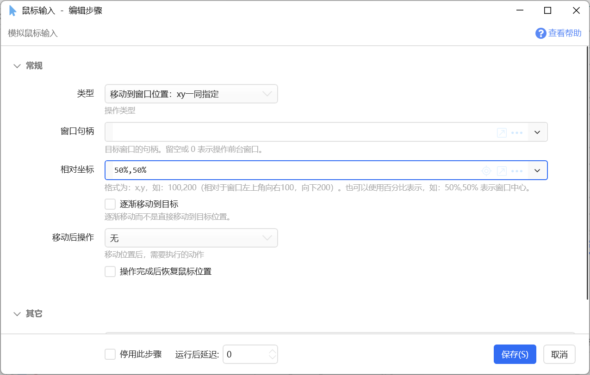

【相对坐标】

格式为：`x,y`，如：`100,200`（相对于窗口左上角向右100，向下200）。也可以使用百分比表示，如：`50%,50%` 表示窗口中心。

#### 移动到位图位置（图片文件、图片变量）

找图定位功能。根据指定的小图，在屏幕上或窗口内查找匹配图片，并将鼠标指针移动到该位置。

找图后自动移动到目标位置。 如果只需要找到位图位置而不需要进行鼠标操作，或者要进行自定义的鼠标操作，请使用“[屏幕找图](/v2/xaction/modules/searchbmp)”模块。也可以使用子程序“[屏幕找图增强版](https://getquicker.net/subprogram?id=e4af1d5b-143b-4b62-4de5-08d85ac8eddb)”进行找图操作，该子程序具有更高的容错能力。

#### 获取鼠标位置（弹出面板前位置）

获取面板的触发位置。

与“还原鼠标位置”操作所恢复的鼠标位置一致。

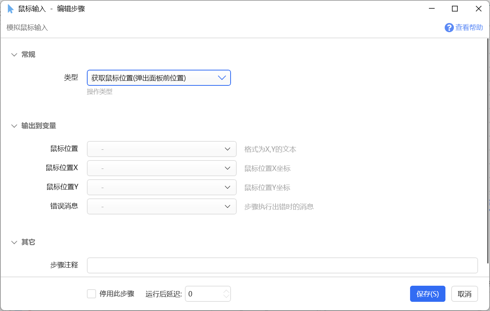

#### 获取鼠标位置及指针类型（当前位置）

获取动作执行到此步骤时的（而非弹出面板之前的）鼠标位置和指针类型。

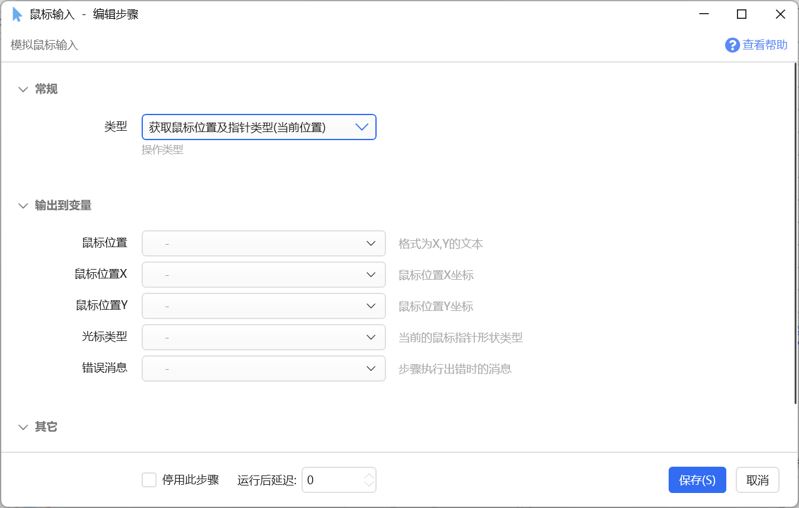

【光标类型】

鼠标指针的类型。请实际测试以获得准确的值。

常见鼠标指针类型：

-   Arrow 默认
-   IBeam 选定文本
-   Hand 链接选择
-   SizeAll 移动
-   SizeWE 水平调整
-   SizeNS 垂直调整
-   SizeNESW 东北西南对角线调整
-   SizeNWSE 西北东南对角线调整
-   Wait 忙碌
-   Appstarting 后台运行

不能识别的，返回原始值（一个数字）。

#### 显示鼠标位置提示

在当前鼠标位置显示一个从小到大的水波纹动画，用于提示当前鼠标位置。

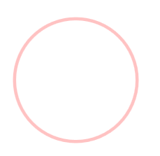

## 注意事项

-   滚动操作会作用到鼠标指针所在位置窗口上。所以不能使用悬浮动作按钮触发（除非在动作中增加了足够的延迟时间，待鼠标移动到目标位置后再模拟滚动）。
-   模拟键盘+鼠标的组合操作时（如模拟Ctrl+滚动），键盘和步骤之间需要增加一些延迟（10ms+）。这是因为鼠标和键盘是不同的消息队列，如果没有延迟，可能会出现生效顺序和预期不一致的情况（[参考](https://getquicker.net/QA/Question/15424)）。

## 移动到位图位置（找图定位）参数说明

注意：本功能已提取为单独的模块《[屏幕找图/找色/找字](/v2/xaction/modules/searchbmp)》，后续开发建议使用该模块。

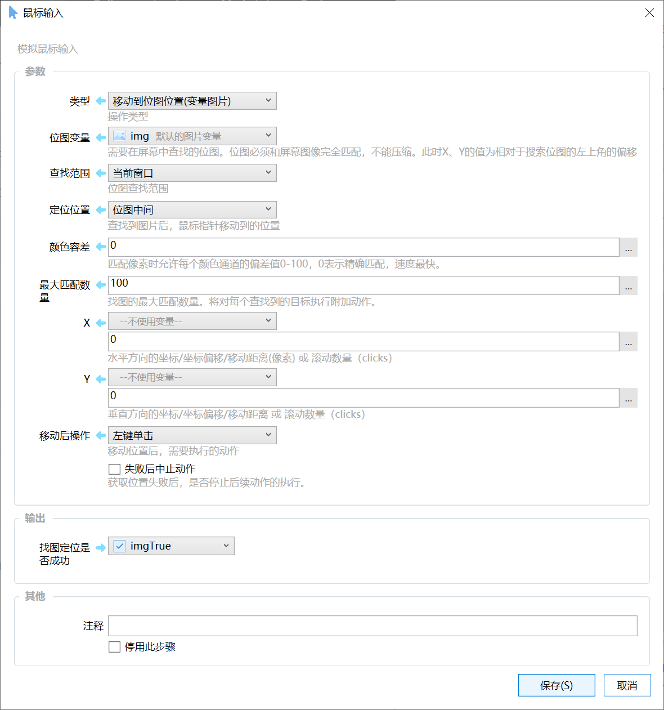

**位图变量/位图路径：**要在屏幕或窗口中寻找的小图；

**查找范围（****当前窗口或主屏幕****）：**在哪个范围内查找图片；

**定位位置：**找到图片位置后，将鼠标移动到寻找图片的左上角（如下图的A点）还是中间位置（如下图的B点）。

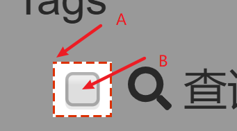

**颜色容差：**在匹配像素颜色时，对每种颜色（red、green、blue）的值在上下多少的范围内认为是匹配。0表示精确匹配，运算速度会最快。

**最大匹配数量：**允许最多找到多少个匹配位置。当一个窗口内有多个匹配时，会对每个匹配执行“移动后操作”。

**X、Y：**定位位置的偏移量。定位到图片的左上角或中间位置后，可以使用这两个值对坐标偏移一定的像素数。

**移动后操作：**移动到目标位置后要进行的操作，比如点击。

### 示例动作

下面的动画演示了一个截图点击动作（参考Marcus的[分享动作](https://getquicker.net/sharedaction?code=95efcbcf-0333-4e72-0086-08d6b398dbc5)）：

此处为语雀视频卡片，点击链接查看：[截图点击.mp4](/v2/xaction/modules/mouse)

**动作定义：**

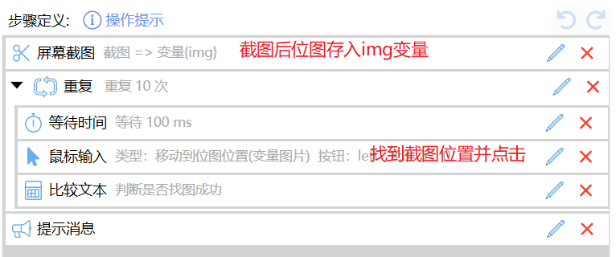

其中“鼠标输入”步骤的定义如下图所示：

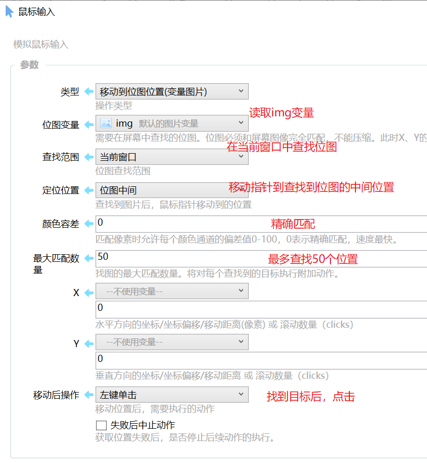

## 更新历史

-   20230109 增加一些注意事项。
-   20250120 完善文档以匹配实际功能。
