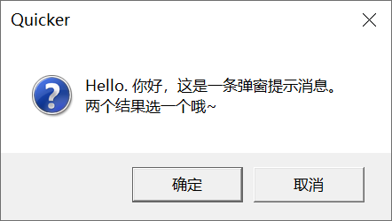
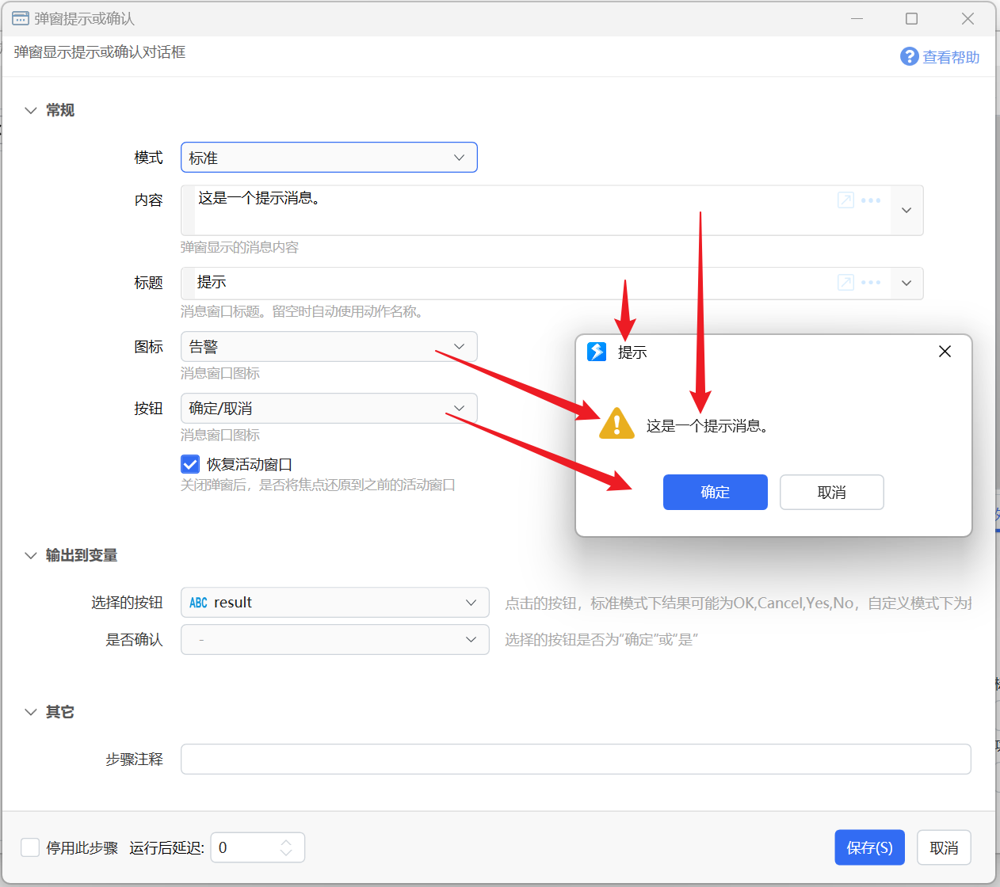
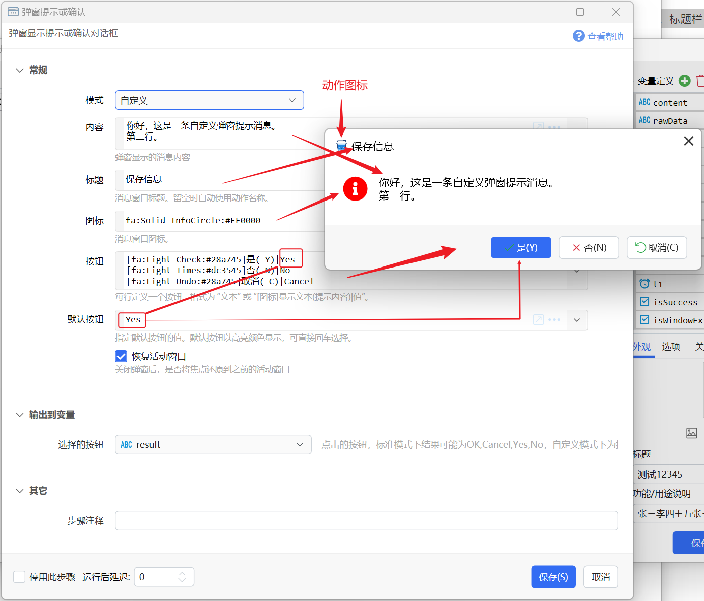
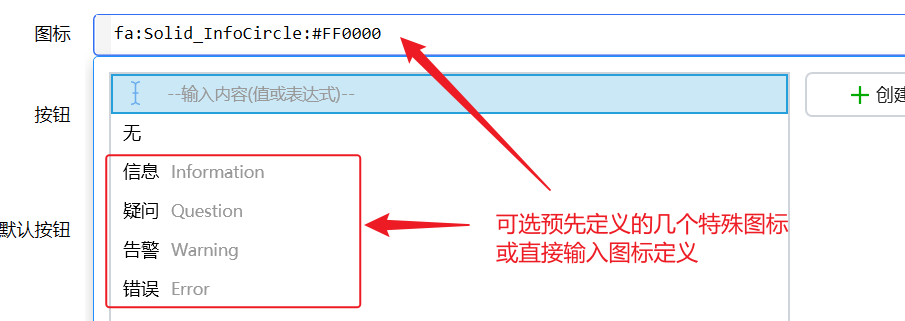

# 弹窗提示或确认

弹窗显示提示或确认对话框

{/* xaction-metadata:start */}
## 当前模块定义

- 模块 Key：`sys:MsgBox`
- 分类：基础（`Basic`）
- 类型：`Action`
- 风险操作：否
- 专业版：否

## 输入参数

| Key | 名称 | 类型 | 默认值 | 必填 | 变量模式 | 条件 | 说明 |
| --- | --- | --- | --- | --- | --- | --- | --- |
| `operation` | 模式 | `Enum` | default | 是 | `Input` |  |  |
| `message` | 消息内容 | `Text` | Hello. | 是 | `UseVarOrInput` |  | 弹窗显示的消息内容。"自定义"模式时，也支持"MD:Markdown内容"。 |
| `title` | 标题 | `Text` | Quicker | 是 | `Input` |  | 消息窗口标题。留空时自动使用动作名称。 |
| `icon` | 图标 | `Enum` | Information | 是 | `Input` | 仅：default | 消息窗口图标 |
| `customIcon` | 图标 | `Text` | Information | 是 | `UseVarOrInput` | 仅：custom | 消息窗口图标。 |
| `buttons` | 按钮 | `Enum` | OK | 是 | `Input` | 仅：default | 消息窗口图标 |
| `customButtons` | 按钮 | `Text` | [fa:Regular_Check:#4caf50]是(_Y)\|Yes [fa:Regular_Times:#dc3545]否(_N)\|No [fa:Light_Undo:#444444]取消(_C)\|Cancel | 是 | `Input` | 仅：custom | 每行定义一个按钮，格式为 "文本" 或 "[图标]显示文本(提示内容)\|值"。 |
| `defaultButton` | 默认按钮 | `Text` | Yes | 是 | `Input` | 仅：custom | 指定默认按钮的值。默认按钮以高亮颜色显示，可直接回车选择。 |
| `restoreFocus` | 恢复活动窗口 | `Boolean` | true | 否 | `Input` |  | 关闭弹窗后，是否将焦点还原到之前的活动窗口 |

## 输出参数

| Key | 名称 | 类型 | 条件 | 说明 |
| --- | --- | --- | --- | --- |
| `result` | 选择的按钮 | `Text` |  | 点击的按钮，标准模式下结果可能为OK,Cancel,Yes,No，自定义模式下为按钮的值。 |
| `okOrYes` | 是否确认 | `Boolean` | 仅：default | 选择的按钮是否为"确定"或"是" |

## 选项值

### `operation` 模式

| Value | 名称 | 说明 |
| --- | --- | --- |
| `default` | 标准 |  |
| `custom` | 自定义 |  |

### `icon` 图标

| Value | 名称 | 说明 |
| --- | --- | --- |
| `None` | 无 |  |
| `Information` | 信息 |  |
| `Question` | 疑问 |  |
| `Warning` | 警告 |  |
| `Error` | 错误 |  |

### `customIcon` 图标

| Value | 名称 | 说明 |
| --- | --- | --- |
| `` | 无 |  |
| `Information` | 信息 |  |
| `Question` | 疑问 |  |
| `Warning` | 警告 |  |
| `Error` | 错误 |  |

### `buttons` 按钮

| Value | 名称 | 说明 |
| --- | --- | --- |
| `OK` | 确定 |  |
| `OKCancel` | 确定/取消 |  |
| `YesNo` | 是/否 |  |
{/* xaction-metadata:end */}

## 概述

显示一个向用户提示或确认信息的对话框，就像你会经常在各种程序里看到的那样：

这个对话框会占用焦点，并且会在手动关闭之前一直显示在屏幕上。动作也会停留在这个步骤，等待关闭后再继续执行。

目前支持两种模式：

-   标准模式：类似于windows内置弹窗，支持固定图标和按钮组合。
-   自定义模式：可自图标和按钮，显示内容比较灵活。

## 标准模式

与Windows内置的弹窗功能类似，支持固定可选的图标类型和按钮组合。与各语言的`MessageBox.Show`方法功能类似。

参数说明：

【模式】选择标准或是自定义模式。

【内容】消息的主要内容。

【标题】窗口标题。

【图标】显示在消息内容左侧的图标，以显示消息的类型。支持如下的图标样式：

-   信息
-   疑问
-   告警
-   错误

【按钮】定义对话框底部显示的按钮，支持如下的组合：

-   确定
-   确定和取消
-   是和否

【恢复活动窗口】是否在弹窗关闭后，将焦点还原到弹窗之前拥有焦点的窗口上。

输出参数

【选择的按钮】点击的按钮，可能为`OK`,`Cancel`,`Yes`,`No`。

【是否确认】是否点击的按钮为“确定”或“是”（表示正面选择的按钮）。

## 自定义模式

支持自定义按钮、图标，标题栏可显示动作图标。

参数说明：

【模式、内容、标题】请参考上文标准模式中的说明。

-   自定义模式下，消息内容也支持MarkDown格式，以`MD:`（MD+英文半角冒号）开始作为启用Markdown的标记，后面写实际的Markdown内容。（需1.39.20+版本）
    支持的[Markdown格式扩展语法参考](&lt;https://github.com/whistyun/MdXaml/wiki/How-to-use-Enhanched-syntax &gt;)。

【图标】可选预定义的图标名称，或手动输入Quicker所支持的[各种自定义图标定义](/v2/xaction/concepts/use-icon-in-actions)（无需输入中括号，如`icon:**一个可能不存在的文件.docx**`）。

【按钮】每行定义一个按钮，其格式可参考《[用户选择](/v2/xaction/concepts/use-icon-in-actions)》模块中的选项定义：

-   `标题` 只指定标题，自动使用和标题一样的内容作为按钮的值。
-   `标题|值` 自定义标题和值。
-   `[图标]标题(_X)(提示文字)|值` 指定图标、快捷字母、提示文字和值。

下划线加字母表示按钮的快捷字母。如`_C`表示按钮的快捷字母为`C`。按`Alt+C`相当于按下此按钮。

【默认按钮】指定要预先选中并且高亮显示的按钮**值**。

输出参数：

【选中的按钮】所点击的按钮的值。如果没有选择，则输出空字符串。

## 示例动作

-   [示例：弹窗消息](https://getquicker.net/sharedaction?code=b6098426-6fda-4db9-6d88-08d6bfa4ff29)

## 更新历史

-   20230617 v1.38.21 版本：增加自定义模式。
-   20230713 图标格式增加无需中括号的说明。
-   20230904 1.39.20 版本，自定义模式支持Markdown内容。
-   20241029 增加markdown扩展语法文档链接。
