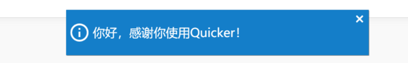
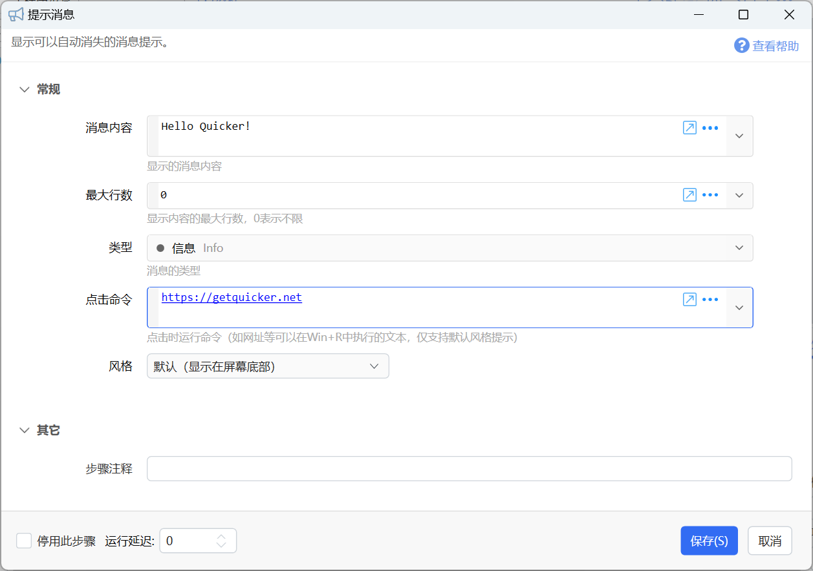

# 提示消息

显示可以自动消失的消息提示。

{/* xaction-metadata:start */}
## 当前模块定义

- 模块 Key：`sys:notify`
- 分类：基础（`Basic`）
- 类型：`Action`
- 风险操作：否
- 专业版：否

## 输入参数

| Key | 名称 | 类型 | 默认值 | 必填 | 变量模式 | 条件 | 说明 |
| --- | --- | --- | --- | --- | --- | --- | --- |
| `type` | 类型 | `Enum` | Info | 是 | `Input` |  | 消息的类型 |
| `msg` | 消息内容 | `Text` |  | 否 | `UseVarOrInput` |  | 显示的消息内容 |
| `title` | 标题 | `Text` |  | 否 | `UseVarOrInput` |  | 留空使用动作名称，填写 - 不显示标题，其他内容原样显示 |
| `placement` | 显示位置 | `Enum` | BottomCenter | 是 | `UseVarOrInput` | 仅：Success, Info, Warning, Error |  |
| `maxLines` | 最大行数 | `Integer` | 0 | 是 | `UseVarOrInput` |  | 显示内容的最大行数，0表示不限 |
| `durationSeconds` | 保持秒数 | `Integer` | 0 | 否 | `UseVarOrInput` | 仅：Success, Info, Warning, Error | 0 使用默认时长，-1 持续显示，或填写 2 到 30 秒 |
| `showTime` | 显示时间 | `Boolean` | false | 否 | `UseVarOrInput` | 仅：Success, Info, Warning, Error | 有标题时，在通知右上方显示消息发出时间；无标题的紧凑通知不显示时间。 |
| `duplicate` | 重复控制 | `Text` |  | 否 | `UseVarOrInput` | 仅：Success, Info, Warning, Error | 留空时每次显示新通知。填写标识可复用同一通知：replace:标识 替换内容，count:标识 累计次数，ignore:标识 忽略后续重复；省略模式时按 replace 处理。 |
| `clickAction` | 点击操作 | `Text` |  | 否 | `UseVarOrInput` |  | 普通文本表示整卡点击命令；以 @button 或 @buttons 独立首行开头时定义一到两个按钮。留空时点击复制正文。 |

## 输出参数

无。

## 选项值

### `type` 类型

| Value | 名称 | 说明 |
| --- | --- | --- |
| `Success` | 成功 |  |
| `Info` | 信息 |  |
| `Warning` | 告警 |  |
| `Error` | 错误 |  |
| `WindowsToast` | Windows 通知 (win10+) |  |

### `placement` 显示位置

| Value | 名称 | 说明 |
| --- | --- | --- |
| `BottomCenter` | 默认位置（底部居中） |  |
| `TopLeft` | 左上角 |  |
| `TopCenter` | 顶部居中 |  |
| `TopRight` | 右上角 |  |
| `BottomLeft` | 左下角 |  |
| `BottomRight` | 右下角 |  |
{/* xaction-metadata:end */}

## 概述

提示消息用于显示可以自动隐藏的提示信息。显示在桌面的中部下方位置。

## 参数说明

【消息内容】：要显示的文字。

【最大行数】：最大显示的文字行数（以换行字符为准）。

【类型】可选信息、成功、告警、错误等，会使用不同的颜色来显示提示。

【点击命令】

点击后执行的命令。需要可以在Win+R打开的窗口中可以正常执行。一般可用于打开网址。

未设置时，会**自动复制消息内容**。

【风格】

默认风格：显示在屏幕底部。

风格2：显示在屏幕右上角。

## 注意

由于提示消息组件未知错误，有可能造成一定条件下不显示提示消息，重启quicker后可恢复。

为带来的不便表示歉意，查明原因后将修复这个问题。
