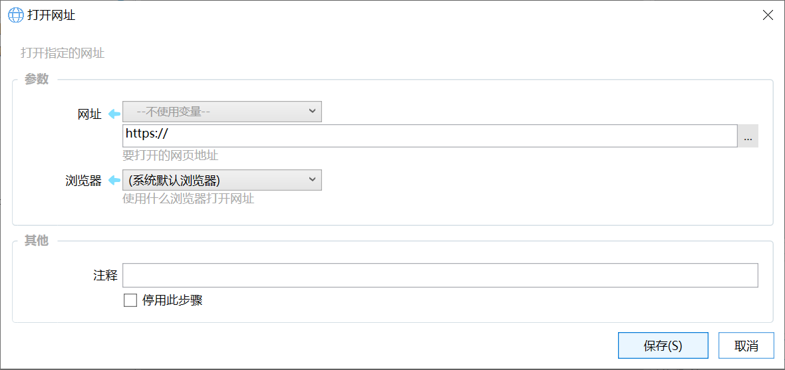
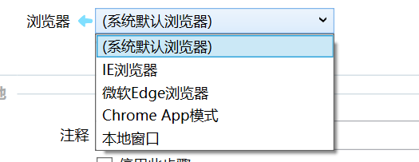
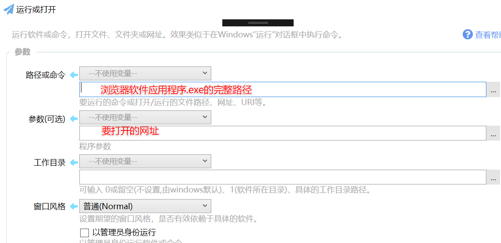

# 打开网址

打开指定的网址

## 当前模块定义

<XActionModuleMeta moduleKey="sys:openUrl" />

使用浏览器打开指定的网址。

## 输入参数

网址：需要打开的网页地址。

浏览器：使用哪个浏览器打开网址。可选“系统默认浏览器”、“IE”、“Edge”、“Chrome App”模式等。

Chrome APP模式可以参考[https://sspai.com/post/47718](https://sspai.com/post/47718)。

“本地窗口”使用Windows内置的IE内核浏览器，在Quicker软件内打开一个小的浏览器窗口，可以用于显示一些简单的信息。

## 常见问题

#### 问：如何使用非默认浏览器打开网页

答：

使用“运行或打开”模块。

