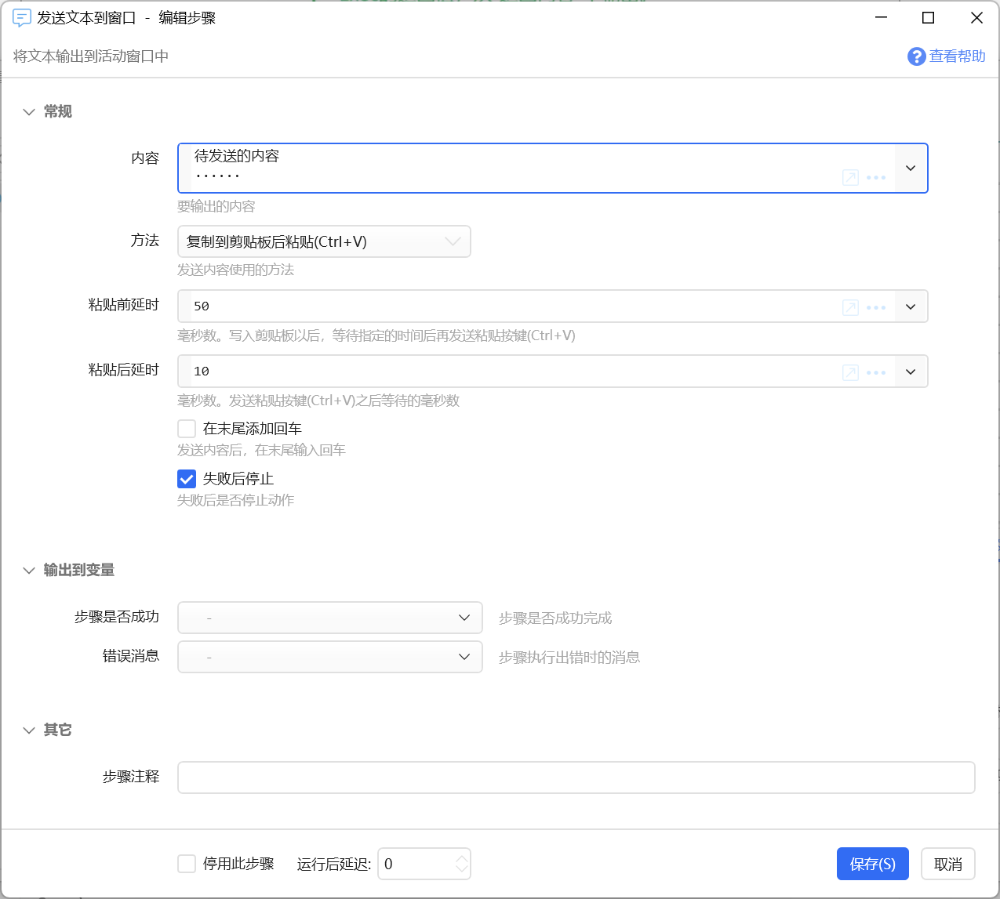

# 发送文本到窗口

将文本输出到活动窗口中

## 当前模块定义

<XActionModuleMeta moduleKey="sys:outputText" />

## 概述

本模块用于将指定的文本发送到当前活动窗口中。例如一个去除空格的动作，则获得文本并去除空格后，需要将处理后的结果再发回到窗口替换之前的文本。

请参考基本动作类型“[发送文本](https://getquicker.net/kc/manual/doc/send-text)”。

## 参数

**内容：**要发送到窗口的文字内容。

**方法：**发送内容使用的方法，可选：

-   复制到剪贴板后粘贴：将内容写入剪贴板后，在窗口中发送Ctrl+V按键粘贴。适合于大段文字，速度快。
-   模拟输入：使用模拟键盘输入的方式键入，**速度较慢**，可能会受到输入法影响，不适合大量的文本输出。

**在末尾添加回车:** 在完成内容输出后，是否发送一个回车键，从而完成换行、在聊天窗口发送等功能。

**粘贴前/后延时：**使用复制粘贴方式发送时，在模拟Ctrl+V之前及之后要等待的时间。某些情况下需要一些时间来改善稳定性。

**字符间延迟**：模拟输入方式时，在每个字符之间增加延迟。 模拟输入收到目标软件接收速度、输入法等影响时，如果出现顺序错乱，可以增加此值。

## 注意事项

-   Excel或WPS表格：粘贴内容时，如果某个单元格处于激活状态（虚线环绕的选中状态）时，会粘贴此单元格的内容。请先模拟Esc按键，取消此状态之后再使用发送文本到窗口功能。

## 更新历史

-   20230116 增加注意事项。
-   20250120 完善文档以匹配实际功能。
