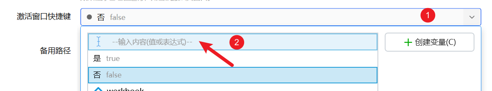
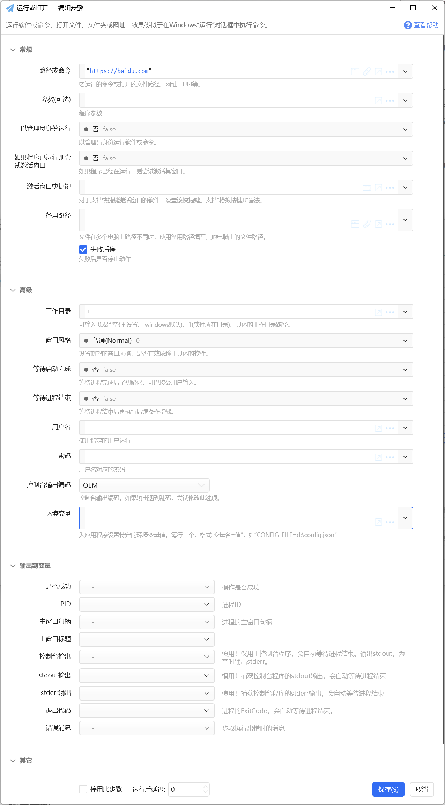
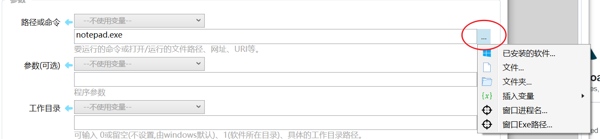

# 运行或打开

运行软件或命令，打开文件、文件夹或网址。效果类似于在Windows"运行"对话框中执行命令。

## 当前模块定义

<XActionModuleMeta moduleKey="sys:run" />

## 概述

本模块用于启动一个Windows进程，其作用类似于在Windows+R运行对话框中执行命令，可以用于如下场景：

-   打开一个exe程序，并根据需要传入命令行参数
-   打开一个文件
-   打开一个文件夹
-   打开一个网址
-   打开一个UWP软件URI
-   执行windows命令等

**提示！**

【1.32.8 版本】如果您需要激活已有窗口，请将激活窗口快捷键的默认值“false”清掉（此问题将在下一个版本中间修复）：

-   点击下拉框展开；
-   选择第一项“输入内容（值或表达式）”
-   清空输入框中的文本内容，或者设置为实际的快捷键内容。

## 参数

**路径或命令：**可以为

-   要执行的windows命令，如`cmd`、`ping`、`control`（控制面板）等
-   要运行的exe软件的文件名（包含或不包含.exe扩展名均可）（如果文件所在目录已加入到Windows环境变量PATH中），或文件的完整路径。
-   要打开的文件的完整路径（如`E:\Download\技术协议-标准软件许可类.doc`）
-   要打开的网址，如`https://baidu.com`
-   Windows10商店应用的URI，如`ms-settings:`（Windows10设置应用）
-   其他可以在Win+R运行窗口中执行的命令。

关于可以运行的命令或WIN10URI，可以参考：[https://getquicker.net/Forum/ViewTopic/172](https://getquicker.net/Forum/ViewTopic/172)

可以点击参数输入框右侧的“...”按钮，在菜单中选择已安装的软件、文件或文件夹路径。

**参数：**运行exe程序时传递给程序的命令行参数。参数的格式依赖于所要启动的具体软件。通常，如果参数中需要包含一个可能带有空格的路径，通常可以在路径两段增加英文双引号"来避免空格造成的路径截断问题。

**以管理员身份运行：**使用管理员身份打开文件或程序。Windows将会显示一个提示框请求确认是否运行。除非必要，请不要以管理员身份运行程序。

**激活窗口快捷键：**如果需要激活已有窗口，并且软件本身支持热键激活，可以在这里提供激活该窗口的快捷键。（[模拟按键B格式](/v2/xaction/modules/sendkeys)，可点击输入框右侧的键盘按钮直接在键盘中输入后生成）

**如果程序已运行则尝试激活窗口：**如果判断到进程已启动，是否激活已存在的窗口，而不是再开启一个新的程序实例。需要“路径或命令”参数中提供程序exe文件的完整路径（需要根据此信息判断进程名）。

注意：

-   此功能依赖于目标软件的支持，需实际测试。
-   对多进程、一个进程多个窗口、窗口最小化到系统托盘等情况，通常无法使用。

**备用路径：**文件在多个电脑上路径不同时，使用备用路径填写其他电脑上的软件应用程序文件的完整路径。可以多个，每个一行。

**工作目录：**打开进程的工作目录，需要时填写。如执行cmd命令时，如果工作目录设置为“d:”，则命令行窗口打开后自动进入到此目录中。

参数值：留空或输入0时由系统默认，输入1时使用exe程序所在目录（此时路径参数需要提供文件的完整路径），或指定某个具体的路径。

**窗口风格：**运行软件时使用的窗口风格（普通、隐藏、最小化、最大化）。

-   此功能依赖于目标软件的支持。对特定的软件或程序，此参数不一定有效。
-   注：在“路径”中使用软件的快捷方式（lnk文件）时此参数不会生效，请直接指定exe文件的完整路径。

**等待启动完成：**等待软件初始化后，开始接受用户输入。仅对某些软件有效。

**等待进程结束：**是否等待进程关闭以后再继续运行后续的动作步骤。

**用户名/密码：**特定情况下，当需要使用（模拟）当前电脑的其他Windows账号启动软件时，可以输入对应的Windows账号用户名，密码。

**控制台编码输出：**如果所获取的控制台输出内容有乱码时，可尝试修改此值。

**环境变量：**为应用程序设置特定的环境变量。

## 输出

【PID】进程ID。

【主窗口句柄】进程主窗口的句柄。不是所有进程都有主窗口。有的程序需要开启“等待启动完成”选项才能获得窗口信息。

【主窗口标题】进程主窗口的标题。不是所有进程都有主窗口。有的程序需要开启“等待启动完成”选项才能获得窗口信息。

【控制台输出】仅必要时使用，用于获取程序的控制台输出内容。

【stdout输出】捕获控制台stdout输出。

【stderr输出】捕获控制台stderr输出。

【退出代码】进程的ExitCode，输出此结果时，会自动等待进程结束。

## 示例动作

-   [示例：运行或打开](https://getquicker.net/sharedaction?code=abf666ed-08bc-46a9-6d8a-08d6bfa4ff29)

## 注意事项

-   除非必要，请勿输出控制台输出、退出代码等信息。

## 更新历史

-   v1.0.2

-   增加“等待启动完成”参数，以及“PID”、“主窗口句柄”、“主窗口标题”输出。

-   1.5.7  增加“失败后停止”参数。
-   20250120 完善文档。
