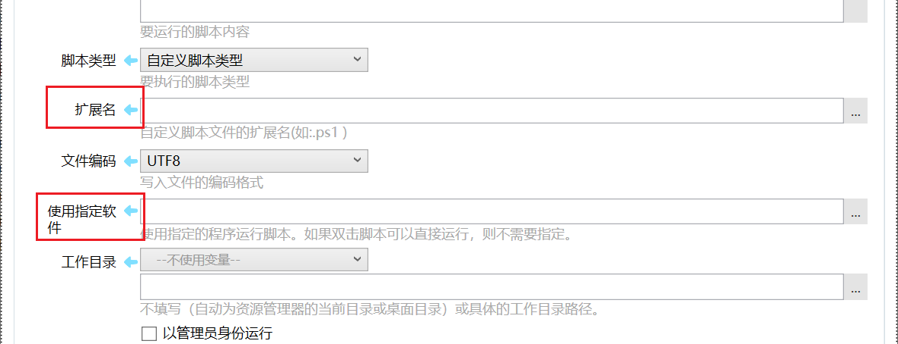

# 运行脚本

运行脚本。

## 当前模块定义

<XActionModuleMeta moduleKey="sys:runScript" />

## 概述

此模块用于执行一段脚本代码。

除了CMD命令，其他脚本类型将会在执行时先将脚本存入临时文件，然后执行此临时文件。

<ModuleParamPreview moduleKey="sys:runScript" />

## 参数说明

**脚本内容**：需要执行的脚本代码。 可以使用插值方式动态变更其内容。

对于“CMD命令”脚本类型，请勿在脚本内容中存放过于复杂的代码（执行时会将多行通过&合并为一行）。

**脚本类型**：脚本所对应的执行方式。

-   CMD命令（完成后保留窗口）：使用cmd /K 方式运行
-   CMD命令（完成后关闭窗口）：使用cmd /C 方式运行

-   CMD命令（隐藏窗口）：使用cmd /c方式运行，并且不显示命令行窗口。此时“以管理员身份运行”选项不可用。
-   BAT批处理脚本：将脚本代码存入.bat文件后执行。

-   CMD批处理脚本：将脚本存入.cmd文件后执行。
-   PowerShell脚本：将脚本存入.ps1文件后执行，使用的命令格式为：powershell.exe -NoProfile -ExecutionPolicy Unrestricted  -File &#123;fileName&#125;

-   AutoHotKey脚本：将脚本存入.ahk文件后执行，需要已安装AutoHotKey软件。
-   自定义脚本类型：指定自定义的文件扩展名以及运行脚本的软件路径。
    

**文件编码**：使用哪种编码写入脚本文件。编码不合适时，运行脚本可能会不被执行或会显示乱码。bat和cmd脚本类型通常应该使用系统默认编码。

**使指定的软件**：自定义脚本类型时，设定用于执行脚本的程序。如果在windows中直接双击文件可以运行脚本，可以忽略此参数。其他情况下，可以指定程序完整路径。如果程序已加入PATH环境变量，可以只写程序文件名或去除后缀的文件名。如vbs脚本的执行程序为`cscript.exe`

**命令行参数模板**：自定义脚本类型时，设定为执行脚本的程序传递的参数格式。在其中使用`%FILE%`表示要生成的临时脚本路径。

**工作目录**：留空或指定具体的路径。如果留空则自动使用资源管理器的当前窗口路径（在资源管理器窗口上运行动作时）或“桌面”路径（在其他位置运行动作时）。

**以管理员身份运行**：是否提升为管理员权限执行脚本。

注意：在使用隐藏窗口或将“控制台输出”到变量时，此选项将失去效果。

**等待进程结束**：是否等待进程结束后再继续执行后续的步骤。如果在脚本中开启了新的进程，则新的进程不会被等待。

### 输出

【控制台输出】可以不选择。 如果选择，将会捕获控制台输出（窗口将会自动隐藏），也会自动等待进程结束。
