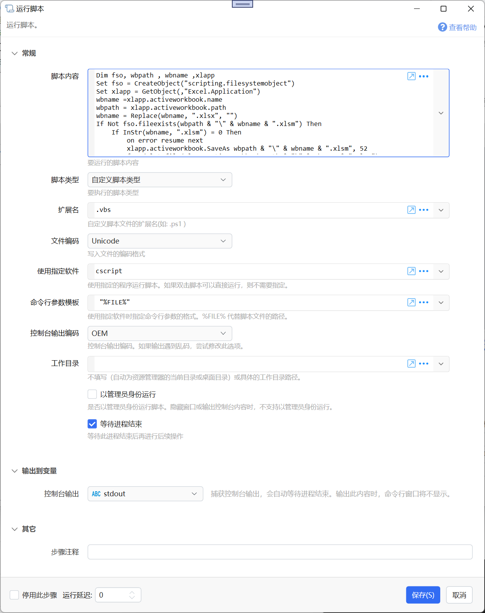

# 运行脚本

运行脚本。

{/* xaction-metadata:start */}
## 当前模块定义

- 模块 Key：`sys:runScript`
- 分类：基础（`Basic`）
- 类型：`Action`
- 风险操作：是
- 专业版：否

## 输入参数

| Key | 名称 | 类型 | 默认值 | 必填 | 变量模式 | 条件 | 说明 |
| --- | --- | --- | --- | --- | --- | --- | --- |
| `script` | 脚本内容 | `Text` |  | 是 | `UseVarOrInput` |  | 要运行的脚本内容 |
| `type` | 脚本类型 | `Enum` | CMD_K | 是 | `Input` |  | 要执行的脚本类型 |
| `ext` | 扩展名 | `Text` |  | 是 | `Input` | 仅：CUSTOM | 自定义脚本文件的扩展名(如: .ps1 ) |
| `encoding` | 文件编码 | `Enum` | default | 是 | `Input` |  | 写入文件的编码格式 |
| `runner` | 使用指定软件 | `Text` |  | 是 | `Input` | 仅：CUSTOM | 使用指定的程序运行脚本。如果双击脚本可以直接运行，则不需要指定。 |
| `argTemplate` | 命令行参数模板 | `Text` | %FILE% | 是 | `Input` | 仅：CUSTOM | 使用指定软件时指定命令行参数的格式。%FILE% 代替脚本文件的路径。 |
| `workingDir` | 工作目录 | `Text` |  | 否 | `UseVarOrInput` |  | 不填写（自动为资源管理器的当前目录或桌面目录）或具体的工作目录路径。 |
| `scriptParams` | 脚本参数 | `Text` |  | 否 | `UseVarOrInput` | 排除：CUSTOM, CMD_C, CMD_H, CMD_K | 为脚本传递的参数。将会被追加到运行脚本的命令行中。 |
| `runAsAdmin` | 以管理员身份运行 | `Boolean` | false | 否 | `Input` |  | 是否以管理员身份运行脚本。隐藏窗口或输出控制台内容时，不支持以管理员身份运行。 |
| `waitToExit` | 等待进程结束 | `Boolean` | false | 否 | `Input` |  | 等待此进程结束后再进行后续操作 |
| `outputEncoding` | 控制台输出编码 | `Enum` | oem | 是 | `Input` |  | 控制台输出编码。如果输出遇到乱码，尝试修改此选项。 |
| `stopIfFail` | 失败后停止 | `Boolean` | true | 否 | `Input` |  | 失败后是否停止动作 |

## 输出参数

| Key | 名称 | 类型 | 条件 | 说明 |
| --- | --- | --- | --- | --- |
| `stdout` | 控制台输出 | `Text` |  | 捕获控制台输出(输出stdout，为空时输出stderr)，会自动等待进程结束。输出此内容时，命令行窗口将不显示。 |
| `stdoutOnly` | 标准输出 | `Text` |  | 捕获标准输出(stdout)，会自动等待进程结束。输出此内容时，命令行窗口将不显示。 |
| `stderr` | 错误输出 | `Text` |  | 捕获错误输出(stderr)，会自动等待进程结束。输出此内容时，命令行窗口将不显示。 |

## 选项值

### `type` 脚本类型

| Value | 名称 | 说明 |
| --- | --- | --- |
| `CMD_K` | CMD命令 (完成后保留窗口) |  |
| `CMD_C` | CMD命令 (完成后关闭窗口) |  |
| `CMD_H` | CMD命令 (隐藏命令行窗口) |  |
| `BAT` | BAT批处理脚本(.bat) |  |
| `CMD_F` | CMD批处理脚本(.cmd) |  |
| `PS` | PowerShell脚本(.ps1) |  |
| `AHK` | AutoHotKey脚本(.ahk) |  |
| `CUSTOM` | 自定义脚本类型 |  |

### `encoding` 文件编码

| Value | 名称 | 说明 |
| --- | --- | --- |
| `utf-8` | UTF8 (有BOM) |  |
| `UTF8-NOBOM` | UTF8 (无BOM) |  |
| `utf-16` | UTF-16 LE |  |
| `utf-16BE` | UTF-16 BE |  |
| `us-ascii` | ASCII |  |
| `utf-7` | UTF7 |  |
| `utf-32` | UTF32 |  |
| `default` | 系统默认(gb2312) |  |

### `outputEncoding` 控制台输出编码

| Value | 名称 | 说明 |
| --- | --- | --- |
| `utf8` | UTF8 |  |
| `oem` | OEM |  |
{/* xaction-metadata:end */}

## 概述

此模块用于执行一段脚本代码。

除了CMD命令，其他脚本类型将会在执行时先将脚本存入临时文件，然后执行此临时文件。

## 参数说明

**脚本内容：**需要执行的脚本代码。 可以使用插值方式动态变更其内容。

对于“CMD命令”脚本类型，请勿在脚本内容中存放过于复杂的代码（执行时会将多行通过&合并为一行）。

**脚本类型：**脚本所对应的执行方式。

-   CMD命令（完成后保留窗口）：使用cmd /K 方式运行
-   CMD命令（完成后关闭窗口）：使用cmd /C 方式运行

-   CMD命令（隐藏窗口）：使用cmd /c方式运行，并且不显示命令行窗口。此时“以管理员身份运行”选项不可用。
-   BAT批处理脚本：将脚本代码存入.bat文件后执行。

-   CMD批处理脚本：将脚本存入.cmd文件后执行。
-   PowerShell脚本：将脚本存入.ps1文件后执行，使用的命令格式为：powershell.exe -NoProfile -ExecutionPolicy Unrestricted  -File &#123;fileName&#125;

-   AutoHotKey脚本：将脚本存入.ahk文件后执行，需要已安装AutoHotKey软件。
-   自定义脚本类型：指定自定义的文件扩展名以及运行脚本的软件路径。
    

**文件编码：**使用哪种编码写入脚本文件。编码不合适时，运行脚本可能会不被执行或会显示乱码。bat和cmd脚本类型通常应该使用系统默认编码。

**使指定的软件：**自定义脚本类型时，设定用于执行脚本的程序。如果在windows中直接双击文件可以运行脚本，可以忽略此参数。其他情况下，可以指定程序完整路径。如果程序已加入PATH环境变量，可以只写程序文件名或去除后缀的文件名。如vbs脚本的执行程序为`cscript.exe`

**命令行参数模板：**自定义脚本类型时，设定为执行脚本的程序传递的参数格式。在其中使用`%FILE%`表示要生成的临时脚本路径。

**工作目录：**留空或指定具体的路径。如果留空则自动使用资源管理器的当前窗口路径（在资源管理器窗口上运行动作时）或“桌面”路径（在其他位置运行动作时）。

**以管理员身份运行：**是否提升为管理员权限执行脚本。

注意：在使用隐藏窗口或将“控制台输出”到变量时，此选项将失去效果。

**等待进程结束：**是否等待进程结束后再继续执行后续的步骤。如果在脚本中开启了新的进程，则新的进程不会被等待。

### 输出

【控制台输出】可以不选择。 如果选择，将会捕获控制台输出（窗口将会自动隐藏），也会自动等待进程结束。
