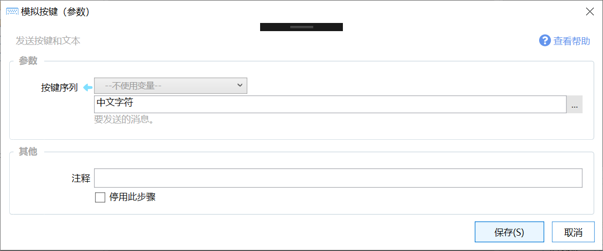

# 模拟按键B（参数）

发送按键和文本

{/* xaction-metadata:start */}
## 当前模块定义

- 模块 Key：`sys:sendKeys`
- 分类：基础（`Basic`）
- 类型：`Action`
- 风险操作：否
- 专业版：否

## 输入参数

| Key | 名称 | 类型 | 默认值 | 必填 | 变量模式 | 条件 | 说明 |
| --- | --- | --- | --- | --- | --- | --- | --- |
| `keys` | 按键序列 | `Text` |  | 否 | `UseVarOrInput` |  | 要发送的按键序列，使用C#语言SendKeys.Send()语法，具体请参考教程文档。 |

## 输出参数

无。
{/* xaction-metadata:end */}

## 概述

发送指定的按键序列到目标窗口。

-   本功能在内部使用了C#的 [System.Windows.Forms.SendKeys.SendWait()](https://docs.microsoft.com/en-us/dotnet/api/system.windows.forms.sendkeys?view=netframework-4.8) 函数。因此，参数格式可以直接参考该文档。
-   **此操作可能会受到输入法的影响，请在使用前将输入法切换到英文状态。**[不受输入法影响的方式，请参考本文。](https://getquicker.net/KC/Kb/Article/1045)

此模块和“[模拟按键A（录入）](/v2/xaction/modules/keyinput)”模块的区别为：

-   “模拟按键（录入）”模块使用直接录入的方式指定要发送的内容，只能发送固定的内容。
-   本模块使用文本参数的形式传入要发送的内容，可以接受参数或使用插值，可以和其他模块协作动态变更发送的按键序列内容。

### 按键序列参数格式

#### 要点

-   `^`代表Ctrl键
-   `+`代表Shift键
-   `%`代表Alt键
-   其它普通字母和数字键使用小写形式。 如`^c`表示Ctrl+C（复制）。特殊键使用`{键名}`的格式，参见下表。
-   不支持Win键和一些特殊按键，如F17-F24、媒体键等。

#### 详解

（1）普通字符使用字符本身表示，如“a”表示发送字符“a”，“abc”表示发送“abc”三个字符。

（2）加号 (+)、插入符 (^)、百分比符号 (%)、上划线 (~) 及圆括号 ( ) 都具有特殊意义。为了指定上述任何一个字符，要将它放在大括号 (&#123;&#125;) 当中。例如，要指定正号，可用 &#123;+&#125; 表示。方括号 (\[ \]) 并不具有特殊意义，但必须将它们放在大括号中。为了指定大括号字符，请使用 "&#123;&#123;&#125;" 和"&#123;&#125;&#125;"。

（3）为了在按下按键时指定那些不显示的字符，例如 ENTER 或 TAB 以及那些表示动作而非字符的按键，请使用下列代码：

| **按键** | **代码** |
| --- | --- |
| WIN | 底层API**不支持** |
| BACKSPACE | &#123;BACKSPACE&#125;, &#123;BS&#125;, or &#123;BKSP&#125; |
| BREAK | &#123;BREAK&#125; |
| CAPS LOCK | &#123;CAPSLOCK&#125; |
| DEL or DELETE | &#123;DELETE&#125; or &#123;DEL&#125; |
| DOWN ARROW | &#123;DOWN&#125; |
| END | &#123;END&#125; |
| **ENTER 回车** | &#123;ENTER&#125; or ~ |
| ESC | &#123;ESC&#125; |
| HELP | &#123;HELP&#125; |
| HOME | &#123;HOME&#125; |
| INS or INSERT | &#123;INSERT&#125; or &#123;INS&#125; |
| LEFT ARROW | &#123;LEFT&#125; |
| NUM LOCK | &#123;NUMLOCK&#125; |
| PAGE DOWN | &#123;PGDN&#125; |
| PAGE UP | &#123;PGUP&#125; |
| PRINT SCREEN | &#123;PRTSC&#125; (reserved for future use) |
| RIGHT ARROW | &#123;RIGHT&#125; |
| SCROLL LOCK | &#123;SCROLLLOCK&#125; |
| TAB | &#123;TAB&#125; |
| UP ARROW | &#123;UP&#125; |
| F1 | &#123;F1&#125; |
| F2 | &#123;F2&#125; |
| F3 | &#123;F3&#125; |
| F4 | &#123;F4&#125; |
| F5 | &#123;F5&#125; |
| F6 | &#123;F6&#125; |
| F7 | &#123;F7&#125; |
| F8 | &#123;F8&#125; |
| F9 | &#123;F9&#125; |
| F10 | &#123;F10&#125; |
| F11 | &#123;F11&#125; |
| F12 | &#123;F12&#125; |
| F13 | &#123;F13&#125; |
| F14 | &#123;F14&#125; |
| F15 | &#123;F15&#125; |
| F16 | &#123;F16&#125; |
| Keypad add | &#123;ADD&#125; |
| Keypad subtract | &#123;SUBTRACT&#125; |
| Keypad multiply | &#123;MULTIPLY&#125; |
| Keypad divide | &#123;DIVIDE&#125; |

（4）为了表示在按下某个按键时同时要按下的SHIFT、CTRL和ALT控制键，可以在按键字符前插入下面的代码：

| **按键** | **代码** |
| --- | --- |
| SHIFT | + |
| CTRL | ^ |
| ALT | % |

如Ctrl+C可以表示为“^c”。

如果在按下SHIFT、CTRL、ALT组合的同时需要按下多个其他按键，则需要将他们包含在括号中。如：要表示按下SHIFT的同时依次按下e和c，可以用“+(ec)”表示。

（5）如果要设定按键的重复次数，使用&#123;按键 次数&#125;的格式。按键和次数之间放置一个空格。如：&#123;LEFT 42&#125;表示按下方向键←42次，&#123;h 10&#125;表示按下H键10次。

请注意，字符的大小写可能会影响执行的结果。如^s和^S可能会产生不同的结果。请多测试以确保目标软件按预期执行操作。

#### 按键组合示例

| **代码** | **按键序列** |
| --- | --- |
| ^p | Ctrl+p 组合键 |
| +p | Shift+p 组合键 |
| %p | Alt+p 组合键 |
| ^+s | Ctrl+Shift+s 组合键 |
| ^(kc) | 按Ctrl同时按K和C |
| ^kc | 先按Ctrl+k组合键，全部松开后再按c键 |
| Hello~New Line | Hello(回车) New Line |
| 中文字符 | 中文字符 |
| &#123;LEFT 10&#125; | 按←键 10次 |
| &#123;h 10&#125; | 按h键 10次 |

## 示例

-   选择一个快捷键组合发送：[https://getquicker.net/Sharedaction?code=67129c30-9d18-40c7-0ab8-08d714376b4c](https://getquicker.net/Sharedaction?code=67129c30-9d18-40c7-0ab8-08d714376b4c)
